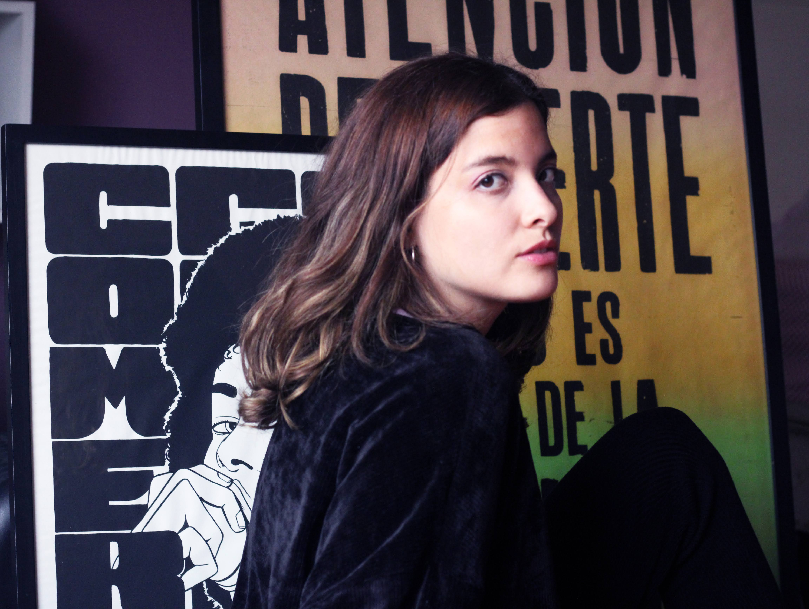
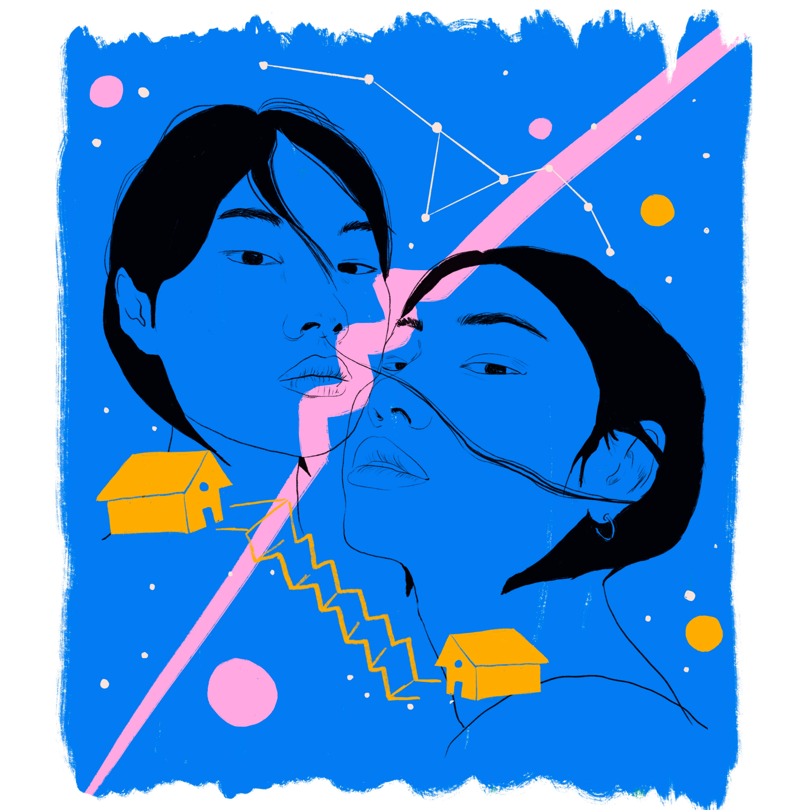

# About

**Updated bio**
Design Lead born in Lima, Perú and currently living in Barcelona. I am interested in exploring futures literacy with a systemic and ecofeminist lens. I specialize in designing closely with users and communities while incorporating principles of design justice. I’ve worked in design challenges related to sexual harassment, positive masculinities, salary inequality, digital behaviors in Latin America and futures literacy in children and migrants. Overall I am interested in designing for care as opposed to a reactionary approach to design. My design process wishes to address the root causes of any design challenge and acknowledges that climate justice cannot occur without gender equality. I am also interested in blending feminism with illustration, having self-published and distributed fanzines through local online communities in Latin America.

> “To dismantle structural inequality and advance collective liberation and ecological survival.”
Sasha Constanza-Chock, Design Justice

**Alternative present**
Humans like myself (and especially younger generations, women and migrants) have the tools, skills and designated spaces to not only imagine but actively co-create futures with an ecofeminist perspective.

Building futures is an active ongoing exercise that exists in education spaces, inside homes and in social gatherings through collage creation, story building and participatory games that welcome differences of perception and thought. This helps combat echo chambers and filter bubbles since the futures are created welcoming and exploring the complex nuances of difference of thought.

**Old bio**
Design Lead & Communications strategist with over 8 years of experience in innovation projects, venture building and cultural transformation initiatives.

My passion is to design solutions that empower and unlock opportunities for underserved demographics. My dream is to devote my professional life to solving inequalities, challenging structural gaps through design and storytelling. I have focused my career on helping new education ventures and cultural transformation projects thrive by leading and participating in cross-disciplinary design projects. But these methodologies have gaps, when a solid research base is not present and when leaders are not committed to questioning the status quo. Seven years into this journey, I have realized the importance of complementing the human-centered design methodology with insights that take into account the complex nuances of structural inequality.

The pandemic hit Latin America, widening disparities and reversing progress. My goal is to help overcome these setbacks and secure an even brighter future for the upcoming generations. My bold hypothesis is that ventures need compelling narratives intentionally designed to solve structural inequality. I still have to acquire deeper knowledge in research and prototyping and I want to expand my network to collaborate with like-minded professionals and subject matter experts to solve some of these problems.

The illustration above visually represents how I feel right now, between two different states of being.

[I also like to draw in my free time.](https://www.jimenasalinas.com)
