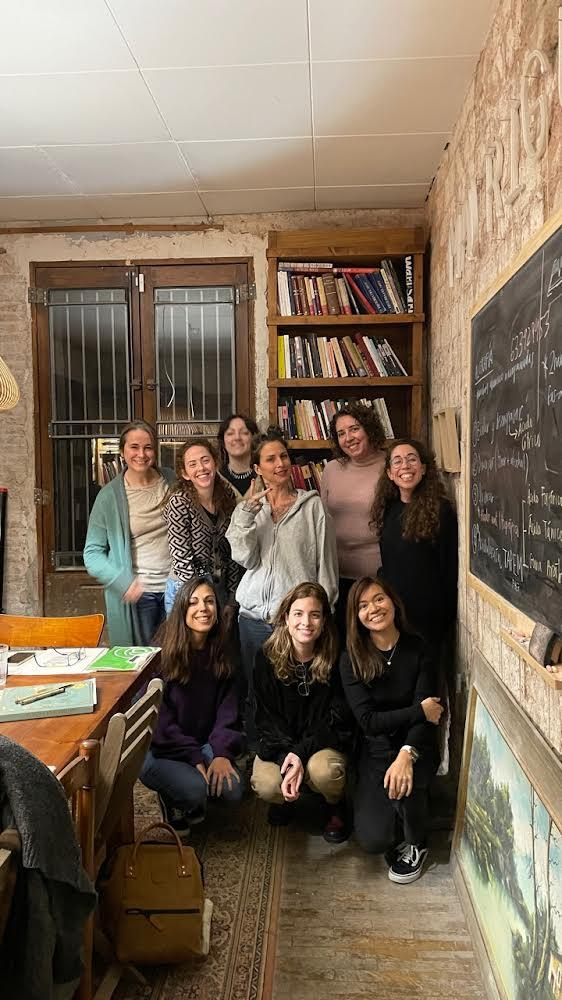
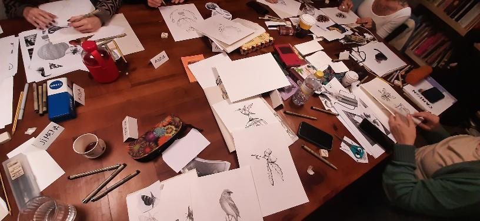
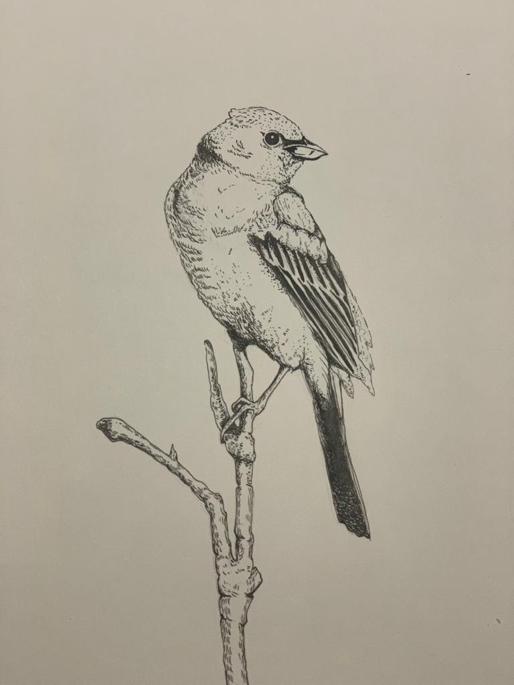

---
hide:
    - toc
---

# Interventions and activities - First Trimester

### Intervention 1 - Mapping the ecosystem in Barcelona in regards to gender

Activities included:
Interviewing key stakeholders (5)
- Shemakes (Fab lab project)
- Femiñetas
- Sexus
- Loba Project (MDEF project)
- Lina from Fab lab

My research started speaking to Lina, an audiovisual specialist at Fab Lab. Lina is very well-connected with the queer community in Barcelona and helped me sharing names of potential NGOs and organizations I could initially reach out to. While some of them did not reply back, I did some desktop research to understand what these initiatives did, what their approach was, what communities they chose to tackle and what their theory of change was.

I was able to have conversations with Petra from Shemakes, Flor from Femiñetas, Ismael from Sexus and Paco from Loba Project. These conversations were very energizing but also intimidating to find out there is so much already being done in this territory in Barcelona. I also went to a conference organized by Plural, a center for masculinities funded by the Ayuntamiento of Barcelona.

This is my attempt to sketch out the ecosystem I have identified. This is not comprehensive but gives you some ideas of what it looks like.

<iframe src="https://embed.kumu.io/2ada9b57811a1dfb3751aeb3ab8bdfd1" width="940" height="600" frameborder="0"></iframe>

### Activity 1 - Attending a masculinities workshop for Catalan Youth

I also attended a 5 session workshop for Catalan youth that revolved around masculinities. I was the only foreigner in the room but everyone was very welcoming. The group was half men and half women, mostly in their early twenties. Women that were attending were there for research purposes (university projects or because they work in psychology fields) while men had more open agendas just being willing to learn and access free education. Ismael, the workshop lead, was very good at creating an atmosphere of reflection and a safe space for everyone to talk about their prejudices, previous preconceptions and future reflections in this subject matter. It felt a very safe space to talk about subjects such as pornography, sexuality and romantic love.

### Intervention 2 - Signing up for an all-women pointillism class at La Madriguera in Eixample

I am very interested in illustration and pursue illustration as a side project. Part of the reason I chose Barcelona as a destination for my Master’s degree is because of La Madriguera. La Madriguera is Paula Bonet’s project where women meet to explore and play with art, illustration and engraving. A month ago I enrolled in a pointillism class with LaLauri, a Spanish artist I admire very much. My goal was to go back to drawing without an iPad, playing with my hands and understanding the role space and community played in these types of workshops.

It was great to find out that many women had traveled from other regions of Spain to join the workshop in Barcelona. The structure of the workshop was highly focused on practical tools and exercises to play around and let go of expectations. The end results were incredible as with simple tips and tricks, Laura managed to get some amazing illustrations from the group.

La Madriguera is also an interesting and safe space for women to discuss art and gender. There were many activist posters around regarding abortion rights and the space had to be initially a secret location because one particular man had consistently harassed the founder Paula. La Madriguera is now open to the public since the case went to a jury and the perpetrator got a jail sentence.

After this workshop I was inspired to keep exploring illustration as a means to reflect on gender equality.

### Intervention 3 - Midjourney and gender bias

This week during the Extended Intelligences course they taught us about synthetic realities. One program that caught my attention was Midjourney and since it is a relatively new tool I wanted to test out if gender bias could be found embedded in the algorithm.

To do so, I inputted different sentences to see if any emerging stereotypes showed up on the AI-generated images.
- “a group of venture capitalists in an office”
- “entrepreneurs in a brainstorming session”
- “university graduate at a house party”
- “university graduate holding diploma”
- “taking care of household chores”
- “intimate partner violence"

Analysis:
- Women and men show equally in “party” settings
- Women tend to show up more than men in student / education settings.
- However, men tend to appear more in office-related settings
- In household chores and IPV women are more protagonists. This correlates to real life and statistics, however can this also perpetuate stereotypes?

[Read the whole story in this Medium article I wrote about the research.](https://medium.com/@jimena.salinasg/identifying-gender-bias-in-midjourney-fcf36240f464)

### Intervention 4 - Crafting stories with children in parks

For my first collective intervention I partnered with Ariel who was very interested in learning about youth perception in regards to climate change. We chose school children between 6 and 9 years old using collage as a tool to co-create postcards from the future with them and designed a first draft of the workshop which can be [read here](https://drive.google.com/file/d/15wzRoRQG4TzwFkWkO6J__ZdF39QAKUqz/view)

Making the PDF was a forcing function for us to outline a first version of what the workshop would look like, define an age to collaborate with and think of the objectives of this intervention. Since the schools were finalizing their terms and could not give us a slot of time until January due to Holidays and end of year, we decided to test the intervention in parks and public spaces of Barcelona. We decided to start in a playground for children in el Raval, walk to La Rambla and then to la Superilla.

We were inspired by this framework designed by Unicef for workshops to build dioramas. For this intervention we only wanted to focus on the Introduction and Brainstorm parts because of time and space constraints. Our question was: What does the future look like to children? How can we incorporate certain elements to help them imagine these futures?
Wen joined our team and we headed out on a Tuesday in the middle of winter to find children and their parents for them to participate in our intervention. We decided it would be best to adapt the format so instead of having the kids build the dioramas, we constructed our own versions of simplified dioramas picking elements that we thought could be good triggers for storytelling. We designed 4 categories (human, non-human, objects and nature) and cut and pasted different figures around these categories on cardboard.

In a three-hour trip we were able to listen to 9 stories from over 15 children aged 3-15. We were able to interview a range of ages that was very wide because of the time of the day (noon) and this allowed us to understand what worked best for each age group.
These were the stories we heard regarding the future with our cardboards as prompts:
- “A kid and a car” - 5 years old, male catalan in Park near Raval
- “The grass and the hat, and the sloth will go out of the hat.” 5 years old, male catalan in Park near Raval
- “The baby brushes her teeth, goes to the car and sleeps”. -  3 years old, female in park near Raval
- “A boy and her little sister, he teases her and the bees tease them” - 4 year old Italian female in a park near Raval.
- “The worm teases the baby.” - 4 year old italian female in park near Raval
- “Cars are bad for the future because of the gas, I prefer bikes, walking. The future with gas and cars is bad.” - Group of 7-10 year old girls and boys in a park near Raval. They said the future with pollution looks bad. They seem migrants, and are environmentally conscious. Had no adult supervision.
- “In the future technology and contamination are everywhere.” “Barcelona has no space for animals, animals should be free not in zoos”. “Nature should have more space in the city” “Barcelona is not very accessible for handicapped people”. - 13-14 year olds girls and boys outside of school in Sant Antoni.
**Some high level learnings from this first iteration:**
**Location preference:** When engaging children in parks, it is hard to do so when they are currently playing since there are a lot of distractions in place. However, places of transit like streets or bus stops are not good because parents or teachers are more focused on mobility and getting their children safe and on time. Engaging teachers in public spaces is also not ideal since they are busy managing large groups of children and do not have the consent from the school or parents to agree to participate in the intervention. Larger groups in public spaces are also difficult to approach since they are focused on the school activity in hand. Street interventions also have a lot of elements of distraction so keeping activities short is essential.
**Role of parents:** Parents act as both translators and facilitators for the exercise (for kids under 6 years old). In some cases they would translate from Catalan and Italian and help us engage children. When parents are present, it is best to approach them first.
**Consent forms and confidentiality:** They didn’t ask for a consent form (even though we bought ones with us) and were ok with us participating as long as they mediated the exercise.
Correct age for intervention: While it was interesting to engage with parents and their young children, children under ages of 6 were too young for the type of reflections we needed. They only interpreted quite literally the images we showed them and had a difficult time building stories.This intervention in particular is most suited for children age 10 and above, they have greater critical thinking skills and can more easily make the connections between elements. We still have doubts regarding the artistic style / aesthetic style of the images and if words might be a better prompt.
**Role of weather and chosen time/date:** When weather is too cold, rainy or gray there are less children outside. This seems obvious but influences also the openness of parents and children to participate and engage.

Overall, this intervention made us reflect as a team that it would be best for these types of prompts to engage with teenagers since they can interpret things more abstract and in a less literal manner.
Some other opportunity areas we identified are: What happens if we input the childrens’ stories in Midjourney or Dall-E? How can we adapt the dynamic for different age ranges?

For schools, we intend on keeping our initial target of 6-9 years old and adapt the dynamic for their age and for the setting. We intend to use the Design Dialogues as a first iteration of our prototype using cut outs from old magazines and making 2 sets of groups for the images: one for climate change and one for gender equality. We feel this activity might be more suitable for teenagers and adults but we are interested to see how people engage with the collages and what types of stories they build out.

> Carolina's collage made during Design Dialogues. Features a look at ecofeminism, incorporating indigenous women.

### Intervention 5 - Using GTP3 to imagine alternative use cases of conversational AI with Wen

Me and Wen were both interested in the potential uses of GPT3. Inspired by this twitter thread, we set out to figure out how to configure the chat for these cases and build a quick user flow for a potential product related to this. We partnered up to create a first draft of a user navigation flow, system architecture and user persona setting. This was built over two weeks with the purpose of having a prototype that we could show on the Design Dialogues.

This experiment related to my areas of interest as I saw an opportunity in being used for the healing stage in cases where people wanted to seek closure from potentially emotionally abusive or physically violent relationships but actually talking with the other person was not the best path.

I input potential scenarios into GPT3 where men had been violent to their ex partners but where it was safer for them not to reach out to them personally in order to not interfere with their healing process. For this purpose I transcribed user interviews from previous projects.

I tried to be as specific as possible, writing down phrases I had heard from previous projects and situations and recreated a potential dialogue where the man asks for forgiveness from his ex partner.

**Some early thoughts:**
**User personas:**
- Victims of violence - receiving apologies and closure
- Perpetrators of violence - apologizing and reaching out to victims

**Questions emerged:**
- Ethics - controlling addiction
Who should use this tool? Therapists? When?
- How can we make this accessible and scalable without going through therapists?
- How can we use this as a storytelling tool? Mimic potential realistic dialogue between two characters that share a past story?

We published this version on [Behance](https://www.behance.net/gallery/159145315/UXR-Innerbot) to get reactions from users online and recruited users on our social media.

We also created this [Figma Landing site](https://www.figma.com/proto/xEz7jcxANz1CPGHMxk0K5P/AI-Chat-bot?node-id=27%3A2641&starting-point-node-id=27%3A2641) with all our initial learnings and this [Figma Prototype](https://www.figma.com/proto/xEz7jcxANz1CPGHMxk0K5P/AI-Chat-bot?node-id=10%3A1147&scaling=scale-down&page-id=1%3A3&starting-point-node-id=10%3A1147&show-proto-sidebar=1) with the most important screens.

> Wen during Design Dialogues showcasing a demo of our first prototype.

**How I would iterate the product moving forward:**

**From:**
a tool for healing IPV by talking to someone you can’t talk to in real life

**to:**
a tool for rehearsing hard conversations and detecting red flags and a tool to have conversations with yourself as a means of healing

**Specific use cases:**
- Handling break ups
- Guiding new parents
- Handling difficult conversations at work
- Rehearsing conversations with your partner
- Healing and asking for forgiveness to a younger self
- Interactive journaling

Before Design Dialogues I conducted 5 user tests with friends and family. You can [check out the reactions here.](https://docs.google.com/document/d/18B8b1YKXKiXwLb5ueVRIeRh91F8mEEJ6Gj--qVKzsig/edit?usp=sharing)
