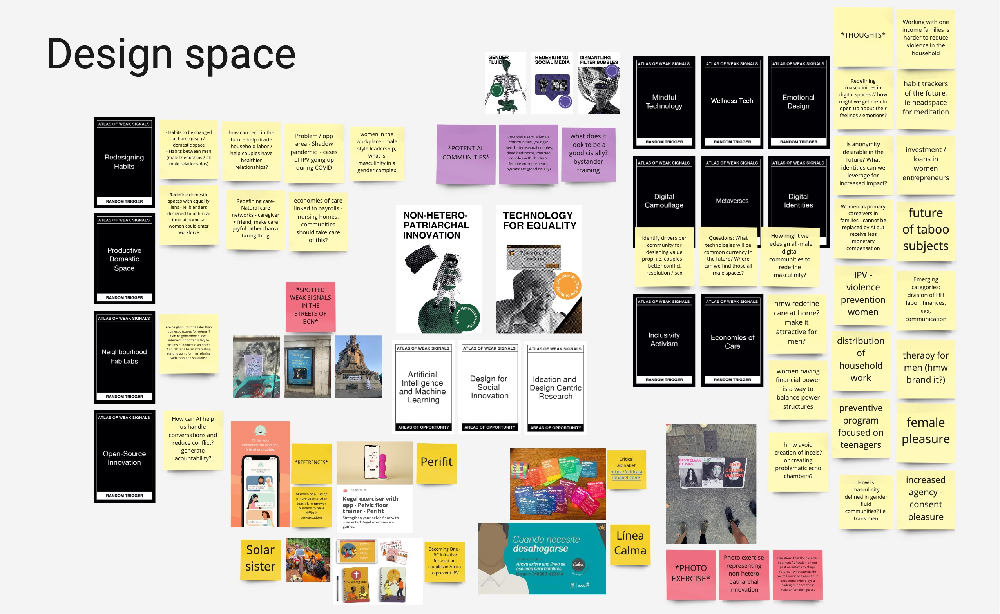
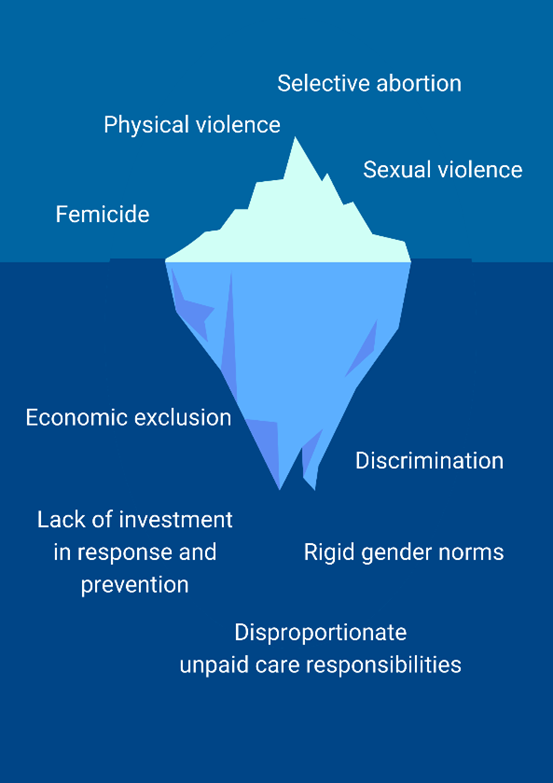

---
hide:
    - toc
---

# Atlas of Weak Signals

My main weak signals are **Non-heteropatriarchal innovation** and **Technology for equality.** I feel technology can be a powerful tool and ally in helping disrupt gender roles and achieving equality if used correctly. I would love to use MDEF as a means to further explore how emergent technologies can be used to serve this purpose. My previous background experience merges human-centered design and agile methodologies to create digital products at the service of creating new ventures (ie. Colectivo23) and new social programs to combat Intimate Partner Violence (ie. Hablemos Entre Patas). I am interested in merging human-centered methodologies and using evidence-based approaches to achieving change at scale. In Peru and Latin America violence against women is increasingly normalized. On the other hand, investment in technology looks at digitally transforming massive corporations that lean towards monopolies whilst social and urgent problems go unnoticed and underfunded. My passion is to merge the learnings of user-centricity, agility and technology at the service of creating a more gender equal world.

At the present moment innovation needs to also tackle societal problems so ingrained and normalized in our social fabric as is violence against women in its multiple forms. I am curious to explore how experiments and prototypes can be conducted in prevention programs and also in other manifestations of gender violence that sit at the lowest part of the iceberg of violence that sometimes go unnoticed, such as stereotypes and sexist humor.

Looking at the iceberg can interestingly ignite different areas of opportunity when thinking about emergent futures. For instance, how might we design a fully preventive program that targets male adolescents and children? How can AI provide a different set of tools to manage conversations around gender stereotypes? Can gamification be a useful path in prevention programs since emergency protocols are not as required and especially when designing for younger populations? Can we design a “coupled” experience for heterosexual couples to mitigate violence? What would the women’s experience vs. male experience look like? What shapes does violence take in a gender fluid future? Who would be the most common perpetrators in said future scenarios? Is violence also directly related to toxic masculinities in the future? What do positive masculinities look like today? What are other factors contributing to gender inequality and what forms do they take in the future? How can we prioritize the causes of IPV and design technology at the service of tackling each of them? Another interesting provocation relates more to designing outside my comfort zone and ideating physical products that may complement the digital experience. How might we design a physical tool or object that aids in mitigating violence or designing positive masculinities? What are the necessary roles that need to be in place for these types of programs or services? Can we design a train the trainers program (especially if working with male facilitators)?
