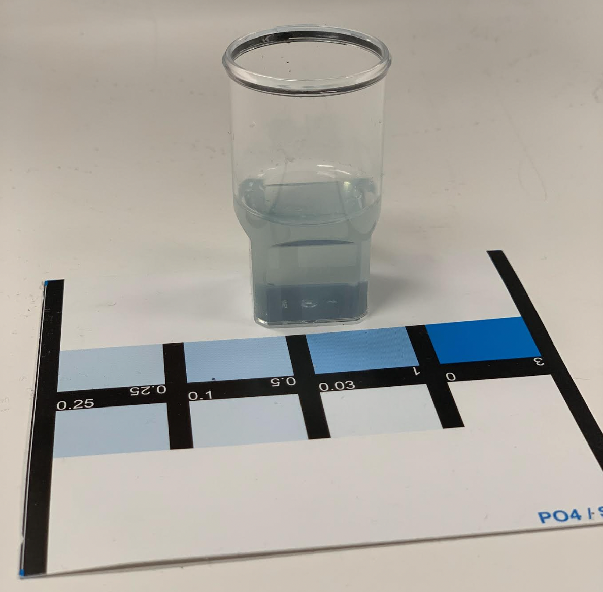
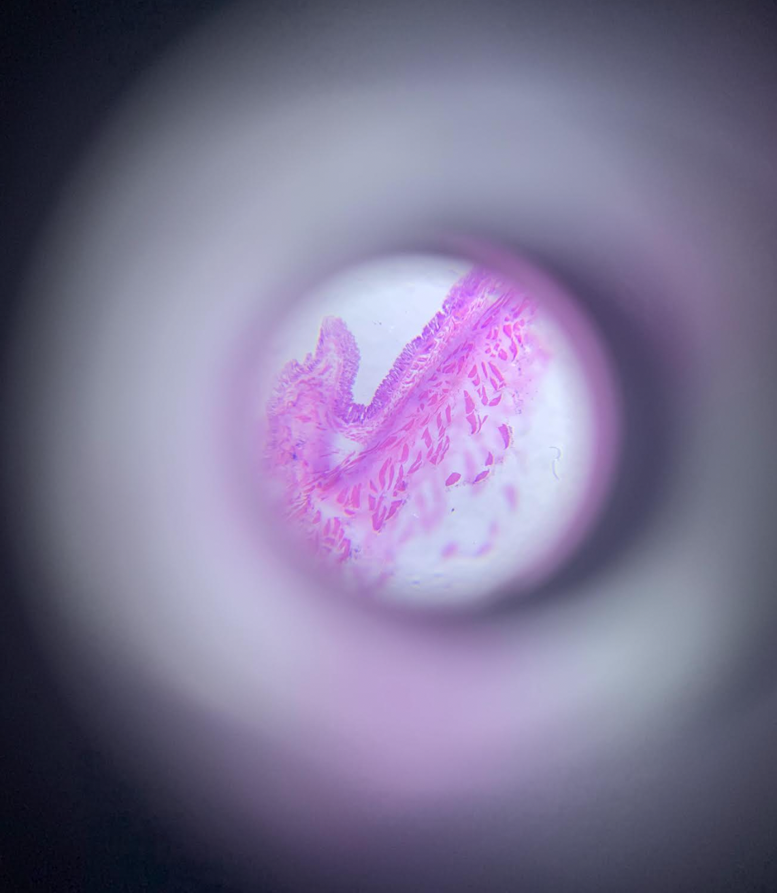
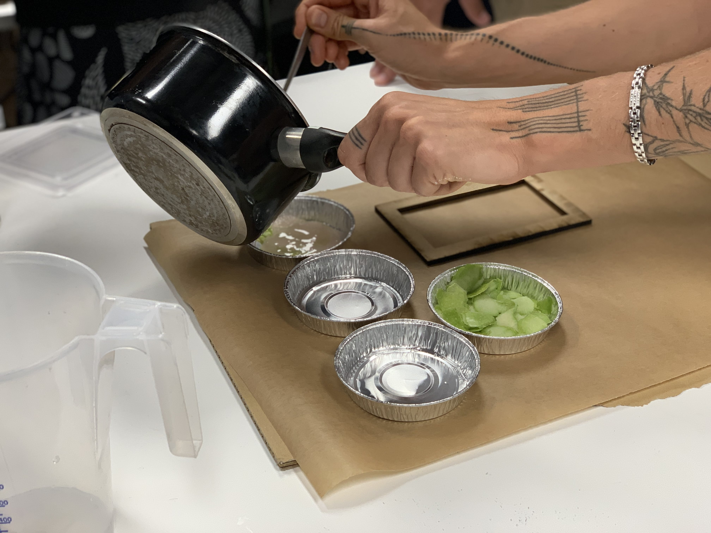

---
hide:
    - toc
---

# Bio and agri zero

## Overall reflection

The last two weeks were focused on Bio Zero and we had 2 remote Agri sessions. It was really mind blowing from me to learn about biology intersecting with design and biomaterial creation. Learning about biohackers and its correlation with cyber punk was incredibly inspiring as making biology accessible and DIY is one of the first steps towards empowerment and decentralizing knowledge. With a background in social sciences and communications I had never made my own bio plastics and while doing the experiment with my group it was very humbling to initially get the measurements wrong but then fix the situation collectively. We were awed by what you can make in your own kitchen and how you can start experimenting with new bioplastics at home.

After these two weeks I am inspired by the potential of combining the discipline of design with biology, especially as it can correlate with public policy, new material creation and circular economy and more sustainable ways of inhabiting planet Earth. As designers, we learn how to experiment in a maybe less organized and systematic way. One takeaway I get is learning to journal and write everything down with as much precision and rigurosity as possible. This is especially useful when analyzing results and coming up with conclusions. Peer reviews and collaboration in scientific papers also make me wonder how that can be translated to the design space with the same rigurosity and spirit of new knowledge creation.

**Some of my favorite moments from the past two weeks captured in photographs**

###Analyzing a news article and contrasting with the original cited scientific paper

Scientific papers and journals are a great source to get closer to scientific evidence, this interests me especially since lately I had previously been working with evidence-based means of generating impact or change in social science and am curious to learn more about how this can relate to biology as well.

The article I have chosen is from The Guardian, titled “Communi-cat-ive: cats attentive to owner’s voice, research finds”. I chose the subject matter because I was curious how this new piece of information could impact human-animal interactions. It argues that cats are able to tune into their human owner’s tone of voice to determine when they are being spoken to. The article does a good job in referring directly to the original research paper, a study done by university students at Paris Nanterre University.

The research, published in Animal Cognition, adds to mounting evidence that one-to-one relationships are important for cats and humans to form strong bonds.

Regarding the original scientific paper, I found that the conclusions are similar. However, I think the sample is very small to determine that said results are scientific truths. I would be curious to learn the results of research taken one step further, maybe outside academia or at a level beyond university research.

A good practice the journalist has done is link to the original scientific paper within the news article. The scientific paper was tested with a small cohort of 16 domestic cats. Explores human-animal relationship and compares and contrasts to baby-adult relationships. The exercise has allowed me to understand the importance of going back to the original source and trusting the scientific paper as opposed to the news article’s bold statements. Content-wise, the article poses interesting design questions and implications between human-animal bonds.
