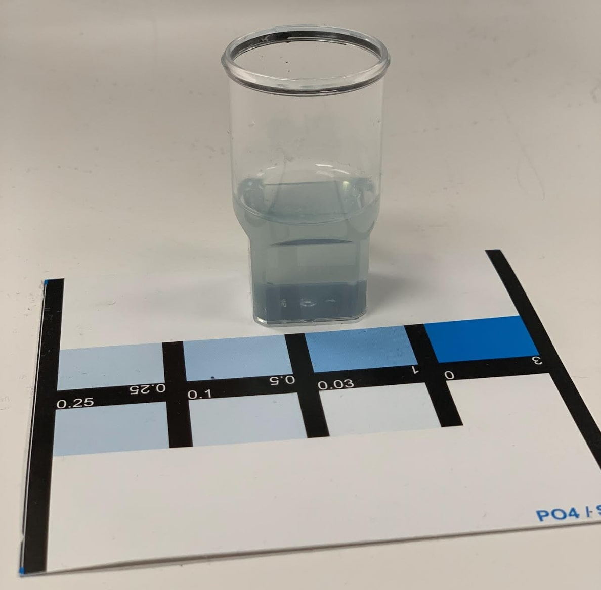

---
hide:
    - toc
---

# Bio and agri zero

## Overall reflection

The last two weeks were focused on Bio Zero and we had two remote Agri sessions during the final week. It was really mind blowing for me to learn about biology intersecting with design and biomaterial creation. Learning about biohackers and their relation with the cyber punk movement was incredibly inspiring as making biology accessible and DIY is one of the first steps towards empowerment and decentralizing knowledge across fields. With a personal background in social sciences and communications, I had never made my own bioplastics before and while doing the experiment with my group it was very humbling to initially get the measurements wrong but then fix the situation collectively. We were awed by what you can make in your own kitchen and how you can start experimenting with new bioplastics at home with materials you can purchase locally and hassle-free.

After these two weeks I am inspired by the potential of combining the discipline of design with biology, especially as it can correlate with public policy, new material creation and circular economy and more sustainable ways of inhabiting planet Earth. As designers, we learn how to experiment in a maybe less organized and systematic way than in the fields of scientific research. One takeaway I get is learning to journal and write everything down with as much precision and rigurosity as possible. This is especially useful when analyzing results and coming up with conclusions. Peer reviews and collaboration in scientific papers also make me wonder how that can be translated to the design space with the same rigurosity and spirit of systematic new knowledge creation.

**Some of my favorite moments from the past two weeks captured in photographs**

This experiment was a highlight for me because of the takeaway that using eyesight to determine pH (or any other measurement) will never be as effective as using a tool that provides an accurate numerological value.

This experiment was a highlight for me from a visual standpoint and the inspiration you can get just by zooming in to objects and materials you already have at home (or even in your own skin!). Pictured above a human cell using my iPhone and a portable microscope. The result is very impressive considering the hands-on and accessible technology we used.

This final picture is inspiring to me as it showcases how you can create bioplastics using regular kitchen tools. My group decided to add apple peel to the mix just to experiment how texture might change in contrast.

###Analyzing a news article and contrasting with the original cited scientific paper

Scientific papers and journals are a great source to get closer to scientific evidence, this interests me especially since lately I had previously been working with evidence-based means of generating impact in social science. I was curious to learn more about how this can relate to the field of biology as well.

The article I have chosen is from The Guardian, titled “Communi-cat-ive: cats attentive to owner’s voice, research finds”. I chose the subject matter because I was curious how this new piece of information could impact and inform the future of human-animal interactions. It argues that cats are able to tune into their human owner’s tone of voice to determine when they are being spoken to. The article does a good job in referring directly to the original research paper, a study done by university students at Paris Nanterre University.

The research, published in Animal Cognition, adds to mounting evidence that one-to-one relationships are important for cats and humans to form strong bonds. Previous research in the field specifically analyzes dogs and this is one of the first research focused entirely on cats.

The scientific paper was tested with a small cohort of 16 domestic cats and explores human-animal relationship in comparison and contrast to baby-adult relationships. According to the news article, "they found that the cats were largely unresponsive to hearing a stranger’s voice calling their name, but when their owner did it, 10 of the 16 cats displayed a constellation of behaviours suggesting increased attentiveness." Because of the framing, rather than a scientific truth the article seems to refer to a rather preliminary and exploratory research that provokes interesting questions.

Regarding the original scientific paper, I found that the conclusions established on the news article are similar. However, some observations I could make is that I think the sample the university students worked with is very small. They only studied 16 cats and the news article refers to the results as if they were long-established scientific truths. I would be curious to learn the results of this same research taken one step further, maybe outside academia or at a level beyond university research.

A good practice the journalist has done is link to the original scientific paper within the news article. I had no trouble reading the entire scientific paper, including their methodology, observations and conclusions. The exercise has allowed me to understand the importance of going back to the original source and trusting the scientific paper as opposed to the news article’s bold statements. Content-wise, the article poses interesting design questions and implications between human-animal bonds.

### Bibliography

**News article:**
Geddes, L. (2022, October 25). Communi-cat-ive: Cats attentive to owner’s voice research finds. Retrieved October 28, 2022, from https://www.theguardian.com/lifeandstyle/2022/oct/25/communi-cat-ive-cats-attentive-to-owners-voice-research-finds

**Scientific paper:**
De Mozuon, C. (2022, August 1). Discrimination of cat‑directed speech from human‑directed speech in a population of indoor companion cats. Retrieved October 28, 2022, from https://link.springer.com/epdf/10.1007/s10071-022-01674-w?sharing_token=1BkvQ3Rs86RfT6QX6fW4Mfe4RwlQNchNByi7wbcMAY4iDVUMIJs8GRK99OYV0aoI0spjnagG9CizsSPPGN_r4KFh9wl7bR6oiaVs5MG0wNJ5LK2zeXb89Ox-U1z0sDfBVk-hXaBFOYx_G-wqgdkmMivkdD39b5PEnhcZPxzUVNA%3D

Other references:
https://phys.org/news/2022-02-dogs-owner-voice.html
