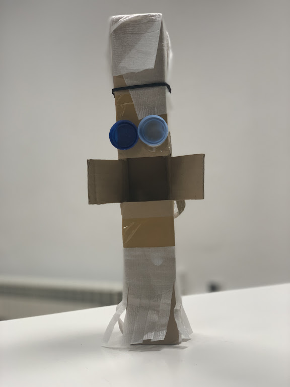
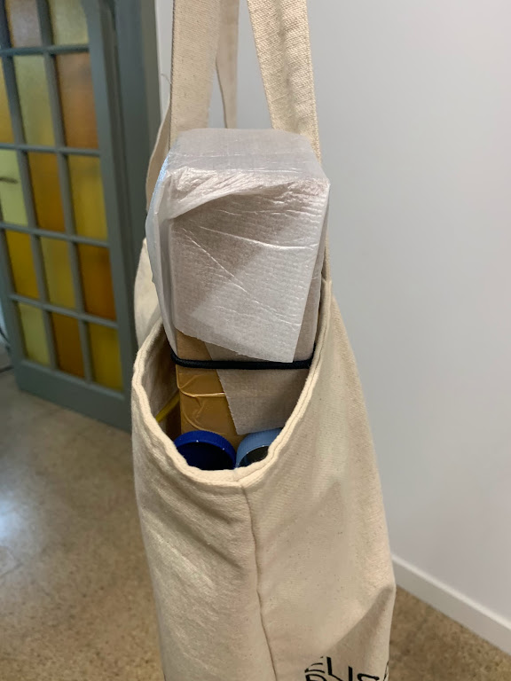

---
hide:
    - toc
---

# Living with your own ideas

## My (non-living) companion

**Family totem**
The “family totem” is my response to finding myself physically distanced from my family.

- **how will you live together?**
I will make a special shrine or dedicated space in my living room for it to be placed when I am not out and about. Whenever I leave my house, I will take it with me inside my purse but allowing for its eyes (2 bottle caps) to look into the outside world.
- **what does it notice?**
The family totem notices my emotions whenever I miss my family in Peru and can tune into them and distract me by asking me to “feed it”, “decorate it” or just stare at it while thinking of my loved ones.
- **what were you thinking?**
While building it I was thinking of a way to reconnect with my family. Initially I was planning on creating some sort of viewfinder that could allow me to browse through pictures of them, then it evolved into some sort of “doll” I could care for as a replacement. I now believe its more of a symbolic totem that I should place in a special place to honor their place in my life.
- **why does it matter?**
The family totem matters because it helped me reflect that rather than “replacing” who you miss it is best to honor the space they occupy while acknowledging the distance. I think the fact that the totem is big in size and not as portable is a good example of this reflection. Another reflection I had while building the totem is that adding eyes or an outfit to it allowed me to create a stronger emotional connection with it. If I focused on perceiving it as “cute”, it helped bring me joy and turn a negative emotion into something more positive or at least nostalgic in a constructive manner.

**Evaluation**

After spending a whole day with the family totem, I realized due to its size that it is very difficult to carry. It almost feels like a “weight” one needs to let go of to be able to handle daily tasks. This made me reflect how nostalgia or sadness sometimes needs its own space and time to not interrupt with daily life. It is also highly noticeable for others and seems more like something I would want to keep in a private and intimate space.

For the second half of the day, I dedicated a special space for the Totem in my living room. This seemed more suitable as I could devote dedicated minutes to staring at it and forcefully thinking of my family back in Peru. One quick reflection I had was related to private / public spaces and where the companion seems to accomplish its objective more meaningfully. Thinking about materiality, if I were to rebuild or iterate this prototype I would use something more durable and polished. Something I like about the Totem is that it allows you to reminisce in a more free and abstract manner without literally looking at a photograph, which at times can take you to a very specific time and place.

##First person perspective: Quantifying household chores

I wanted to explore a way to quantify household chores using time as a unit of measure while recording myself cleaning my apartment using the slowest mechanism possible (i.e. using a broom as opposed to a vacuum cleaner, hand washing dishes as opposed to using a dishwasher and hand washing my clothes as opposed to using a washing machine). I wanted to explore gender roles, considering that an unequal division of household chores between men and women usually contributes to gender inequality.

I was inspired by the 1920s boom in technology when vacuum cleaners and other time-saving electronic devices were invented as a means of empowering women and allowing them to enter the workforce. However, 100 years later women typically spend disproportionately more time on unpaid care work than men even though technology in the cleaning space is still going in the direction of time-saving and automation (such as Roombas). The trend of “Cleantoks” on TikTok is making visible the craft of cleaning while mostly women are sharing tips, tricks and hacks to make their homes as clean as possible.

I had doubts as to what I could learn from this experiment since these are tasks I mostly do spread out during an entire week and are not completely new to me. I think the process made me reflect on my cleaning process and how caring for your house can also be a political act. There is also value in quantifying the time and effort it requires to perform a task when looking at the potential of dividing chores equally among couples, roommates or families. Additionally, the act of recording yourself doing this task also makes it considerably more visible.

Some questions that emerged from this experiment: What does it mean to clean without technology today? How can cleaning without technology evidence the value and time involved in this type of unpaid labor? How can quantifying the time invested in cleaning help with distribution of household chores? How can we reinforce the value in cleaning and re define this "unpaid work"? How can we design public policies around unpaid labor if it isn't visible?

<iframe src="https://player.vimeo.com/video/767871701?h=29a153fd2a&amp;badge=0&amp;autopause=0&amp;player_id=0&amp;app_id=58479" frameborder="0" allow="autoplay; fullscreen; picture-in-picture" allowfullscreen style="position:absolute;top:0;left:0;width:100%;height:100%;" title="Jimena Salinas - Living with your own ideas - Division of household labor"></iframe>

