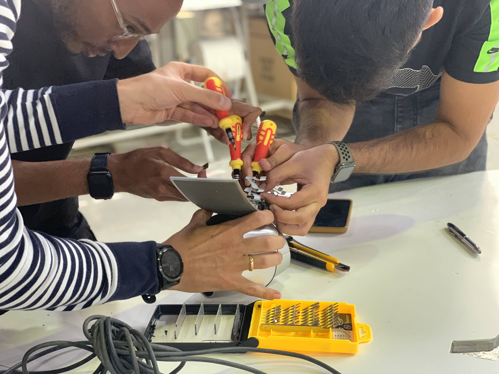

---
hide:
    - toc
---

# Tech beyond myth

## Forensic report

##Week 1

These past two weeks have been the most time consuming of the MDEF program but also the most hands-on. Our team “Eagle eyes” had to disassemble a video conference camera that tracks voice to follow participants in a physical space connected to a Zoom call. The device in itself is considerably a few years old. We forgot to test if the device itself worked because of the excitement of beginning to unscrew its components and seeing what was inside this specific “Black box”. We were very tempted to use a hammer and start breaking things apart but enjoyed the challenge of only using screwdrivers and disassembling it with patience and respecting the final form of each of its parts.

One of the highlights of the first week was learning that the individual components sold separately were much more expensive than buying the old video camera on eBay today. The camera had devalued itself considerably in only 5 years because of the low quality of the video camera. However it could be fixed to work perfectly and many of its parts were designed to be thrown out even if it could be designed as a device where the camera is replaced every couple of years to avoid waste creation and having to buy a completely new product. Another observation that stood out for me was that there were red Sharpie marks for labeling individual components inside the device. This gave us a clue that some part of the building of the device was fully manual and relied on man-made effort. The marks seemed to be hastily written down and I was surprised to learn that some part of its industrial assembly line involved humans having to manually label internal components inside the machine.

Link to original forensic report
https://hackmd.io/FGIM55OESi-aVK3K8WSJNw?view

## Week 2
During the second week we had to begin by tinkering with the components found inside the Eagle eyes. Our group had fun proposing ideas and letting our judgment go during this stage of the creative process. We brainstormed and ideated ideas as wild as a robotic frog, a cyclops and a zombie. One of the team’s successes was in quickly aligning on a concept and building on top of it during the week. We had to let go of the urge to design in a linear way and try to think of ways to make the product useful. Instead, we had playful fun while making our robot look as aesthetic as possible and making our pendulum swing in a way that would make the movement more exaggerated to simulate a “real hypnosis session.”

>blockquote
Our team was lucky in that it had 3 team members that had previous experience coding, using Arduino and setting up electronics. This meant that we could specialize in specific tasks to manage and distribute the use of time. While this also meant that there was little time for failure in the setting up of the electronics, I learned by observing attentively how my teammates used Arduino and played with the code to ensure the speed, pauses and movement were the correct ones for each of the artifacts we wanted to implement. One of the greatest challenges was in setting up the dependencies within our system. We wanted the pendulum and the robot to start moving at the same time as sound was detected in our sensing boards and this proved to be a challenge in the coding part.

Finally, I had a lot of fun stepping out of my comfort zone by tinkering with electronic materials, looking at which motors and sensors could be reused for other purposes and contributing by actively documenting the final presentation and leading the video creation with the help of my team’s creativity in script writing and voice over recording.

Our final presentation can be found here
<iframe src="https://docs.google.com/presentation/d/e/2PACX-1vTTQO_XSIxVUyx1t2SV1jZkZ3d_LaPaoD0acKGtcLQjWj1S_JzVHuQOAZpkNnTIJoewtk_96gw2rgTW/embed?start=false&loop=false&delayms=3000" frameborder="0" width="960" height="569" allowfullscreen="true" mozallowfullscreen="true" webkitallowfullscreen="true"></iframe>

Final promo video for our product (We had a lot of fun producing this one!)
<iframe width="640" height="360" src="https://www.youtube.com/embed/E9ExftAZnVA" title="Tech beyond Myth - Almost useless machine" frameborder="0" allow="accelerometer; autoplay; clipboard-write; encrypted-media; gyroscope; picture-in-picture" allowfullscreen></iframe>
