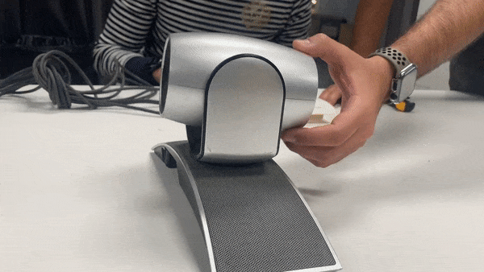

---
hide:
    - toc
---

# Community Engagement

## Reflections from learning from Holon

##Week 1

These past two weeks have been the most time consuming of the MDEF program but also the most hands-on. Our team “Eagle eyes” had to disassemble a video conference camera that tracks voice to follow participants in a physical space connected to a Zoom call. The device in itself is considerably a few years old. We forgot to test if the device itself worked because of the excitement of beginning to unscrew its components and seeing what was inside this specific “Black box”. We were very tempted to use a hammer and start breaking things apart but enjoyed the challenge of only using screwdrivers and disassembling it with patience and respecting the final form of each of its parts.

One of the highlights of the first week was learning that the individual components sold separately were much more expensive than buying the old video camera on eBay today. The camera had devalued itself considerably in only 5 years because of the low quality of the video camera. However it could be fixed to work perfectly and many of its parts were designed to be thrown out even if it could be designed as a device where the camera is replaced every couple of years to avoid waste creation and having to buy a completely new product. Another observation that stood out for me was that there were red Sharpie marks for labeling individual components inside the device. This gave us a clue that some part of the building of the device was fully manual and relied on man-made effort. The marks seemed to be hastily written down and I was surprised to learn that some part of its industrial assembly line involved humans having to manually label internal components inside the machine.
