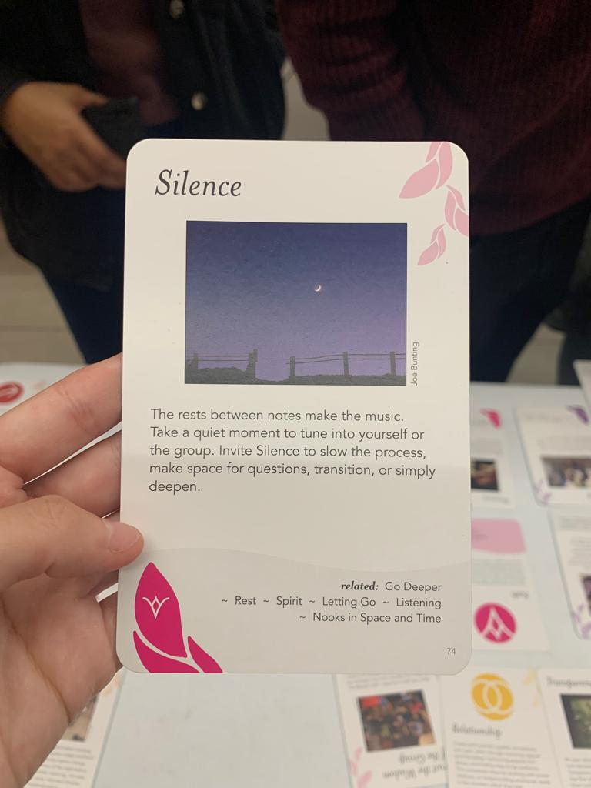
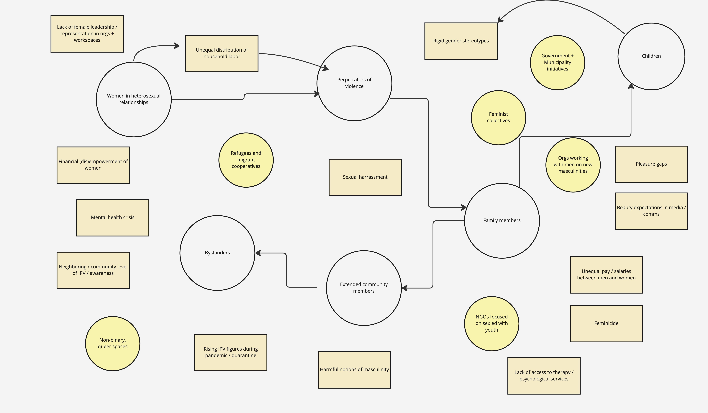

---
hide:
    - toc
---

# Community Engagement

## Mapping complex systems

This week we focused on understanding and mapping all the agents involved in complex systems to then ideate ways to intervene at a community level and co-design with all voices in one room. One of the highlights for me was getting to know the work of Donella H. Meadows and becoming familiar with visual ways to map systems, including the actors involved but also the root causes and other non-human elements that will inevitably shape the way a system functions.

We were provided with hands-on tools to set the stage when dealing with different stakeholders in the same room, each with their own hopes, fears and interests in relation to specific topics that are addressed. Another takeaway for me was that system maps do not attempt to be 100% comprehensive but rather a visual way to communicate complexity. This is why it is not necessary for them to be exhaustive.

> Another highlight for me was the introduction to the “Group work card decks”. I chose the “Silence” card when instructed to pick one that resonated most with ourselves at the moment. It reminded me of an advice I was once given by a Project Lead when doing design research. She told me that when interviewing users one should not rush to fulfill the interview guide as quickly as possible but to allow for silence since this is usually when users would give the most interesting reflective and even unexpected answers. I now want to feel comfortable with silence as a design tool and will think of ways to incorporate it in my next interventions as an ally.

##Visually mapping the complexity of my intervention

As an exercise for the class we attempted to map out the conflict related to our collective intervention and to our design space. I focused on school children (since this is the community I will first engage with) in relation to gender stereotypes, expectations and the possibility of domestic violence while also including other factors in the mix. The end result is depicted below.

This was my first draft. Although it appears very incomplete I felt it was extremely useful in identifying non-human influences that may be found in the ecosystem and also the ways elements interrelate between each other as I plan to initially engage with children but may later reach out to other types of communities.

Deep diving on the collective intervention and how it relates to the tools learned in community engagement with Holon and Milena, I have outlined the following diagram below. I plan on working with Ariel who is interested in climate change perception and we plan on integrating both a gender and a climate change perspective to our project.

---

##Double clicking on my intervention and potential nuances

- **Creative community:**
School children in Poblenou and Badalona.

- **Context:**
Gender stereotypes and ways to solve conflict are embedded and ingrained starting from childhood in family homes, schools, media and public places. We are planning on engaging with 6-9 year old school children in high complexity and low complexity schools to understand their perceptions in regards to gender roles and climate change.

- **Current situation:**
Schools are very eager to engage with students and designers that are willing to use new creative methods for class. This is a great opportunity for us to create a close collaboration with them. On the other hand, we are planning on co-creating future visions with the children themselves since they are the ones that will benefit from better and improved futures in regards to gender inclusiveness and gender equality.

- **Engagement and limits:**
For engaging with children, we plan on working closely with the teachers that already have the parents’ trust. We also plan to follow strict guidelines to protect the identity of the children in the shareback of the project such as blurring their faces and not mentioning their names or last names. We will also be very mindful of our use of cameras and focus on recording the outputs of the workshop rather than the children themselves.

- **Theory of change:**
Our theory of change is understanding the voice of children and their perceptions as active designers and co-creators. We will channel horizontality with them and give them the creative tools to design their own future visions. We believe that children are the protagonists of any future engagement and their point of view should be considered from the starting point of any intervention we plan on designing in the future. I also believe that addressing emotional regulation with children and demystifying stereotypes can also be a way to challenge perceptions that violence is an acceptable tool for solving conflict.

- **Design challenges:**
Some challenges that may emerge are linking the interventions with the content they are taught as part of their academic curriculum. If it is too detached from their day-to-day content we may lose engagement or retention since we can only intervene for a limited amount of time. Another challenge that may engage is related to the use of language in particular when talking about gender. It will be interesting to design ways to address these issues without directly talking about gender, i.e. emotional regulation, inclusion. It will be a challenge to also work with children in different age ranges and socioeconomic status because of varying levels of comprehension and literacy.

- **Design opportunities:**
There is a great opportunity in visualizing the results of the creative intervention with children and using a maker or creative centered approach. It will be also super rich to learn from the narratives and stories the children themselves propose. There is also an opportunity in designing for the teacher and having the teacher be a facilitator of the activity rather than a passive actor. Because of the creative nature of the intervention, there is an opportunity area to make a fanzine or a creative publication gathering the results of all of the children and seeing what comes out of this collective venture.
