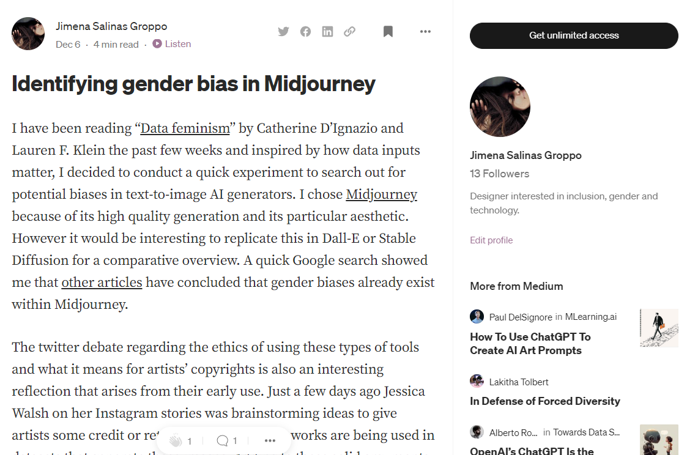

---
hide:
    - toc
---

# Extended Intelligences

## Demystifying Artificial Intelligence

The past two weeks we deep dived on the subject of Extended Intelligences and AI in order to demystify it. We began by deep diving on the subject of what is intelligence, looking at definitions as old as Ancient Greece and then linking those concepts back to the latest advancements in these types of technologies.

Since AI is built by man-made inputs such as datasets and humans making key decisions behind what is prioritized on those datasets and cleaning the data themselves, it is thus an imperfect product and we should not expect a “robotic” perfection from it. We should actually look for ways to help the AI achieve its end goal looking at mitigating risks for both humans and the environment. The myth that AI is a rational agent is founded upon the myth that robots and humans are at opposing ends of a spectrum. We don’t talk about humans as rational agents as thus we should not expect the same from our man-made technology.

Adding to this, AI is also built with intrinsic human biases that we should be on the active lookout for. We were recommended the book “Data feminism” (i) to reflect more on how biases can be found in both the datasets and inputs as well as the final AI solutions. Something I found interesting that already existed were datasets that included hate speech or microsexist aggressions in the workplace as a means to actively combat biases. (ii)

##Group Project - The Active Listener

One of the highlights for me was working as a group on designing an AI starting from the concept all the way to the inputs and datasets needed for its creation. Conceptually, it was interesting the questions the exercise itself raised. I particularly remember the example of a team tasked with designing a “pet companion” and questions that this would raise particularly cloud be: How do you design the personality for a dog? What is the personality of a dog? What are the visual signs of a dog’s personality? The categories of types of AI also helped organize my thoughts around it such as planners, recommenders or personal assistants such as Alexa.

My team worked on an Active Listener, an AI solution that allowed humans to feel heard by the device and offered empathy in response. It was interesting to me how it was more important to “simulate care and aid” rather than the machine actually comprehending and empathizing with the user or human using it. We want to feel heard just as much as we want to be heard.

Another interesting takeaway was the use of the text processor GPT3 that is built on neural networks. Me and Wen were interested in exploring uses of GPT3 as a means for healing in terms of mental health and also violent relationships, and this coincided with the construction of the Active Listener. Running fast experiments on Open AI’s playground, we learned that the tool is surprisingly good at emulating healthy communication barriers, acting empathetic and also being in tune with the user’s emotions. It was fun and also enlightening to play with the technology and datasets while outlining our plan for the Active Listener.

The use of Google Colaboratory, shown to us by Taller Estampa, was also a surprising find for me. The logic of working in cells and running the code on an online server showed me how powerful and also increasingly accessible AI is becoming.

Finally, I believe this week has been very enlightening for me. Me and Wen will run tests with real users to test our AI version of a bot that can connect people with their younger selves and people they no longer have access to. Personally, I also want to deep dive on Caroline Sinders’ work on feminist data sets and see if AI can be actively built to combat sexist biases. I did a quick experiment using Midjourney and wrote a Medium article about it [here](https://medium.com/@jimena.salinasg/identifying-gender-bias-in-midjourney-fcf36240f464).

**Our final presentation**
<iframe src="https://docs.google.com/presentation/d/e/2PACX-1vRQr30wQJBjok40yedHwd7v4k1wcYmMQBtwPsIW2RmZBMUaizxoVCf61k9eWNu8xDTV1T4ub7OezjQB/embed?start=false&loop=false&delayms=3000" frameborder="0" width="960" height="569" allowfullscreen="true" mozallowfullscreen="true" webkitallowfullscreen="true"></iframe>

You can read our in-depth written report [here](https://drive.google.com/file/d/1TSfpGsglDTGJIapHvofC5u5tArTlLwr2/view?usp=share_link).

**References:**

- (i) Data feminism https://mitpress.mit.edu/9780262044004/data-feminism/

- (ii) Sexist workplace statements dataset: https://www.kaggle.com/code/kerneler/starter-sexist-workplace-statements-a8e79cab-c/data
