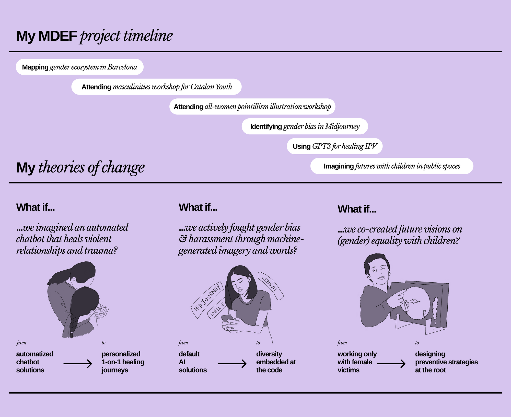
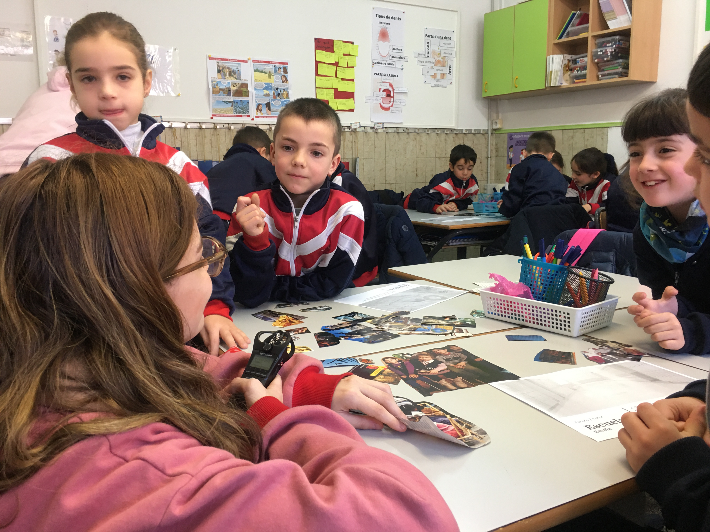
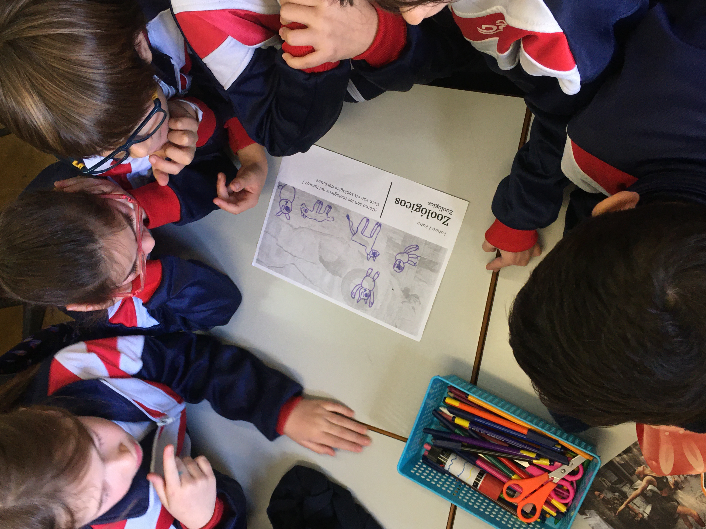
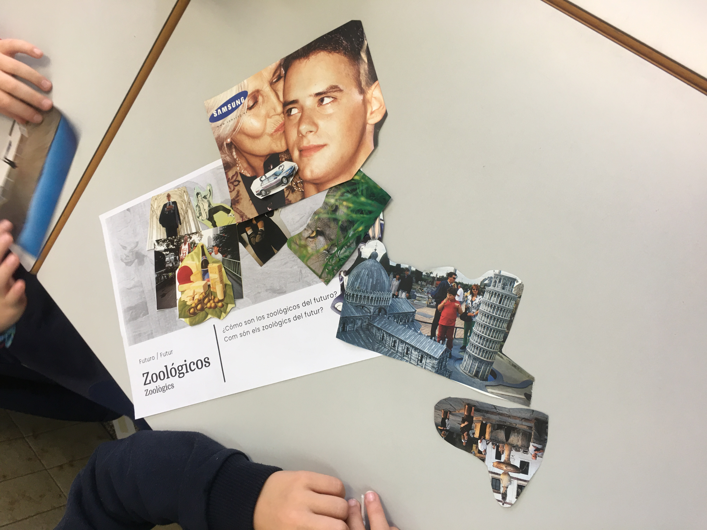
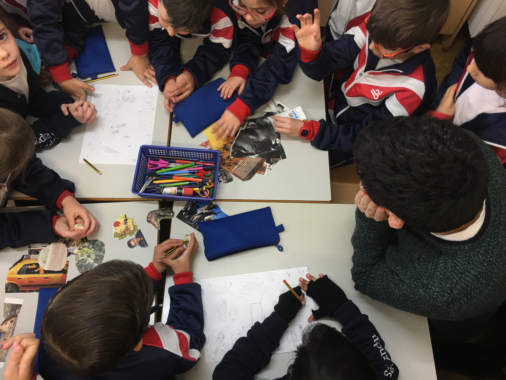
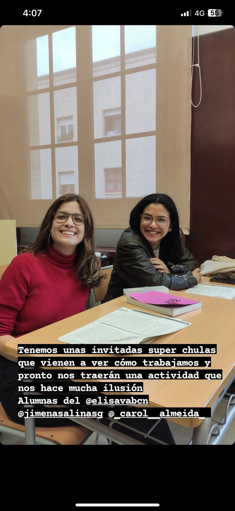
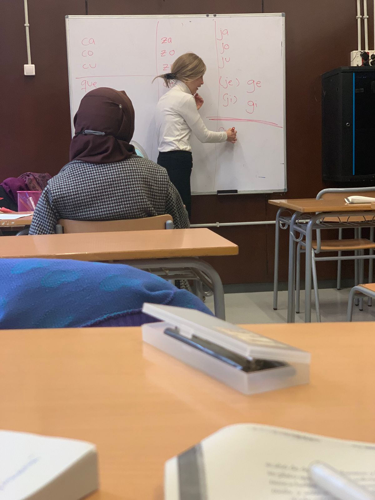
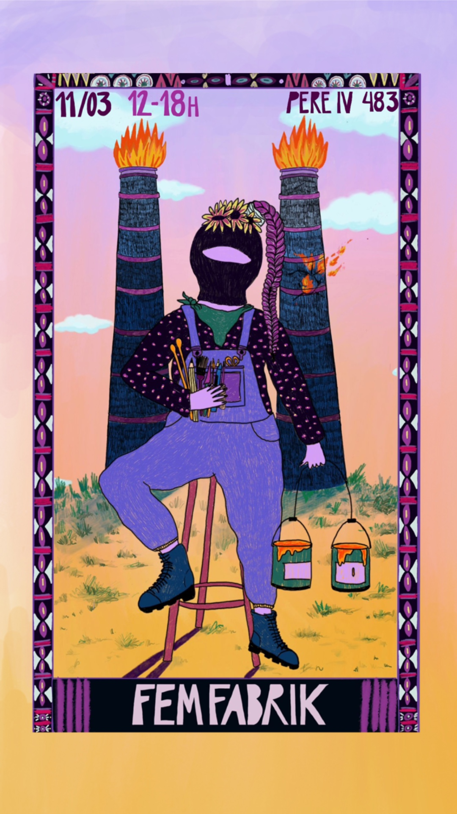
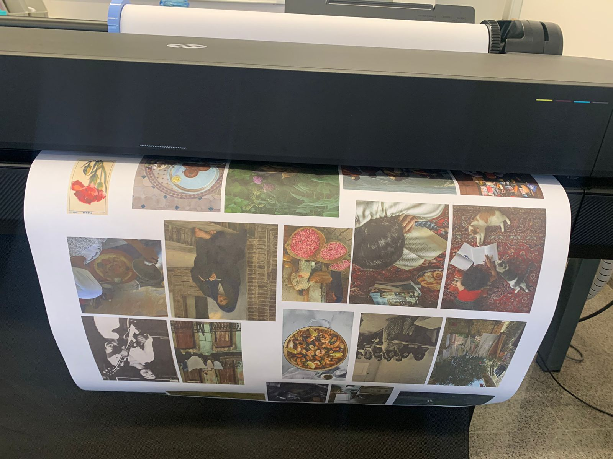

---
hide:
    - toc
---

# Design studio - Second Trimester

> Assignment: Reflect on your and your project’s current stage of development allowing your project to talk back. Analyze your so-called “failures” as opportunities for redefining your frames of reference and repositioning yourself and your project accordingly.

###How has my project evolved?

During the first trimester, I set out to map the gender / innovation / tech ecosystem in Barcelona, gather a community interested in deep diving on these subjects and conducting short and quick experiments both individually and collectively to identify connections both from a subject matter perspective to connecting with other peers in MDEF.

After the first trimester I had 3 theories of change I wanted to deep dive further in:

- **What if we imagined an automated chatbot that heals violent relationships and trauma?**
I learned that healing using GPT3 can sit within ethical borders and it is best to use this technology for actual conversations that will indeed happen in the future. ie. Helping someone practice for a break-up conversation, using chat as a means to teach people about non-violent communication.

- **What if we actively fought gender bias and harassment through machine generated imagery and words?**
For this one, I wrote a medium article and shared it on my newsletter. While I feel it is a great opportunity area, I feel generating feminist data sets will be a bit too time-consuming considering the time frames of the Master so will put this one on hold.

- **What if we co-created future visions on gender equality with children?** I will run a workshop with 75 9-year old children in a school in Badalona with Ariel and Wen. The objective is to use these imagined futures as a means to work towards those goals for the rest of my interventions.

###Arising opportunity areas:
These are 2 areas I will deep dive in this second trimester.

**What if we co-created future visions on ecofeminism with migrant women?** This can shift power balance, allow them to discover their voices and be an introduction towards developing a futures literacy muscle.

**What if we taught non-violent communication through micro digital stories for children?**

###New project goals

While I feel my areas of interest and weak signals have not changed, process-wise I am learning to flow more freely and let myself be swept away by potential collaborations that may emerge even if they don’t fit precisely into my original ideas. I also plan on using interventions as a way to gain insights rather than as a means to designing a final product or service.

The interventions for the following month are as follows:

- **Deep dive on collage-creation workshop with Ariel and Wen**
My intention in this intervention is to use the end results imagined by children as starting points for my experiments for a final project. What futures do children imagine in relation to gender equality and ecofeminism?

- **Intervention with Carolina on futures literacy with migrant women.**
We intend to give voice to women in vulnerable situations through a collage exercise to capture ancestral knowledge and think of ways of documenting beyond texts and verbal language.

- **Personal project - Online open-source glossary on gender-related terminology and/or micro digital storybooks to teach children Non-Violent Communication**

- **Personal project - AI chatbot to help men and women navigate difficult conversations**

Iteration of Innerbot (from first trimester) and content curated by a Non Violent Communication expert.

**Some scripts to explore for chatbot:**

- Rehearsing a couples’ negotiation

- Talking about couple finances

- Women asking for a raise

- Simulating a break up

- Helping fathers have healthy communication with their children

For pushing this project forward my next steps will be contacting Taller Estampa for technical help and playing with chat GPT3 to emulate the scenarios. After having an initial prototype, I will seek the aid of a Nonviolent Communication expert and a GBV expert.

## Intervention 1 Second Trimester- Imagining futures with children

###Workshop plan
We will do a school intervention with 75 9-year old children in Sant Andreu school in Badalona. The activity is divided into 3 classes of approx. 20 children (75 children in total). For us to implement this workshop we had to leverage the trust Xavi and Fab Lab team had already created with schools in Badalona and had to email the Principal and key coordinators for over 2 months. It is hard to schedule activities with children since they need to be integrated into key dates of the academic calendars.

###Co-creation process
For the co-creation process, we first built on the findings from the public parks interventions and design dialogues from Trimester I. Mariana gave us some insights and guidelines to approach the intervention in this second round.

We visited the school on Wednesday to co-create with the tutor and ask her relevant content questions, how the exercise fits with the regular curricula and what we can change to create more engagement with the children. We decided to ask children more specific questions - i.e. how do you imagine zoos of the future? or parks of the future? or schools of the future? or sports of the future? as opposed to a general “How do you imagine the future?” question. This specificity will help them be much more concrete with their answers which is rich input for us as designers.

As mentioned above, trust building with schools was done through Xavi’s Fab Lab network and took a couple of months to actually schedule the activity. Since schools have to provide a uniform experience for all children in one grade, we needed to replicate the activity with all 75 students and had to run a pretty big pilot. We decided to start off with only one class and then iterate the activity for the remaining 2 classes.

###1st intervention with 24 children

**Location:** Collegio Sant Andreu, Badalona
**Date:** January 20th, 2023
**Grade:** Second grade, primary schools
**Age:** 8-9 years old
**Class size:** 24 children

The workshop lasted 45 minutes. The teachers were very open to what we proposed and actually felt they couldn’t interrupt our session. Children were very happy and motivated by our presence. We documented photos, videos and voice recordings but were careful to take pictures of their individual faces because of child protection laws.

One thing we noticed we could improve was help teachers feel more involved with the activity. We felt that teachers felt they could take a break and rest from their busy schedules but were also very interested and curious of the content. Incorporating teachers more actively can be something we can improve later on.

In preparation for the activity, we designed a short presentation that would serve as an introduction (who we are, our backgrounds, where we come from and introduction to climate change and gender equality). You can check the attached presentation here with our group findings and you can hear some of their stories from this session here.

###Mapped improvements for next iterations:
- Show collage cutouts later since children are easily distracted. Once they saw the collage cut outs they stopped thinking of the futures and focused more on the images themselves.

- Spend a bit more time on introduction, asking them questions about the topic area and having a horizontal conversation.

- They are very young so they are more interested in animals than in humans.

- They do not comprehend very much gender inequality. It is a very complex subject for them so it would be best to talk about inclusion in general.

- Teachers are willing to do more activities with them and use innovative tools in their classes. This can also be an opportunity to onboard teachers on new tools and exercises.

- Teachers want to participate too! and design their futures. First teacher imagined a school with modular furniture that quickly transformed into different settings for diverse learning styles.

- Children are happy to help us imagine futures and enthusiastic about welcoming new people into their classrooms.

###Childrens’ imagined futures grouped thematically:
- **Parks:** New animal species. Animals, fruits and no cars so animals are not scared, vet in parks. Pokemons are part of parks.

- **Schools:** Poor children are fed in schools, bread to feed everyone in schools.

- **Zoos:** Punishing people that kill animals by making them go to jail, animal protection. No zoos, animals free to roam around. People in charge of animal rescue. Animals are trained to become stronger so we can live with wild animals and feed them, live with them without killing others. Where you can be friends with animals and they are not hunted.

- **Sports:** Each person chooses their uniform, their way to express themselves. In one same area all sports can be held in the same area, it can be transformed for different sports.

###Emerging insights from this first intervention:
- Better futures for children are more inclusive futures and non-humans are very included.

- Mindful of eating, nourishment, especially for poor children.

- Children imagine better futures in regards to inclusion more than inequality, ie. letting all animals be in a zoo, letting everyone participate in sports, no uniforms, letting everyone express themselves freely.

- Sidenote: Children associate “poor” people with racial diversity. Children have a hard time also reflecting on their own school experience and prefer to design for children from lower income families.

###My personal takeaways on how this intervention relates to emerging visions on gender equality:
Children have a hard time imagining gender equality since they are unaware of how society impacts human beings differently according to gender.
However children can imagine and imagine a world with more inclusion.
This looks like olympics and soccer matches for all ages and all genders, where uniform is a personal choice of expression.

###Some visions children imagined:

- Household tasks are distributed equally

- Interspecies schooling

- Housing for everyone

- Places of repair and healing in public spaces

This allows us to build a future where preservation and care are pillars in equality and inclusion.

> Some emerging results from our first iteration in Badalona below.

<iframe src="https://docs.google.com/presentation/d/e/2PACX-1vQiCsmH_SjnIBAuwOatagBR0MqHWonFWqyWF6EM-KWvRnaQn73rRRN2PPkVqKCn-PLY6PoCH4_r-PCO/embed?start=false&loop=false&delayms=3000" frameborder="0" width="960" height="569" allowfullscreen="true" mozallowfullscreen="true" webkitallowfullscreen="true"></iframe>

> Video with stories imagined by childrens

<iframe src="https://drive.google.com/file/d/1pZM9j4HIuR60JDaCzX0uBr50ZseyZjDQ/preview" width="640" height="480" allow="autoplay"></iframe>

- [PDF we shared with teachers to schedule the activity.](https://drive.google.com/file/d/15wzRoRQG4TzwFkWkO6J__ZdF39QAKUqz/view?usp=share_link)
- [Learnings from doing a first prototype in parks.](https://drive.google.com/file/d/1ftk1MGdBgBFSiJCTD-5RFohZCD5CJkSt/view?usp=share_link)

##2nd intervention with 50 children

**Location:** Collegio Sant Andreu, Badalona
**Date:** January 27th, 2023
**Grade:** Second grade, primary schools
**Age:** 8-9 years old
**Class size:** 50 children (2 classes)

The workshop will be almost identical with the previous one with some changes. The children will imagine future scenarios on topics related to climate change and gender equity. They will be making a collage of the future scenario in different settings, for example: future for the park, for the school, sports, etc. based on the theme we selected.

For this second iteration of intervention with children, we decided to not show the collage cut outs from the start and to let the children spend more time ideating and focusing on crafting more compelling stories. We allowed them to use color pencils and crayons and not to focus on using cut outs from magazines.

###This second iteration gave us the following results:
After we introduced the collage cut outs, no children used the cut outs anymore. We realized they were more distracting than adding to the experience. What you show at first is crucial for children since it is what they will focus their attention on.
Children spent more time collaborating and listening to their peers when they didn’t have distracting elements.

The end stories were more reflexive and of higher quality this time around. With the collage in the first iteration, they struggled incorporating all the elements and with no collages being shown, they could focus on their stories and adding details to the stories.
Question for future iterations: If we choose not to use collage anymore, what would be the minimum viable prompts we would need to give children for better stories and more engagement? Is the template with the backdrop enough or is there any other element we can incorporate that adds to the experience?

###Some insights from the second iteration:
- Content-wise, children are overall optimistic and positive about the future.

- Some emerging themes from this session:
Redistribution of wealth (ie. feeding the poor, free housing for the poor)
Inclusion (ie. Sports for all ages and all genders)
Freedom (ie. Abolishing zoos)
Diversity (ie. New species, interspecies schools)

- [Some emerging results from the second iteration in Badalona in the following link.](https://docs.google.com/presentation/d/1FiELWKOhSUin_vXvCO1yJs08Tfgk6alYPw7RD3eBG5M/mobilepresent?slide=id.g1fc3f272b64_0_5)

We received the feedback from faculty to make the workshop more participatory in the sense that children are given increased agency, new facilitation roles and we let go of control to see where the activity takes us and how this can influence their imagined futures. We will also talk to a school psychologist for a future iteration. Ask ourselves, how can this feel co-created rather than imposed?

## Second Trimester Intervention 2 - Exploring futures literacy with Mamás que leen

###Workshop plan
We started with the initial idea of using collage as a means to empower migrant women and explore futures literacy as a skillset that can be actively developed.

After feedback from Tomás we decided our engagement strategy would first be have casual conversations with potential communities and organizations and then see which ones are relevant to work with and to generate trust for greater horizontality in the intervention.

We decided to reach out to 3 communities:

- Open Cultural Center

- Mamás que leen

- Periferias cimarronas

After that process we picked the community that was most enthusiastic about collaborating with us: Mamás que leen.

[This document reflects our initial point of view on what the workshop would look like.](https://drive.google.com/file/d/1xbAi9UF0elX2lWGD4MFkiK3Dc90o0V8M/view?usp=sharing)

###Trust building - Attending classes before implementing the workshop

Me and Carolina went to Mamas que leen on January 24th to meet Karin the founder, get to know the classes and the location. We left feeling super inspired and they offered 2 1-hour sessions for us to conduct the ecofeminism collage intervention.

Some highlights and first impressions from this first visit:

- The female environment of women teaching women and supporting each other.

- The huge stigma migration is in Europe and how aggressive it is and how it impacts these women.

- Their relation to nature before and after migration.

- The financial struggles of the organization as they seek support from ayuntamiento but receive little funding because Spanish is the language being taught (not Catalan).

- Latin American women offering themselves as volunteers (from Chile, Peru, Mexico).
Potential of future literacy and collage being a third / fourth / fifth language in the room.

- We are happy that Tomás advised us to first blend in and get to know the group. We plan on attending a couple of lessons before implementing the workshop.

- Frugality.

- Their lack of knowledge on geography is an opportunity for us to also print maps of their countries (Bangladesh, Morocco and Pakistan).

- Karin, the founder, suggested we incorporate a vision board so they can reflect about their dreams, goals and hopes.

###First class we attended at Mamas que Leen - 3rd February

*Diary entry:*
>“I went to Mamas que Leen with Carolina. We arrived a bit late and there were only 3 students, Karin and 1 volunteer in the class. They mentioned that there were many students missing because their children had fallen sick with the flu. They were reading a short story as a group with Karin and then Karin gave us a fun game with rolling dice to co-create stories as a group. It felt nice just to spend time with them, getting to know them and them familiarizing with us. We still need to think about the workshop itself, but I am learning that building confidence is just as important for these types of interventions.”

###Second class we attended at Mamas que Leen - 7th February

*Diary entry:*
>“We arrived on time this time and introduced ourselves to the whole group. They were reading a short story collectively and I was surprised by the trust and humor of the environment. Karin is very good at asking questions and getting the women interested in the texts they are reading.”

###Applying to Fem Fabrik
We co-created a workshop with Carolina and are applying to Fem Fabrik in La Clandestina to see if we can showcase the end result of our workshop with Mamas que leen in a full-day event held for women artists on Saturday 11th of March.

Our shift in the workshop design is to use inputs from female poets that also allude to nature and use that as a starting point to discuss ecofeminism. We chose this because we feel this is a less academic point of view and we can use the poems as an input to highlight keywords and co-create a collective map for the second session.

We were selected to Fem Fabrik but were asked to clarify a bit more our intentions. We will be given a 1x1 exhibit space and we are thinking of adapting the format of the fanzine to fit the vertical space we have been assigned. We also need to verify with Karin, founder of Mamás que leen, if our participation is ok by her.

###Workshop prep
We made collaborative Google Slides files to crowdsource images for the collage then prepared the file for printing at Elisava. We used bond paper and tried to align aesthetically all the images while allowing for randomness in the content area to emerge. We also curated 5 different poems from female authors that would be talking points to start discussing ecofeminism.

We sent our workshop structure to Karin via email to gather her reactions. You can read the workshop structure here.

