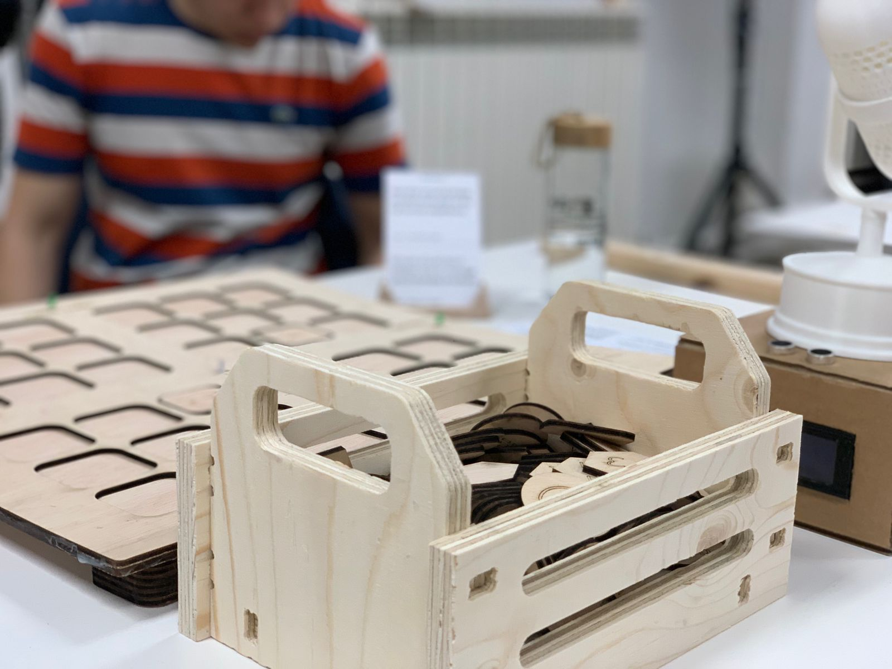
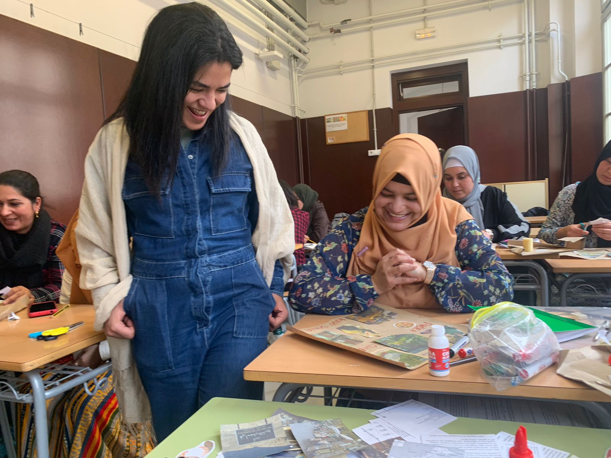
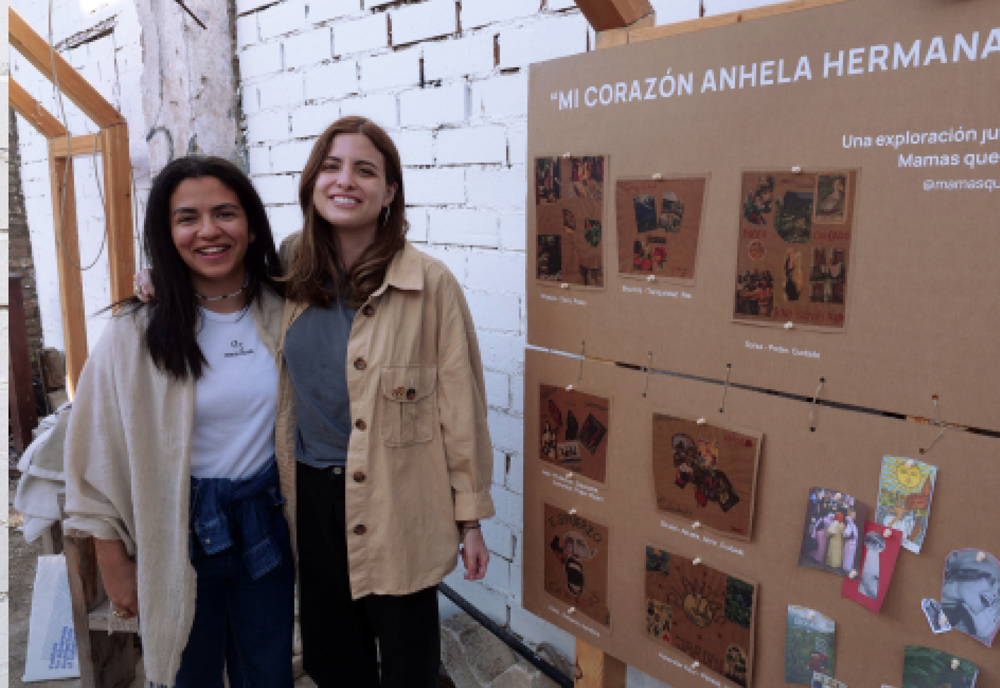
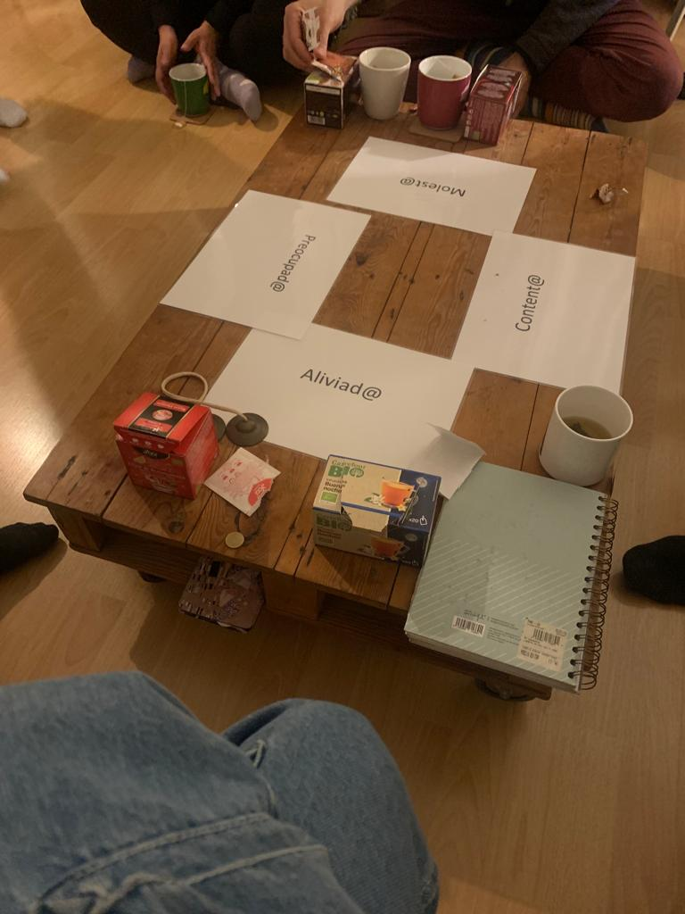

---
hide:
    - toc
---

# Design studio - Second Trimester

> Assignment: Reflect on your and your project’s current stage of development allowing your project to talk back. Analyze your so-called “failures” as opportunities for redefining your frames of reference and repositioning yourself and your project accordingly.

###How has my project evolved?

During the first trimester, I set out to map the gender / innovation / tech ecosystem in Barcelona, gather a community interested in deep diving on these subjects and conducting short and quick experiments both individually and collectively to identify connections both from a subject matter perspective to connecting with other peers in MDEF.

After the first trimester I had 3 theories of change I wanted to deep dive further in:

- **What if we imagined an automated chatbot that heals violent relationships and trauma?**
I learned that healing using GPT3 can sit within ethical borders and it is best to use this technology for actual conversations that will indeed happen in the future. ie. Helping someone practice for a break-up conversation, using chat as a means to teach people about non-violent communication.

- **What if we actively fought gender bias and harassment through machine generated imagery and words?**
For this one, I wrote a medium article and shared it on my newsletter. While I feel it is a great opportunity area, I feel generating feminist data sets will be a bit too time-consuming considering the time frames of the Master so will put this one on hold.

- **What if we co-created future visions on gender equality with children?** I will run a workshop with 75 9-year old children in a school in Badalona with Ariel and Wen. The objective is to use these imagined futures as a means to work towards those goals for the rest of my interventions.

###Arising opportunity areas:
These are 2 areas I will deep dive in this second trimester.

**What if we co-created future visions on ecofeminism with migrant women?** This can shift power balance, allow them to discover their voices and be an introduction towards developing a futures literacy muscle.

**What if we taught non-violent communication through micro digital stories for children?**

###New project goals

While I feel my areas of interest and weak signals have not changed, process-wise I am learning to flow more freely and let myself be swept away by potential collaborations that may emerge even if they don’t fit precisely into my original ideas. I also plan on using interventions as a way to gain insights rather than as a means to designing a final product or service.

The interventions for the following month are as follows:

- **Deep dive on collage-creation workshop with Ariel and Wen**
My intention in this intervention is to use the end results imagined by children as starting points for my experiments for a final project. What futures do children imagine in relation to gender equality and ecofeminism?

- **Intervention with Carolina on futures literacy with migrant women.**
We intend to give voice to women in vulnerable situations through a collage exercise to capture ancestral knowledge and think of ways of documenting beyond texts and verbal language.

- **Personal project - Online open-source glossary on gender-related terminology and/or micro digital storybooks to teach children Non-Violent Communication**

- **Personal project - AI chatbot to help men and women navigate difficult conversations**

Iteration of Innerbot (from first trimester) and content curated by a Non Violent Communication expert.

**Some scripts to explore for chatbot:**

- Rehearsing a couples’ negotiation

- Talking about couple finances

- Women asking for a raise

- Simulating a break up

- Helping fathers have healthy communication with their children

For pushing this project forward my next steps will be contacting Taller Estampa for technical help and playing with chat GPT3 to emulate the scenarios. After having an initial prototype, I will seek the aid of a Nonviolent Communication expert and a GBV expert.

## Intervention 1 Second Trimester- Imagining futures with children

###Workshop plan
We will do a school intervention with 75 9-year old children in Sant Andreu school in Badalona. The activity is divided into 3 classes of approx. 20 children (75 children in total). For us to implement this workshop we had to leverage the trust Xavi and Fab Lab team had already created with schools in Badalona and had to email the Principal and key coordinators for over 2 months. It is hard to schedule activities with children since they need to be integrated into key dates of the academic calendars.

###Co-creation process
For the co-creation process, we first built on the findings from the public parks interventions and design dialogues from Trimester I. Mariana gave us some insights and guidelines to approach the intervention in this second round.

We visited the school on Wednesday to co-create with the tutor and ask her relevant content questions, how the exercise fits with the regular curricula and what we can change to create more engagement with the children. We decided to ask children more specific questions - i.e. how do you imagine zoos of the future? or parks of the future? or schools of the future? or sports of the future? as opposed to a general “How do you imagine the future?” question. This specificity will help them be much more concrete with their answers which is rich input for us as designers.

As mentioned above, trust building with schools was done through Xavi’s Fab Lab network and took a couple of months to actually schedule the activity. Since schools have to provide a uniform experience for all children in one grade, we needed to replicate the activity with all 75 students and had to run a pretty big pilot. We decided to start off with only one class and then iterate the activity for the remaining 2 classes.

###1st intervention with 24 children

**Location:** Collegio Sant Andreu, Badalona
**Date:** January 20th, 2023
**Grade:** Second grade, primary schools
**Age:** 8-9 years old
**Class size:** 24 children

The workshop lasted 45 minutes. The teachers were very open to what we proposed and actually felt they couldn’t interrupt our session. Children were very happy and motivated by our presence. We documented photos, videos and voice recordings but were careful to take pictures of their individual faces because of child protection laws.

One thing we noticed we could improve was help teachers feel more involved with the activity. We felt that teachers felt they could take a break and rest from their busy schedules but were also very interested and curious of the content. Incorporating teachers more actively can be something we can improve later on.

In preparation for the activity, we designed a short presentation that would serve as an introduction (who we are, our backgrounds, where we come from and introduction to climate change and gender equality).

- [You can check the attached presentation here with our group findings](https://docs.google.com/presentation/d/1Hkj7H9bcod0-XRHAT7gP9X1Z5cYaU7jsKe10Cn9XK0s/edit?usp=sharing)

- [You can hear some of their stories from this session here.](https://drive.google.com/file/d/1pZM9j4HIuR60JDaCzX0uBr50ZseyZjDQ/view)

###Mapped improvements for next iterations:
- Show collage cutouts later since children are easily distracted. Once they saw the collage cut outs they stopped thinking of the futures and focused more on the images themselves.

- Spend a bit more time on introduction, asking them questions about the topic area and having a horizontal conversation.

- They are very young so they are more interested in animals than in humans.

- They do not comprehend very much gender inequality. It is a very complex subject for them so it would be best to talk about inclusion in general.

- Teachers are willing to do more activities with them and use innovative tools in their classes. This can also be an opportunity to onboard teachers on new tools and exercises.

- Teachers want to participate too! and design their futures. First teacher imagined a school with modular furniture that quickly transformed into different settings for diverse learning styles.

- Children are happy to help us imagine futures and enthusiastic about welcoming new people into their classrooms.

###Childrens’ imagined futures grouped thematically:
- **Parks:** New animal species. Animals, fruits and no cars so animals are not scared, vet in parks. Pokemons are part of parks.

- **Schools:** Poor children are fed in schools, bread to feed everyone in schools.

- **Zoos:** Punishing people that kill animals by making them go to jail, animal protection. No zoos, animals free to roam around. People in charge of animal rescue. Animals are trained to become stronger so we can live with wild animals and feed them, live with them without killing others. Where you can be friends with animals and they are not hunted.

- **Sports:** Each person chooses their uniform, their way to express themselves. In one same area all sports can be held in the same area, it can be transformed for different sports.

###Emerging insights from this first intervention:
- Better futures for children are more inclusive futures and non-humans are very included.

- Mindful of eating, nourishment, especially for poor children.

- Children imagine better futures in regards to inclusion more than inequality, ie. letting all animals be in a zoo, letting everyone participate in sports, no uniforms, letting everyone express themselves freely.

- Sidenote: Children associate “poor” people with racial diversity. Children have a hard time also reflecting on their own school experience and prefer to design for children from lower income families.

###My personal takeaways on how this intervention relates to emerging visions on gender equality:
Children have a hard time imagining gender equality since they are unaware of how society impacts human beings differently according to gender.
However children can imagine and imagine a world with more inclusion.
This looks like olympics and soccer matches for all ages and all genders, where uniform is a personal choice of expression.

###Some visions children imagined:

- Household tasks are distributed equally

- Interspecies schooling

- Housing for everyone

- Places of repair and healing in public spaces

This allows us to build a future where preservation and care are pillars in equality and inclusion.

> Some emerging results from our first iteration in Badalona below.

<iframe src="https://docs.google.com/presentation/d/e/2PACX-1vQiCsmH_SjnIBAuwOatagBR0MqHWonFWqyWF6EM-KWvRnaQn73rRRN2PPkVqKCn-PLY6PoCH4_r-PCO/embed?start=false&loop=false&delayms=3000" frameborder="0" width="960" height="569" allowfullscreen="true" mozallowfullscreen="true" webkitallowfullscreen="true"></iframe>

> Video with stories imagined by childrens

<iframe src="https://drive.google.com/file/d/1pZM9j4HIuR60JDaCzX0uBr50ZseyZjDQ/preview" width="640" height="480" allow="autoplay"></iframe>

- [PDF we shared with teachers to schedule the activity.](https://drive.google.com/file/d/15wzRoRQG4TzwFkWkO6J__ZdF39QAKUqz/view?usp=share_link)
- [Learnings from doing a first prototype in parks.](https://drive.google.com/file/d/1ftk1MGdBgBFSiJCTD-5RFohZCD5CJkSt/view?usp=share_link)

###2nd intervention with 50 children

**Location:** Collegio Sant Andreu, Badalona
**Date:** January 27th, 2023
**Grade:** Second grade, primary schools
**Age:** 8-9 years old
**Class size:** 50 children (2 classes)

The workshop will be almost identical with the previous one with some changes. The children will imagine future scenarios on topics related to climate change and gender equity. They will be making a collage of the future scenario in different settings, for example: future for the park, for the school, sports, etc. based on the theme we selected.

For this second iteration of intervention with children, we decided to not show the collage cut outs from the start and to let the children spend more time ideating and focusing on crafting more compelling stories. We allowed them to use color pencils and crayons and not to focus on using cut outs from magazines.

###This second iteration gave us the following results:
After we introduced the collage cut outs, no children used the cut outs anymore. We realized they were more distracting than adding to the experience. What you show at first is crucial for children since it is what they will focus their attention on.
Children spent more time collaborating and listening to their peers when they didn’t have distracting elements.

The end stories were more reflexive and of higher quality this time around. With the collage in the first iteration, they struggled incorporating all the elements and with no collages being shown, they could focus on their stories and adding details to the stories.

Question for future iterations: If we choose not to use collage anymore, what would be the minimum viable prompts we would need to give children for better stories and more engagement? Is the template with the backdrop enough or is there any other element we can incorporate that adds to the experience?

###Some insights from the second iteration:
- Content-wise, children are overall optimistic and positive about the future.

- Some emerging themes from this session:
Redistribution of wealth (ie. feeding the poor, free housing for the poor)
Inclusion (ie. Sports for all ages and all genders)
Freedom (ie. Abolishing zoos)
Diversity (ie. New species, interspecies schools)

- [Some emerging results from the second iteration in Badalona in the following link.](https://docs.google.com/presentation/d/1FiELWKOhSUin_vXvCO1yJs08Tfgk6alYPw7RD3eBG5M/mobilepresent?slide=id.g1fc3f272b64_0_5)

We received the feedback from faculty to make the workshop more participatory in the sense that children are given increased agency, new facilitation roles and we let go of control to see where the activity takes us and how this can influence their imagined futures. We will also talk to a school psychologist for a future iteration. Ask ourselves, how can this feel co-created rather than imposed?

###Perception Board (developed during First Fab Lab Challenge)
This week I worked with Ariel and Wen to develop a physical product that would allow us to engage with children’s perceptions in relation to 3 different fields: climate change, gender equality and mental health. We were inspired by analog data visualizations and an exercise we did with Holon during the Community Engagement week where we had to physically move our body along an x and y spectrum to show how we felt in regards to certain topics.

We decided to go big on format to make it more accessible for children and to include emojis as a way to also start destigmatizing emotions.

One of the highlights for me was how fast we aligned on the subject matter and concept of the proposal. As early feedback we were suggested to incorporate electronics to our product that would be fabricated mostly using laser cutting. We used the first day to brainstorm some ideas that would not be time consuming and would above all be very meaningful for both the product and the facilitation behind it.

We will test the product with the school we previously worked with but this time with older children since the exercise requires more cognitive skills and debate capabilities from them.

One of the highlights for me was how fast we aligned on the subject matter and concept of the proposal. As early feedback we were suggested to incorporate electronics to our product that would be fabricated mostly using laser cutting. We used the first day to brainstorm some ideas that would not be time consuming and would above all be very meaningful for both the product and the facilitation behind it.

We will test the product with the school we previously worked with but this time with older children since the exercise requires more cognitive skills and debate capabilities from them.

**Some learnings that emerged from this week:**

- Electronics require a lot of time and that should be reflected on the planning side of managing time. Colored LED lights also use different resistors and when lighting up many LEDs on one same product the amount of power is something to take into account.

- When making different prototypes, take notes of changes in materials, design files and extra pieces you will need for next time or round of iteration. For instance, by making the cardboard design we realized we need a card holder to place all the cards inside, some way to transport the board to schools and a taller structure to hide the Arduino set up from children. We also want to explore using LED strips as opposed to LED bulbs.

- Laser cutting is also very time-sensitive. Make sure that happens earlier on you work flow because laser cutting two wooden boards can take over an hour between cutting time and setting up the file time.

- Early alignment is key. Had we not aligned on Tuesday on the output and key concept we would not have had time to fail early building the actual product and iterating.

I am looking forward to using our Perception board with teenagers and seeing how this project can also evolve in designing DIY tools for teachers to facilitate participatory processes with children and teenagers. These types of tools can be easily scaled to schools and taught to teachers to implement in classrooms. We hope this can be a low-tech analog way of fighting back filter bubbles in digital social media, allowing and welcoming difference of thought.

### Incorporating a Speaker Mic to the Perception Board
This week I worked with Wen and Ariel on designing a complementary product that would amplify the experience of using our Perception Board. While we haven't had the time and space to test with school students, we still wanted to iterate on the experience to test with both teachers and students during the Third Trimester.

For this challenge, we had to incorporate 3D printing, CNC and sensors. This is why we designed a **Speaker Mic** that would have the objective of helping define who speaks during a classroom session and can design a small ritual around that moment.

Some learnings during this challenge listed below:

- **Fabrication processes take a lot of time and efficient time planning is mandatory.** During challenges and when working with time constraints, it is best to align fast and then iterate and add more complex systems to the design. Only the 3D printing took over 18 hours.

- **While most processes are digitally fabricated, manual work is very important for incorporating systems and to make sure final adjustments are done correctly.** We had to sand manually, put nails on the 3D printed microphone and make a cardboard box by hand to make sure everything worked correctly at the end.

- **Testing with users the final system is equally as important**. While these production weeks focused on fabrication help us design the system, it is also important to go back to our communities and test the product and system with them. We are planning on going back to classrooms to test both the perception board and our speaker mics.

- **Incorporate electronics meaningfully.** While we can be very drawn to using electronics playfully and introducing a lot of sensors, we chose to make the interaction as simple as possible. This is because using the board in itself is quite complex for  children and electronics should help them understand what action is required from them.

- **Building fast allows you to gain a full picture of the system** We were happy to see how our Board was nicely integrated at the end with all the elements. This weeks allow us to move forward and not think too much on the design. This I feel was good because it helped us think of the system as a whole and integrating it with the user experience as fast as possible. One of the feedback we received from Santi was that our classmates gathered around when we showed our artifact which we can take as a positive signal that high school students might be equally as engaged.

[Project repo](https://github.com/jimenasalinasgroppo/microchallenge-02)

###Design Dialogues Term 2
I used the Design Dialogues space during March 22nd as a way to gather feedback primarily on the Perception Board and the Speaker Mic. Overall we were prompted to go test with students because while we may be receiving helpful suggestions, we will never know how they react to the product until we test it out on a classroom. Some of the feedback we received listed below:

- Circularity and sustainability are topics teachers want and need to address in today’s classroom

- Try product with smaller groups (max. 10 students)

- The future is fluid so make sure prompts are flexible and do not reflect a particular political point of view

- Maybe think of narratives rather than solutions

- Pointers may be personalized by the children themselves before using them

- How do we incorporate principles of Non Violent Communication into the process of using the tools we designed? i.e.  Respect everyone’s turn

- Explore “urgent” and “relevant” as dimensions for the board

- Change the design of the board to make it more transport-friendly (i.e. foldable Monopoly board)

## Intervention 2 Second Trimester - Exploring futures literacy with Mamás que leen

###Workshop plan
We started with the initial idea of using collage as a means to empower migrant women and explore futures literacy as a skillset that can be actively developed.

After feedback from Tomás we decided our engagement strategy would first be have casual conversations with potential communities and organizations and then see which ones are relevant to work with and to generate trust for greater horizontality in the intervention.

We decided to reach out to 3 communities:

- Open Cultural Center

- Mamás que leen

- Periferias cimarronas

After that process we picked the community that was most enthusiastic about collaborating with us: Mamás que leen.

[This document reflects our initial point of view on what the workshop would look like.](https://drive.google.com/file/d/1xbAi9UF0elX2lWGD4MFkiK3Dc90o0V8M/view?usp=sharing)

###Trust building - Attending classes before implementing the workshop

Me and Carolina went to Mamas que leen on January 24th to meet Karin the founder, get to know the classes and the location. We left feeling super inspired and they offered 2 1-hour sessions for us to conduct the ecofeminism collage intervention.

Some highlights and first impressions from this first visit:

- The female environment of women teaching women and supporting each other.

- The huge stigma migration is in Europe and how aggressive it is and how it impacts these women.

- Their relation to nature before and after migration.

- The financial struggles of the organization as they seek support from ayuntamiento but receive little funding because Spanish is the language being taught (not Catalan).

- Latin American women offering themselves as volunteers (from Chile, Peru, Mexico).
Potential of future literacy and collage being a third / fourth / fifth language in the room.

- We are happy that Tomás advised us to first blend in and get to know the group. We plan on attending a couple of lessons before implementing the workshop.

- Frugality.

- Their lack of knowledge on geography is an opportunity for us to also print maps of their countries (Bangladesh, Morocco and Pakistan).

- Karin, the founder, suggested we incorporate a vision board so they can reflect about their dreams, goals and hopes.

###First class we attended at Mamas que Leen - 3rd February

*Diary entry:*
>“I went to Mamas que Leen with Carolina. We arrived a bit late and there were only 3 students, Karin and 1 volunteer in the class. They mentioned that there were many students missing because their children had fallen sick with the flu. They were reading a short story as a group with Karin and then Karin gave us a fun game with rolling dice to co-create stories as a group. It felt nice just to spend time with them, getting to know them and them familiarizing with us. We still need to think about the workshop itself, but I am learning that building confidence is just as important for these types of interventions.”

###Second class we attended at Mamas que Leen - 7th February

*Diary entry:*
>“We arrived on time this time and introduced ourselves to the whole group. They were reading a short story collectively and I was surprised by the trust and humor of the environment. Karin is very good at asking questions and getting the women interested in the texts they are reading.”

###Applying to Fem Fabrik
We co-created a workshop with Carolina and are applying to Fem Fabrik in La Clandestina to see if we can showcase the end result of our workshop with Mamas que leen in a full-day event held for women artists on Saturday 11th of March.

Our shift in the workshop design is to use inputs from female poets that also allude to nature and use that as a starting point to discuss ecofeminism. We chose this because we feel this is a less academic point of view and we can use the poems as an input to highlight keywords and co-create a collective map for the second session.

We were selected to Fem Fabrik but were asked to clarify a bit more our intentions. We will be given a 1x1 exhibit space and we are thinking of adapting the format of the fanzine to fit the vertical space we have been assigned. We also need to verify with Karin, founder of Mamás que leen, if our participation is ok by her.

###Workshop prep
We made collaborative Google Slides files to crowdsource images for the collage then prepared the file for printing at Elisava. We used bond paper and tried to align aesthetically all the images while allowing for randomness in the content area to emerge. We also curated 5 different poems from female authors that would be talking points to start discussing ecofeminism.

We sent our workshop structure to Karin via email to gather her reactions. You can read the workshop structure here.

[This document reflects our workshop structure.](https://docs.google.com/document/d/1gp5axbDmoieLNq_LkXEXzMSlXDVORx4qOH6loN1W1M0/edit?usp=sharing)

###Workshop - 2 sessions

**Workshop day 1 - February 23rd**

**Participants:** 9 women

2 volunteers + Karin (Javiera and Maria Jose)

We held the first session of the 2-day workshop today. We used the session to build trust and introduce the subject matter on ecofeminism. The session involved introducing the them then reading out loud 4 different poems from The Intersectional Environmentalist, Rupi Kaur and Maya Angelou. There was some area for improvement and some highlights listed below.

**Highlights:**

- It was great to build on existing behaviors, such as reading texts out loud

- Showing vulnerability ourselves and personal stories is key to creating a safe space.

- Building trust to later ask them to write words on their own maternal tongues was also important.

- Creating poems that are short and easy to understand is key.

- Karin’s role is vital. She already has trust with them and can dig deeper or get them to participate more.

- There were some very deep discussions around etymologies of words, such as “capullo” or “kaur”. Everyone sharing how they say specific words in their own maternal tongue was also a special moment in the dynamic.

- They’ve never done collage before so they are looking forward to the crafts moment.

One personal learning for me was to not over plan the actual workshop and allow for improvisation and for things not being perfect. While this is our first collage intervention we still have time to do a different version with the same community and they are not expecting perfection out of our workshop with them. They are valuing the time and effort we are investing in them and the possibility of learning a new craft and that is something we should honor.

**Improvements:**

- Space arrangement. We did not have the time or freedom to make a circular space.

- Asking them how they are feeling didn’t work because of the space arrangement and also felt forced.

- We could’ve explained what is a collage earlier on for greater clarity.

- We needed to print more copies of the poems so they could take home.

Tomorrow I am looking forward to getting our hands dirty and making the collages.

**24th February Second day collage creation**

**Workshop day 2 - February 24th**

**Participants:** 6 women

1 volunteer

Today was the second day of the collage creation workshop at Mamás que Leen. We felt much more confident and less nervous this second time even though we had a few material constraints (forgot to bring more scissors, didn’t cut the paper that we were using as base previously). The women also felt much more comfortable participating (one chose to carry on learning Spanish) and the other 6 attendants joined the collage creation. None of them had ever done a collage before and it felt like the appropriate art technique to imagine futures and relations with words. Each woman picked a set of 2 words from the poems we had read out loud the previous day. Some word combinations that were chosen “tranquilidad + calma”, “poder + cuidado”, “abuelos amor”.

Carolina spoke a blend of Portuguese + Spanish and to me that also set the perfect tone since we wanted to create a space of vulnerability, showing how we are all migrants in Spain and how we are all here to learn. We struggled with the space setting since we didn’t want to be placed in a hierarchically higher position than them. Quite the contrary, we wanted to learn from them and hear what they had to say.

They started cutting some of the images they picked and with very little needed guidance they each made their own collage. It was beautiful to see their creations. They also were very happy to learn that we would scan them and place the collages in a fanzine.

These are the words each participant chose:

- Karin (fundadora) - Esfuerzo, cambios

- Khadiza - Tierra, poder

- Souad - Abuela, ciudado, amor

- Lina - Poder, Protección, Placer, Capacidad, Comenzar, Poder

- Kazi Sonia Alam - Poder, Cuidado

- Kulwinder Kaur - Plantas y jardín

- Bouchra - tranquilidad y paz

[Materials we printed and used](https://docs.google.com/presentation/d/1ajoNcLoOjwBly_cq1mJWg2CRuoH_6qn41NJln3d8HXY/edit?usp=sharing)

[Documented audio files from both days.](https://drive.google.com/drive/folders/1jg9AJ1SIIFjpF2CnD4D3k0jryACqunLk?usp=share_link)

Karin the founder gave us tulips as a gift for doing the workshop and each participant wrote out our names in their mother tongue. We honestly felt so grateful and that we were receiving much more than we were giving to them. For me it was one of those moments were I felt blessed to be part of something and that I would be willing to repeat this activity even if I were not part of MDEF.

When we were walking back home, me and Carolina talked about this feeling of us receiving so much more than we gave and also how these communities that are bottom up are usually much more generous than other more formal ones. We questioned how we can design experiences or interventions where the facilitators (us) are not gaining more out of the exchange. This may benefit our academic careers and help us generate design knowledge, but what we have given to them is enough? We personally feel we are gaining more. Carolina put down our thoughts quite beautifully on her Instagram story.

> Mamas que leen is an association that teaches immigrant women in
El Raval how to read and write in Spanish. We did a co-design exercise on the connection between nature and women. A moment to defy the status quo of the daily life and imagine ecofeminist futures.
We learned much more from them than they learned from us. The exchange was not equal. And we are trying to learn how we can build spaces where the exchange of knowledge draws from both sides equally (facilitator and participants). In the photo I am in a different baseline, we tried to diffuse this physical difference (that so often penetrates the perception of someone) by sitting down during the workshop and sharing our own experiences on the different topics. Our role there was not the role of the teacher. It was not easy as the structures of a hierarchy based education (top-down) are deeply infiltrated into everything, from mindsets, table arrangements to available space to freely move and defy stillness.
We were struggling to adapt our methods to a space that was created for strict teaching structures. By trying to imagine this new futures we were seeing the present struggles more thoughtfully.

To me one of the takeaways was also how to honor that beautiful space that is Mamás que Leen. If we were to turn this into a language learning app all the beauty and meaningfulness of the space would be lost. I think the women there value the horizontal space with other women, the cultural and language exchange and also the rich debates they have on topics related to feminism, women’s rights, sexual education. I was pleasantly surprised as to how Karin talks with ease about these subjects with them without imposing her point of view and how these important subjects emerge just on day-to-day Spanish lessons. I hope Mamás que leen continues as a space next trimester to see how our intervention can evolve. Me and Carolina were also discussing how we are both interesting in the financial side of supporting these organizations. Can we find ways to help Karin find volunteers? Can we amplify the stories of these women and in turn help them generate financial funds to keep going?

###FemFabrik
Me and Carolina started working on the exhibition for FemFabrik. We wanted to give space to the collages and not to overdesign what is around them. We designed a mock up of what the structure would look like and using Fab lab materials (cardbooard and vinyl cutting).

This is what our design looks like.

###Material prep for Fem Fabrik
We experienced a few setbacks during the production and set up of our exhibition because there was an error in scheduling MDEF courses that week. This meant we were only left with Friday afternoon for laser cutting, vinyl cutting and printing. While we were initially frustrated, we managed to iterate the design, set up the files in Rhino and have everything ready for the event.

###Fem Fabrik - March 11th
On Saturday morning we arrived to have all the materials set up during the event. It was sunny and windy, which meant we struggled with setting up the exhibit space but were finally successful. I found it was a very inspiring event, focused on women and non-binary humans. The energy felt alive in the event and many assistants reached out to us to find out more about the interventions. They also found the collages to be quite beautiful. This was a key moment for us to share back our reactions from the intervention and also help Mamas que Leen reach a bigger audience. We shared photos with Mamas que leen so they could also share on their own social media channels.
The main takeaway of the event for me was that this intervention was the only one that addressed women in vulnerable situations and from non European countries. The assistants to the event we talked to were intrigued by the collage results and also started a debate about women’s rights in the SWANA region. Representing the voices of all women is important, especially of those that  cannot afford the time and space to attend these types of events. We were particularly cautious of not making our voices be more important than those of las “Mamás que leen”, which is why the collages were at the forefront of the exhibition space.

[See a compilation of the collages in PDF.](https://drive.google.com/file/d/1sg5YMHlFUE_KE6EyM3hACHNTY3WaRrgy/view)

[We also made them mobile phone wallpapers.](https://drive.google.com/drive/u/1/folders/1h_Xs0n1CqAxntPi2sAohTZ6JyfLRnilF)

##Other activities explored - NonViolent Communication course, salary negotiation experiment and Bologna’s Children Book Fair

###NonViolent Communication Course at Horta Guinardó
On January 10th I attended a Non Violent Communication Course I found through Meetup. My intention was to know more about the methodology and engage with experts that could help me develop a chatbot that uses GPT-3 to heal violent relationships and trauma. I was surprised at the amount of men that were there hoping to have healthier relationships not only with their partners but in general.

Mixed crowd, 30-40 range
Conducted by expert on NVC and on hiking (2 people)
!5 people attended
Mixed backgrounds, some were football coaches, consultants. There were 2 men willing to unlearn biases and willing to manage their tempers.
They organize 2 day retreats in nature

**Workshop takeaways:**

- Content itself - very useful and interesting tips to apply in daily life

- Importance of relation to nature when wanting to unlearn violence

- Importance of finding strategies that best suit yourself

- Amount of people interested and willing to learn more, older age too

- Naming emotions as an exercise and exerting control over your own reactions as one of the keys to Non Violent Communication.

- More space and time needed for more depth.

###Exploring GPT3 to combat gender inequality (healing trauma and salary negotiations)
For this exploration I will be working with Paula. Paula is an amazing Design Lead with background in political sciences that has worked in initiatives to prevent sexual harassment and to financially empower women through microloans. We will be playing remotely with Chat GPT3 to explore alternative uses of this technology and suggest how this technology can also be better used, considering ethical constraints.

I had a co-creating design session with Paula on February 3rd. We are interested in developing some type of product with a gender lens.
[You can check out this initial presentation with our emerging ideas.](https://docs.google.com/presentation/d/1hbo4nS5ldI8cpnK8bcHrbeUeCQLgpOQ4y1B9_5J9UEg/edit)

We explored using chat GPT3 for rehearsing important conversations. Some initial learnings from our exploration:

- Chat GPT3 is not good at providing information beyond what is inputted.
Does not offer skills for managing conversations

- Some interesting findings when inputting CVs with job descriptions

- Can write cover letters

- Can outline talking points to make a convincing argument

- Focus on salary negotiations might be a good starting point considering limitations of the tool

- You can input performance reviews, emails from bosses, chat conversations

We will launch a quick survey to gather ideas on what makes a good salary negotiation.

For the survey, I designed an airtable form linked to an airtable gallery card view to enable users to submit answers but also to openly visualize other users’ responses. This is a first probe to see if people are willing to share salary increases publicly and openly, and to see if this is a tool they may also use in these types of negotiations. After publicly sharing the link on Linkedin, with personal colleagues and with communities of designers in Latin America, our next iteration will be to recommend Chat GPT3 use cases to have actual conversations around salary increase with their employers.

Even though in my conversation with Tomas he mentioned to just deploy fast and maybe move on to a new experiment, I feel there is potential in these types of tools around salary negotiations, transparency and the potential for financial power being transferred back to women.

**What do next steps for this look like?**

- Measure traction of surveys and analyze patterns in data (what makes a good salary negotiation?)

- Share GPT3 tools with community

[You can see the results we got in this table.](https://www.google.com/url?q=https://airtable.com/shrmLGTJ1Wn4UMbAV/tblzaZkrZ4ZTHuwR6&sa=D&source=docs&ust=1678669313607413&usg=AOvVaw31eNB5fLmw47-1DwelgDlqw)

**The release of the survey allowed me to craft these early insights:**

- A lot of women realized they had never negotiated a salary before so they could not answer the survey.

- Many men and women are scared of answering surveys because they might lose their job if the employer finds out.

- Salary negotiation is not only taboo but is also penalized.

- Women that did fill out the form had to design “hacks” to get their salary to be fair and readjusted. i.e. talk about type of contract, ask current employees on Linkedin.

- Companies lie during the process and don’t disclose salaries.

**Some opportunity areas:**

- Design for hacks?

- While tech can help, negotiating salaries has to do with managing culture, making allies and engaging key people in the org to support your raise.

I chose to keep this intervention on standby to focus on the other two, but I may resume it in the last trimester.

###Bologna Book Fair
As an early activity to explore my interest in children’s books as a means to actively imagine the future with them, I attended the Bologna Book Fair with Wen as illustrators from March 6th to 8th. We also participated by submitting our personal illustrations on the Virtual Illustrators Wall. However, our focus was to be absorbed by the event itself and understand the publishing side of the business and get familiar with editorials all over the world.

**Some emerging learnings for me were:**

- The emerging genre of silent books (or wordless books)

- Visual narratives that need no translators as they are designed to be understood without the use of words. Beautiful concept when thinking of imaging futures beyond language.

- Emotional regulation and soft skills as key themes

- Children are being actively taught to cope with difficult emotions and are no longer taboo. Alzheimers, depression, grief, war and even rape are some of the subject matters for children’s books. This was surprising to me because when I was younger these are topics that maybe TV shows for teenagers would target but never a cultural product designed for children.

- Women’s representation - As the event coincided with March 8th, there was a dedicated section devoted to engaging women in publishers and representing women in different lenses.

- LGBTQ representation, gender fluidity. These concepts are no longer taboo in certain European countries, though not the case for Asian, Easter and Latin American countries.

- Using children’s books to talk about tough subjects, build bridges beyond language, engage children with the full human experience.

##Exploring alternative presents
Having absorbed the content from the Futures Talks, as well as my interventions for this second trimester, I feel an overall arch that unites these is using futures literacy with an ecofeminist lens. Solving gender inequalities is actually one of the most effective ways to help combat global warming, and notions of femininity and how it links to our perception of the Earth also relates to how we as humans are damaging the environment. It is quite difficult to separate these concepts and while I was initially not particularly interested in focusing on environment and ecologies, I have found myself immersed in this subject.
In relation to the ways of drifting, I feel this Trimester I have had an expansive and a probing approach. Expansive because I have deliberately linked all my interventions to gender equality and probing because I have also allowed myself to flow and find interconnections with my classmates, even pushing some interventions that are more artistic (like the one I did with Carolina and Mamás que Leen).

Due to this shift in my thinking, I have outlined an alternative present below.

**Present continuities**
Citizens in Barcelona like myself (and especially younger generations and migrants) don’t have allocated time, space or skills to actively imagine future scenarios that are optimistic and also daring. Crafting futures is typically reserved to spaces dominated by capitalist logics of extraction and exclusively reserved to privileged humans that have the space and time to monetize efforts to predict the future, without taking into consideration planetary wellbeing  (ecologies) or even the desire and needs of minorities (or feminist perspectives).

**Alternative present**
Citizens in Barcelona like myself (and especially younger generations and migrants) have the tools, skills and designated spaces to not only imagine but actively co-create futures with an ecofeminist perspective. Building futures is an active ongoing exercise that exists in education spaces, inside homes and in social gatherings through collage creation, story building and participatory games that welcome differences of perception and thought. This helps combat echo chambers and filter bubbles since the futures are created welcoming and exploring the complex nuances of difference of thought.

