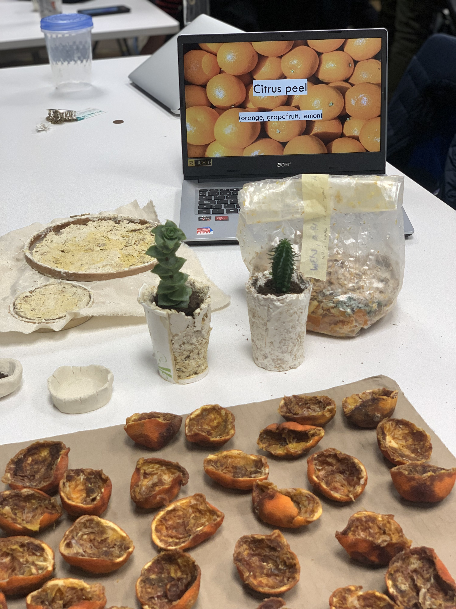
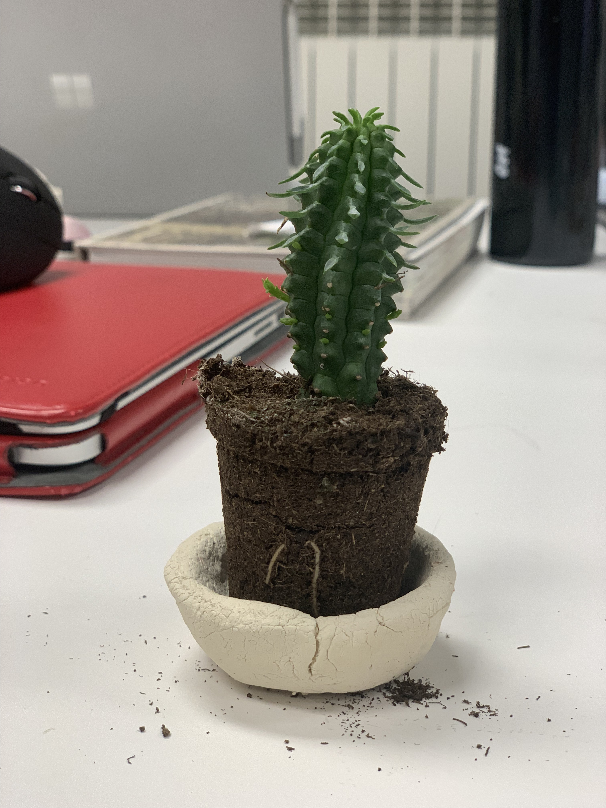
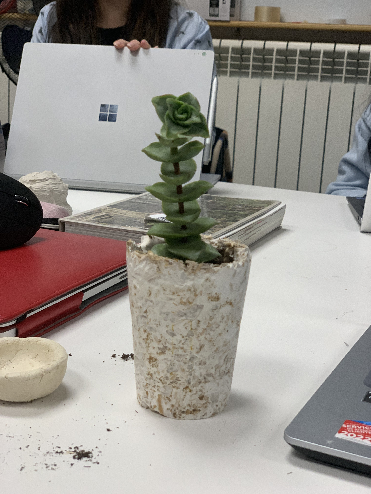

---
hide:
    - toc
---

# Remixing materials

This week we deep dived on remixing materials with a particular point of view on growing materials from nature (such as mycelium) and using waste for designing with circularity. One of the highlights for me was the possibility of using waste as input and then mixing the process with other tools such as 3D printing or using moulds to create new objects.

Remixing materials is an important part of achieving a more sustainable, circular economy. Remixing materials also allows us to create innovative new materials from existing organic and waste materials. This helps to reduce energy consumption and greenhouse gas emissions associated with manufacturing new materials from scratch. Remixing materials can also help to create more affordable, custom-made products, reducing the cost of goods and making them more accessible to everyone. Furthermore, remixing materials can enable more creative and sustainable design solutions, allowing designers to find new and innovative ways to reduce our impact on the environment.

<iframe src="https://docs.google.com/presentation/d/e/2PACX-1vQbBgNVoIh63YzmdYFap7mJNNHmMtMvOhAs07CpN5GnNLJNF8aEK-iyRfLHXpzBxHri_1LEvMflfcSy/embed?start=false&loop=false&delayms=3000" frameborder="0" width="1440" height="839" allowfullscreen="true" mozallowfullscreen="true" webkitallowfullscreen="true"></iframe>

# Our material exploration: Remixing orange peels

During the following classes we became familiarized with moulding, 3D printing and ways to create our own moulds. I was very inspired by ways you can create reproductions of your own products just by creating your own moulds and not necessarily relying on a 3D printer to do so.

Me, Ariel and Wen decided to experiment with orange peel during the second week as a means to explore new material applications and the possibility of building a compostable product. We were inspired by all the orange peel leftovers from the "Zumos de Naranjas" consumed during breakfast in Barcelona and self-served in stores and supermarkets such as Mercadona. One of our initial questions we asked was: What if the vase that contained the orange juice was made out of peel instead of plastic?

Process-wise, we decided to use a recipe that was compostable with the aim of creating flower pots that could then be re planted in soil and contribute to fertility. We used varying levels of water in our recipes to contrast what generated the most suitable texture. While the results weren't the most aesthetic we were pleased with the results and the possibility of creating your own compostable pots to replace plastic pots that do not biodegrade. As feedback, we received the suggestions of designing different sized pots for different stages of plant growth taking into account the most suitable nutrients and additives. We also were advised to use silicone moulds so the mix does not get stuck to the vase.

> Our final curation of materials combining our experiments with orange-peel fed mycelium.

> Final decompostable pot made with dried orange peel.

> Final decompostable pot made with wet orange peel.

Some follow up questions I have moving forward are: How long would it take for our pots to biodegrade? Will this compostable process truly be beneficial for plant growth and soil? What if plastic pots were completely replaced by biodegradable alternatives?

<iframe src="https://docs.google.com/presentation/d/e/2PACX-1vQjwELS_tVeeGxQCWpacXyekfA70PH8oJnDA69kNYzHA8wr1SCJGlHVOQb0-5qvoaGbVi8SWo8l4Ip1/embed?start=false&loop=false&delayms=3000" frameborder="0" width="960" height="569" allowfullscreen="true" mozallowfullscreen="true" webkitallowfullscreen="true"></iframe>
