---
hide:
    - toc
---

# Prototyping For Design

## Week 1 - Day 1

Today Victor told us about microchips and the specific parts behind it. The highlight for me was learning that there were layers of communication that could be closest to the hardware and therefore most technical and then there were others that are closest to the user and therefore more accessible to humans, such as the chat prompts of GPT-3.

###**Micro challenge 1** Learning to activate music with a buzzer using our electronic kit.

This was my first time operating Arduino by myself. In Tech beyond the myth I worked with experts on my team so I was in charge of the communications aspect. Wen lent me here Arduino Uno which was a great starting point because its especially designed to teach children in high school to approach Arduino.

I started looking at open source libraries with different music tracks, such as Harry Potter, Ed Sheeran songs and The Pink Panther theme song. Marielle helped me iterate certain numbers on the code to get the code tu run properly on my computer.

> This is the code I inputted into Arduino. Saving it for future documentation.
// Copyright (c) 2022 HiBit <https://www.hibit.dev>
// -------------------------------------------------#include "pitches.h" #define BUZZER_PIN 8
int REST = 0;
int melody[] = {
  REST, REST, REST, NOTE_DS4,
  NOTE_E4, REST, NOTE_FS4, NOTE_G4, REST, NOTE_DS4,
  NOTE_E4, NOTE_FS4,  NOTE_G4, NOTE_C5, NOTE_B4, NOTE_E4, NOTE_G4, NOTE_B4,   
  NOTE_AS4, NOTE_A4, NOTE_G4, NOTE_E4, NOTE_D4,
  NOTE_E4, REST, REST, NOTE_DS4,
    NOTE_E4, REST, NOTE_FS4, NOTE_G4, REST, NOTE_DS4,
  NOTE_E4, NOTE_FS4,  NOTE_G4, NOTE_C5, NOTE_B4, NOTE_G4, NOTE_B4, NOTE_E5,
  NOTE_DS5,   
  NOTE_D5, REST, REST, NOTE_DS4,
  NOTE_E4, REST, NOTE_FS4, NOTE_G4, REST, NOTE_DS4,
  NOTE_E4, NOTE_FS4,  NOTE_G4, NOTE_C5, NOTE_B4, NOTE_E4,…
[1:57 p. m., 2/2/2023] Jimena: 2, 16, 16, 16, 16,
  4, 4,
  4, 8, 8, 8, 8, 8, 8,
  16, 8, 16, 8, 16, 8, 16, 8,   
  16, 16, 16, 16, 16, 2
};
void setup()
{
  pinMode(BUZZER_PIN, OUTPUT);
}
void loop()
{
  int size = sizeof(durations) / sizeof(int);
  for (int note = 0; note < size; note++) {
    //to calculate the note duration, take one second divided by the note type.
    //e.g. quarter note = 1000 / 4, eighth note = 1000/8, etc.
    int duration = 1000 / durations[note];
    tone(BUZZER_PIN, melody[note], duration);
  //to distinguish the notes, set a minimum time between them.
    //the note's duration + 30% seems to work well:
    int pauseBetweenNotes = duration * 1.30;
    delay(pauseBetweenNotes);
      //stop the tone playing:
    noTone(BUZZER_PIN);
  }
}

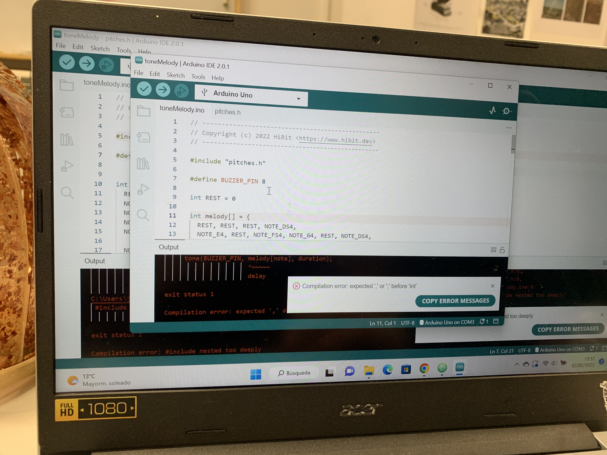
> Computer screenshot trying to play around with the code.

<iframe src="https://drive.google.com/file/d/1B-k_0CPGA_EUfufSy7-iKUgSR2F0h0jh/preview" width="640" height="480" allow="autoplay"></iframe>
> Experiments with music playing with Arduino Uno.

<iframe src="https://drive.google.com/file/d/10qI70r5I5w05KhABOjRGJ7F32T0jfZ_8/preview" width="640" height="480" allow="autoplay"></iframe>
> Experiments with music playing with Arduino Uno.

## Week 1 - Day 2

Today Eduardo taught us more about modelling and 3D models. He started by introducing terminology such as pixels vs vectors and going to basics allowed all of us to start with a clear mind.

One of the technical highlights for me was learning the importance of reducing image file sizes when uploading them to a website and being mindful of the ecological impact of not doing this.

###**Micro challenge 2.1** Parametrizing a croissant

I asked Chat GPT3 to parametrize a croissant since I have zero experience with modeling and 3D software besides 3Ds max when I was doing an animation class on product advertising.

First I used Noun Project to look for 2D croissant vectors. I then looked for open Rhino libraries that would allow me to look for different croissant models. I downloaded one that looked the most simple and opened it up on Rhino.

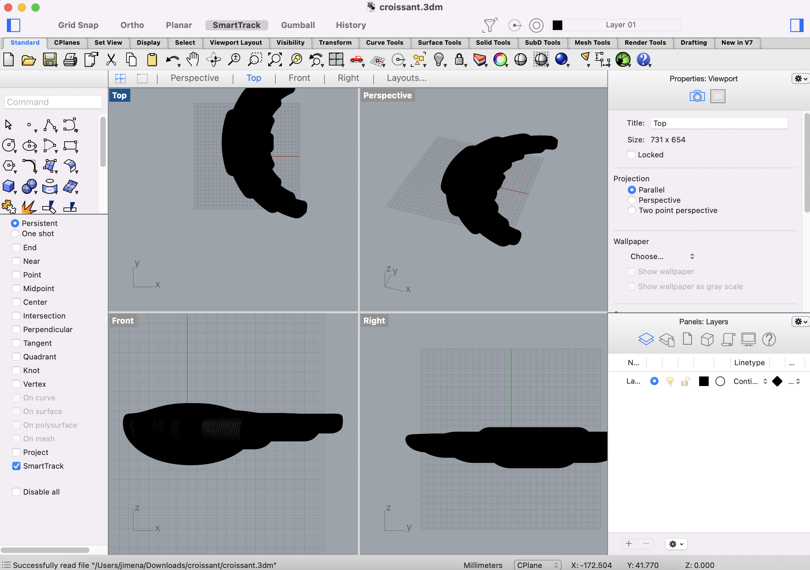

###**Micro challenge 2.2** Create a 3D design based on algorithmic thinking of any object or concept you like.

This was very exciting for me because I have zero experience modelling but the tools are very accesible. I was interested in exploring how to do 3D models of illustrations and logotypes and deep dive on that a bit more. I really like the work of Cabeza Patata, an illustration collective that does 3D renderings of illustrations.

The software I chose was Blender, I wanted to get familiar with the tool and saw there was a very big internet community offering free tutorials. I started first watching introductory tutorials that showed me keyboard shortcuts and the logic behind the tool.

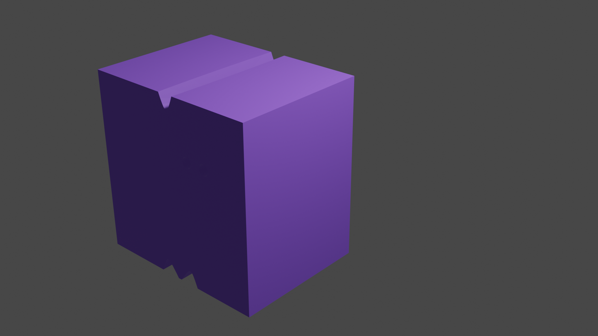

I wanted to create a 3D version of a logotype I had created for a client last year. I chose that image because the shape is pretty simple and would have a potential use if I sent it back to the client.

I made this video outlining the end result and sharing a bit of my process. I learned to use the Boolean tool as a means to cut shapes inside the 3D model. The logic to me was very familiar as this is a technique I used when playing around with 2D vectors and typography.

I am really content with the end result even though I know it is quite basic. This made me aware that my interest in 3D modeling is more connected to illustration and branding rather than to engineering or making products.

I also tried to input "3D render letter M" on stable diffusion to see how the AI generated models looked like and how much they could serve me for this purpose.

<iframe src="https://drive.google.com/file/d/1cpFjbrwoYZcdUgm_nwvtEMNkgJIRbuMJ/preview" width="640" height="480" allow="autoplay"></iframe>

<iframe src="https://drive.google.com/file/d/1wUheQw-FMzn4cT79XZlqX_pWJ67tQQ-C/preview" width="640" height="480" allow="autoplay"></iframe>

<iframe src="https://www.loom.com/embed/a7195a10f0344416b72c9196f8e5258a" frameborder="0" webkitallowfullscreen mozallowfullscreen allowfullscreen style="position: absolute; top: 0; left: 0; width: 100%; height: 100%;"></iframe>

## Week 2 - Day 1

Today we learned about laser cutting and vinyl cutting. What resonated with me most was the application of these techniques for building installations and communicating ideas in spaces. Using pens with the vinyl cutter was also incredible, a way to mix an analog and traditional technique with the digital.

###**Micro challenge 3** Create a parametric model and print it.
To explore laser cutting press-fit for the first time I chose to build out of an existing file of a cat. I then modified the file size a bit to fit the laser cut machine and added my name to personalize the cat.

What was hardest of the process was setting up the properties on the laser cut machine to have the correct scale, position the laser in the right corner and understanding the colors for engraving and cutting. I set up the file with Wen and Carolina and we needed to ask Eduardo and Josep for help a couple of times. We used some spare cardboard that had already been used for our initial prototypes before using a fancier cardboard for the end result.

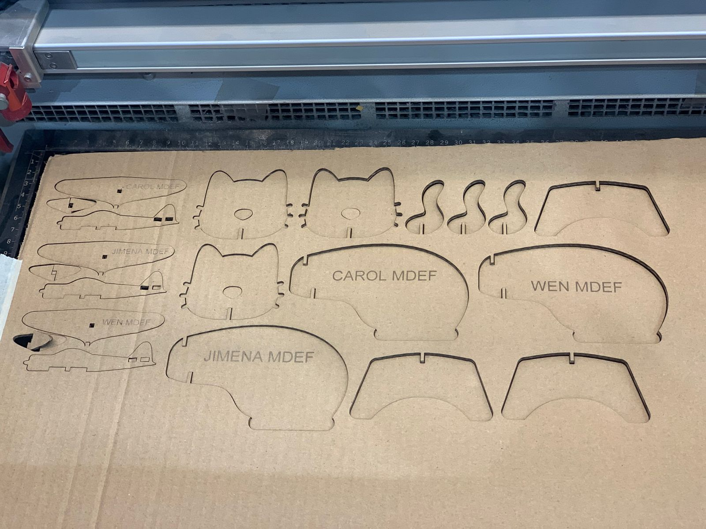

While testing out the final materials the press fit was right on point for the cat but not so much for the airplane I also printed out on cardboard. This was because the model was too small and the material was not rigid enough. For the future I would love to explore using laster cutting for exhibit design mixing engraving with cut parts using negative space for typography.

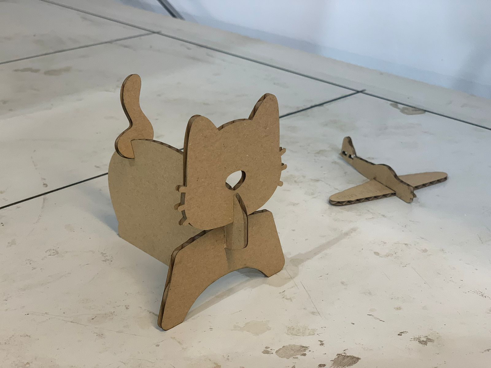

## Week 2 - Day 2
We learned about inputs and outputs from Victor. It was very inspiring to learn how sensors such as GPS actually work and to see the potential of using sensors in fields such as biology where electronics has not been very funded or investigated much before.

I also enjoyed learning about DIY communities in Japan where making your own input and output systems is a great way to also combat private corporations using personal data for their own gain. Some questions asked during class that resonate with me: Why is Alexa so cheap if the investment for its development was so expensive? Answer: potentially they want to aim for the most quantity of Alexa's per household to gain our data and use that for profit.

The list of sensors and potential inputs was also very exhaustive and allwoed us as a group to push our thinking into what we can begin to monitor, especially for groups looking at collaboration with nature and water.

###**Micro challenge 4** Arduino challenge inputs and outputs
For this challenge I came to IAAC with Carolina, Wen, Sami and Josephine on Friday. We tried to individually set up our Arduinos to either light up the LED with the switch and to use the sensor correctly on a separate board.

We realized this task would take us much more time than we initially thought. I worked with Carolina trying to connect the switch to the LED light and were succesful for a period of time but then the Arduino stopped working. We tried plugging and re plugging everything but it didn't work again. Finally we got the board to keep working and focused on integrating our output with the sensor Sami and Josephine had been working on. We had fun seeing how far we could go on connecting both systems.

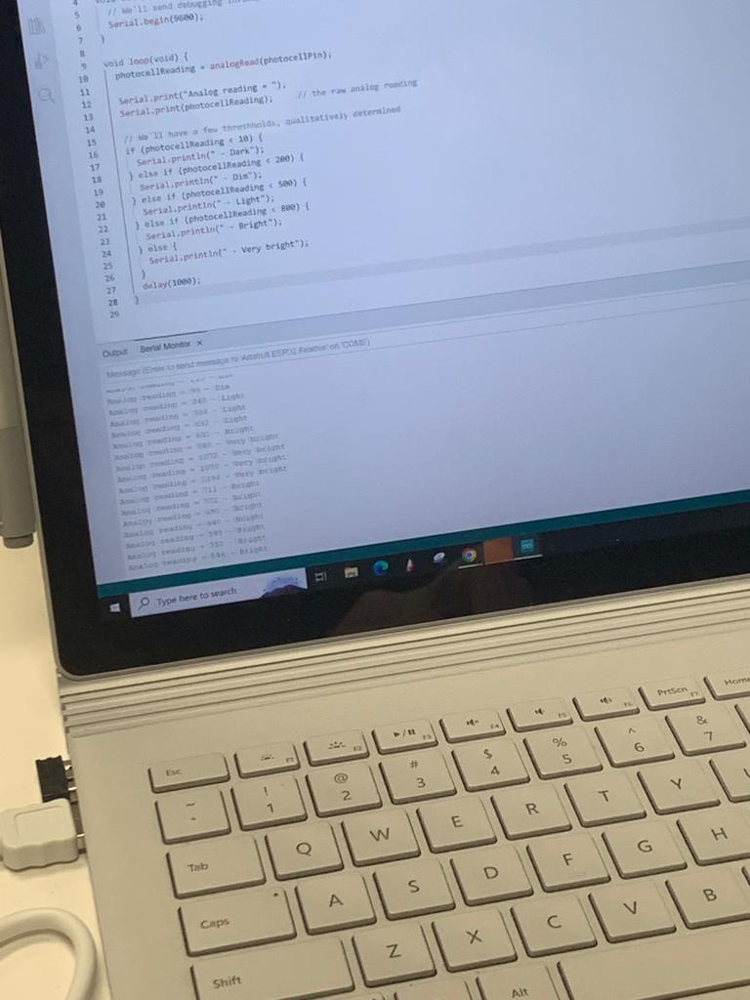

<iframe src="https://drive.google.com/file/d/1kGEJIMOf4V4TCAQaPAhjd-58WySkgSfi/preview" width="640" height="480" allow="autoplay"></iframe>

> **This was the code we used to get the output to work correctly (LED light).**
/*
 Button
 Turns on and off a light emitting diode(LED) connected to digital pin 13,
 when pressing a pushbutton attached to pin 2.
The circuit:
 - LED attached from pin 13 to ground through 220 ohm resistor
 - pushbutton attached to pin 2 from +5V
 - 10K resistor attached to pin 2 from ground
 - Note: on most Arduinos there is already an LED on the board
   attached to pin 13.
 created 2005
 by DojoDave <http://www.0j0.org>
 modified 30 Aug 2011
 by Tom Igoe
 This example code is in the public domain.
 https://www.arduino.cc/en/Tutorial/BuiltInExamples/Button
*/
// constants won't change. They're used here to set pin numbers:
const int buttonPin = 14;  // the number of the pushbutton pin
const int ledPin = 13;    // the number of the LED pin
const int buttonPin = 33;  // the number of the pushbutton pin
const int ledPin = 13;    // the number of the LED pin
const int ldrPin = A3;  
int ldrValue = 0; // luminosity
int start = 0;  // time starts counting
bool prevstate; // variable to evaluate previous state of the measurement
bool state;  // variable for assessing the status of point or dash
int buttonState = 0;  // variable for reading the pushbutton status
char punto = '.';
char raya = '-';
String letters[27]={
".-", "-...", "-.-.", "-..", ".", "..-.", "--.", "....", "..", ".---", "-.-", ".-..", "--", "-.", "---", ".--.", "--.-", ".-.", "...", "-", "..-", "...-", ".--", "-..-", "-.--", "--..",  
};
void setup() {
 Serial.begin(9600);
 // initialize the LED pin as an output:
 pinMode(ledPin, OUTPUT);
 // initialize the pushbutton pin as an input:
 pinMode(buttonPin, INPUT);
}
void loop() {
 // read the state of the pushbutton value:
 buttonState = digitalRead(buttonPin);
 // check if the pushbutton is pressed. If it is, the buttonState is HIGH:
 if (buttonState == HIGH) {
   // turn LED on:
   digitalWrite(ledPin, HIGH);
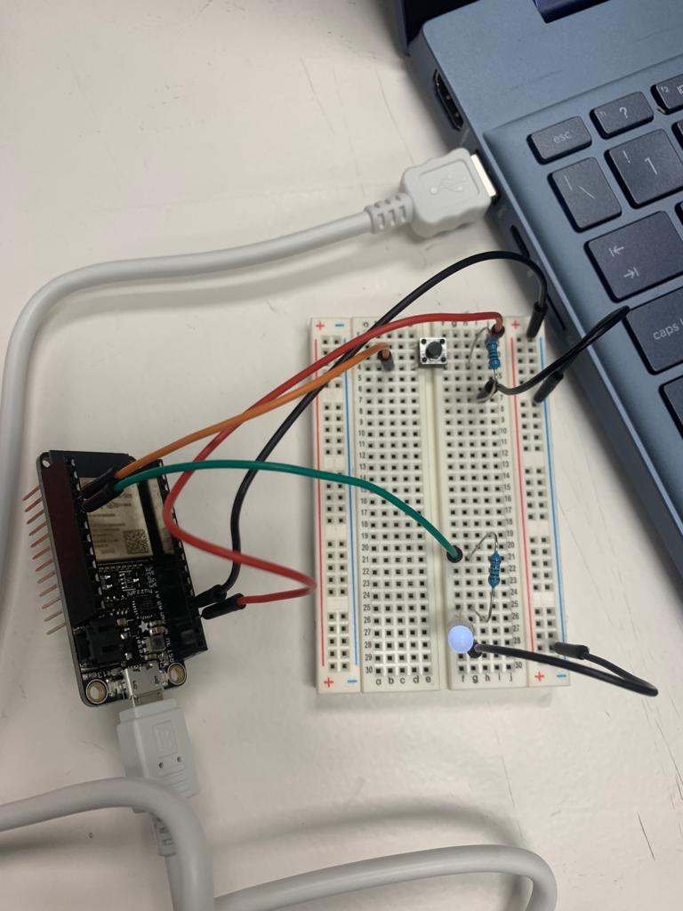
<iframe src="https://drive.google.com/file/d/1o328u2SyitJx4OLxxbWRUyOrb4B-2Kx-/preview" width="640" height="480" allow="autoplay"></iframe>

## Week 3 - First Fab Lab challenge

This week I worked with Ariel and Wen to develop a physical product that would allow us to engage with children's perceptions in relation to 3 different fields: climate change, gender equality and mental health. We were inspired by analog data visualizations and an exercise we did with Holon during the Community Engagement week where we had to physically move our body along an x and y spectrum to show how we felt in regards to certain topics.

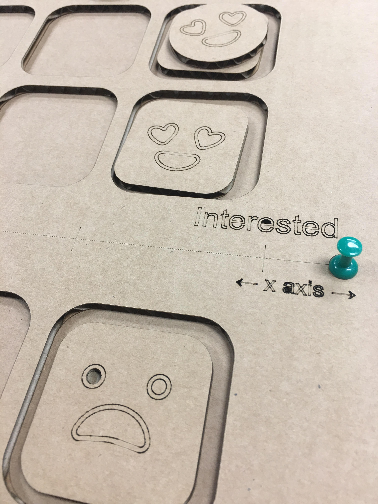
> We decided to go big on format to make it more accessible for children and to include emojis as a way to also start destigmatizing emotions.

One of the highlights for me was how fast we aligned on the subject matter and concept of the proposal. As early feedback we were suggested to incoporate electronics to our product that would be fabricated mostly using laser cutting. We used the first day to brainstorm some ideas that would not be time consuming and would above all be very meaningful for both the product and the facilitation behind it.

My participation in the project was primarily in designing the concept and MVP in digital format, looking at how the user interaction would work inside a classroom and how would the use of the Perception Board work integrating the cards, questions and the x and y axis. I then designed the question cards, iterating the content itself so it would be more understandable by children. My role was also to help set up the laser cutting and help Ariel and Wen finalize Rhino file details and pasting the parts of the final piece together with glue.

We will test the product with the school we previously worked but this time with older children since the exercise requires more cognitive skills and debate capabilities from them.

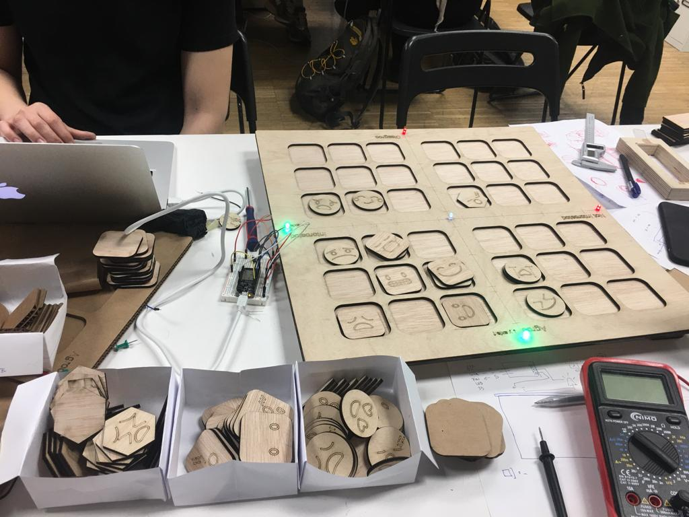
> What our final board looked like after connecting a circuit and coding Arduino for LED lights to switch on using a button.

> What our product looked like after a hands-on week of a lot of iterations, learnings and testing out new things.

Some learnings that emerged from this week:

- **Electronics require a lot of time and that should be reflected on the planning side of managing time.** Colored LED lights also use different resistors and when lighting up many LEDs on one same product the amount of power is something to take into account.

- **When making different prototypes, take notes of changes in materials, design files and extra pieces you will need for next time or round of iteration.** For instance, by making the cardboard design we realized we need a card holder to place all the cards inside, some way to transport the board to schools and a taller structure to hide the Arduino set up from children. We also want to explore using LED strips as opposed to LED bulbs.

- **Laser cutting is also very time-sensitive** Make sure that happens earlier on you work flow because laser cutting two wooden boards can take over an hour between cutting time and setting up the file time.

- **Early alignment is key.** Had we not aligned on Tuesday on the output and key concept we would not have had time to fail early building the actual product and iterating.

I am looking forward to using our Perception board with teenagers and seeing how this project can also evolve in designing DIY tools for teachers to facilitate participatory processes with children and teenagers.

[Project repo](https://github.com/wenqianchua/microchallenge-01)

## Week 3 - Day 1
We started this week with an introduction by Eduardo on 3D printing and 3D scanning technologies. We were exposed to a recap of the history of 3D printing and given an overview of different ways to engage with 3D technology nowadays. We were also provided with actionable tips to 3D scan ourselves using software that is freely available and understanding what we can do with 3D scanned data (i.e. understand volume of material we require after 3D scan).

###**Micro challenge 5** 3D printing and scanning
For this challenge I chose to 3D print a pencil holder looking at 3D libraries available online with files ready for printing. I chose Thingverse because it had a variety of options and I was looking to print something functional that I would intentionally use at home and would therefore not be wasteful.

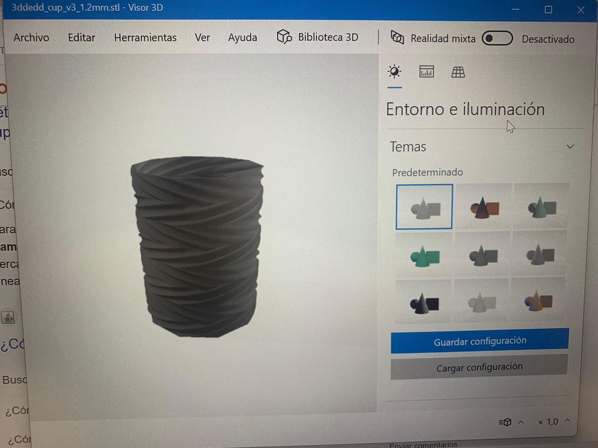
> I first started looking up for vases online that had organic shapes in the edges.

I then had to install Windows 3D viewer to be able to preview the files and make modifications so it could be printed at IAAC. I installed Cura on my computer following the Fab Lab Video were Julia shows the instructions on how to 3D print. I sliced my original pencil holder but it showed 3 hours to print so I iterated to picking another easier and smaller object. I chose a ring.

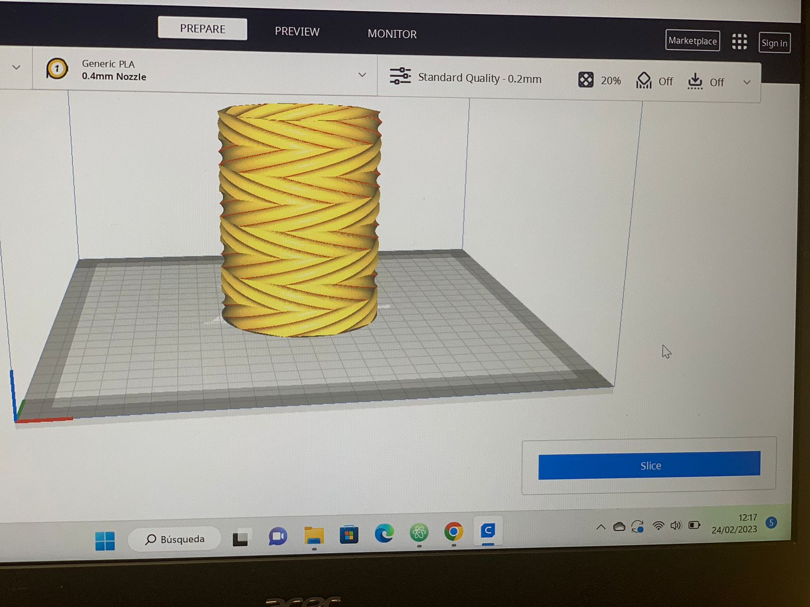
> I then opened the file on Ultimaker cura.

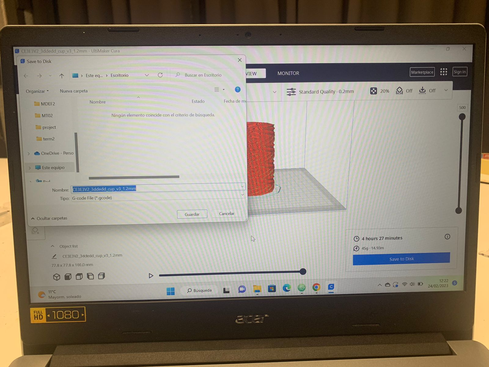
> I had to iterate the chosen file because of its size. To print this file it would take 4 hours 27 minutes.

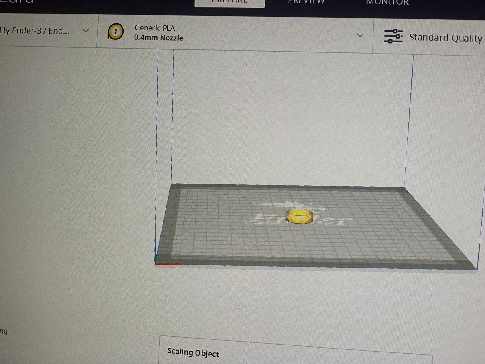
> This ring was the chosen alternative.

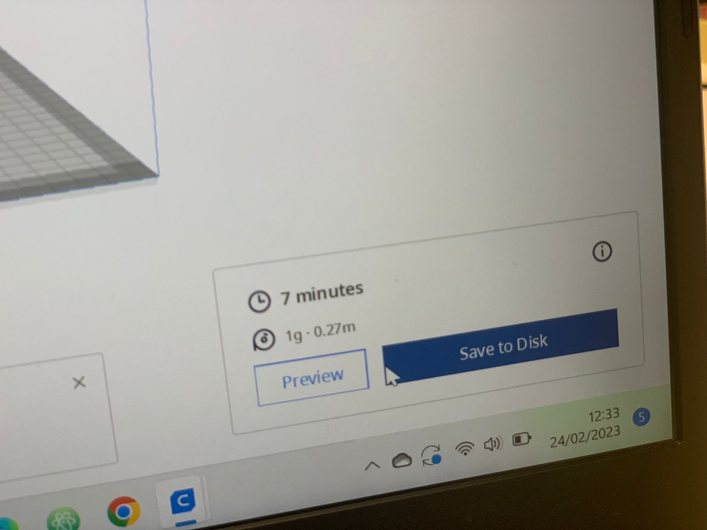
> It was more time-efficient with only 7 minutes to print.

For printing, we did a first try with Wen and Sami and we had help from someone from Fab Lab. We had to change the temperature to 215 from 200 degrees celsius and change the quality from Low to Standard. This allowed us to print correctly.

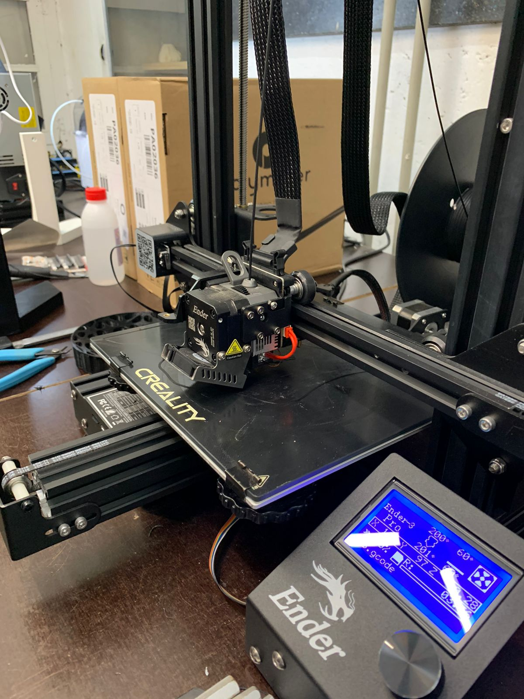
> We set up the printer using Auto settings.

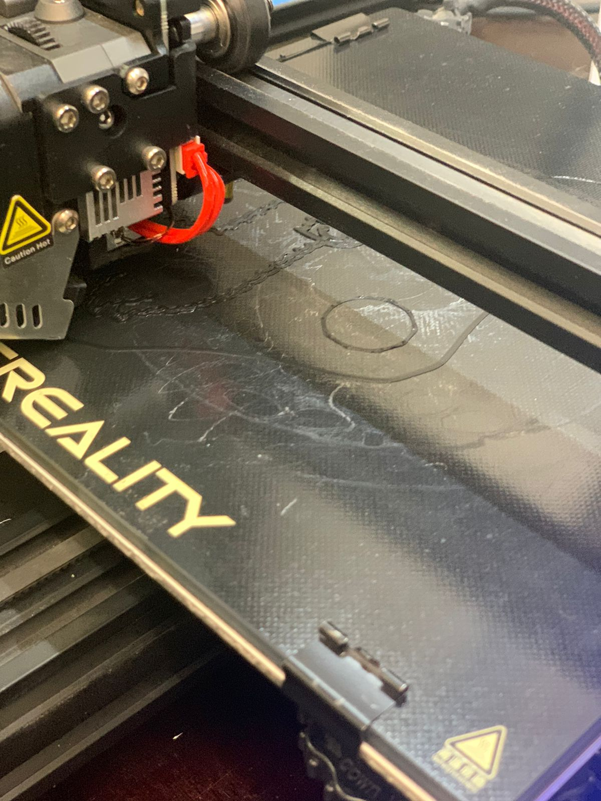
> Waiting for the ring to print.

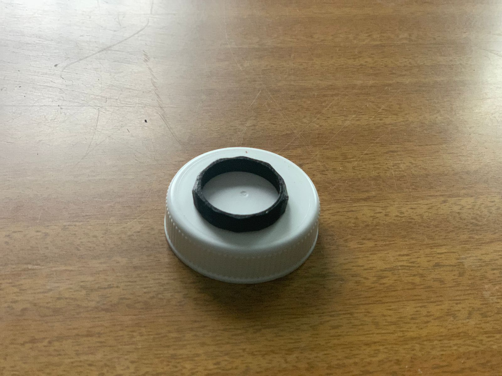
> Printed ring.

For 3D scanning I used the app Polycam. I realized early on that the ring's size is too small for scanning so I tried scanning the ring with my hand to be able to get a correct scan.

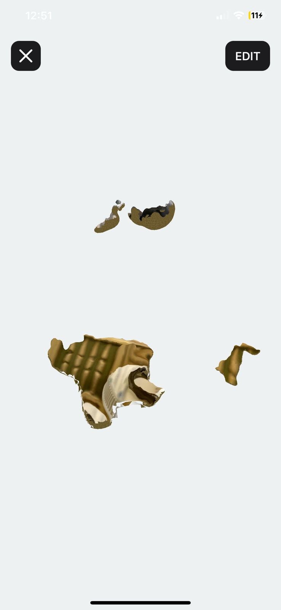
> Failed scan of the ring after several attempts and trying out different apps.

This is my end result. It was a failure because it is too small and I tried adding a big object underneath but was still unable to properly scan.

So instead I tried 3D scanning a bigger different object to see if I would be successful this time around.

<iframe src="https://drive.google.com/file/d/1nDOwZ5aHmfpCwS8ViRLM8cgDA6FaKES8/preview" width="640" height="480" allow="autoplay"></iframe>
> I then tried scanning my water bottle and camera bag. Because of the bigger size, I got a much closer scan.

## Week 3 - Day 2
Today's class Victor shared information about the origin of the internet and helped debunk myths about how the "cloud" works or how servers and data is actually stored physically and mostly in California. What resonated with me most were examples such as Gemini network or Proton email that helped me broaden my horizons as to what safe navigation or data sharing can look like.

###**Micro challenge 6** Connecting Arduino to wifi server

For this micro challenge I worked with Ariel trying to set up the Arduino to the server. We inputted the code listed below.

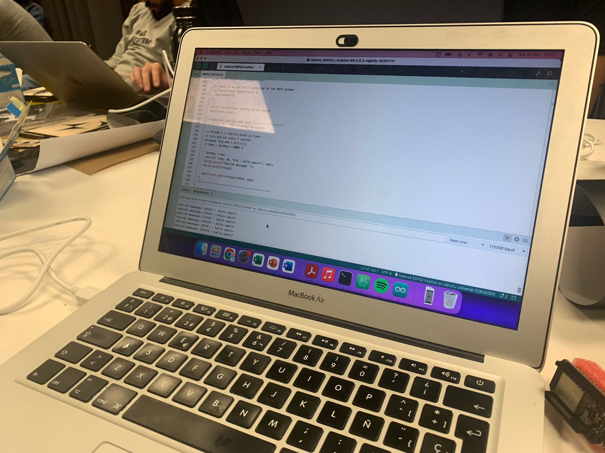
> We embedded the code listed below.

> This is the code I inputted into Arduino #include <WiFi.h> #include <PubSubClient.h>
const char* ssid = "Iaac-Wifi";
const char* password = "EnterIaac22@";
WiFiClient wifiClient;
const char* mqttBroker = "172.16.10.224";
const char* mqttClientName = "jimena";
const char* topicToSub = "teamx/in";
const char* topicToPub = "teamx/out";
PubSubClient mqttClient(wifiClient);
const int buttPin = 6;
bool buttState;
void mqttConnect() {
  while (!mqttClient.connected()) {
    Serial.print("Attempting MQTT connection...");
    if (mqttClient.connect(mqttClientName)) {
      Serial.println("connected");
      mqttClient.publish("hello", mqttClientName);
      // Topic(s) subscription
      mqttClient.subscribe(topicToSub);
    } else {
      Serial.print("failed, rc=");
      Serial.print(mqttClient.state());
      Serial.println(" try again in 5 seconds");
      delay(5000);
    }
  }
}
void callback(char* topic, byte* message, unsigned int length) {  
  String receivedMsg;
  for (int i = 0; i < length; i++) {
     receivedMsg += (char)message[i];
  }
  Serial.print("Message arrived on topic: ");
  Serial.print(topic);
  Serial.print(". Message: ");
  Serial.println(receivedMsg);
  if (String(topic) == topicToSub) {
    // Add here the code to act on input --------------
    // Arduino String obejct reference :
    // https://www.arduino.cc/reference/en/language/variables/data-types/stringobject/
    if (receivedMsg == ("1")) {
      Serial.println("on");
      digitalWrite(LED_BUILTIN, HIGH);
    } else if (receivedMsg == "0") {
      Serial.println("off");
      digitalWrite(LED_BUILTIN, LOW);
    }
    //-------------------------------------------------
  }
}
void setup() {  
  Serial.begin(115200);
  // Connect to wifi
  WiFi.begin(ssid, password);
  while (WiFi.status() != WL_CONNECTED) {
    delay(500);
    Serial.print(".");
  }
  Serial.print("Connected to ");
  Serial.println(ssid);
  Serial.print("IP address: ");
  Serial.println(WiFi.localIP());
  // MQTT setup
  mqttClient.setServer(mqttBroker, 1883);
  mqttClient.setCallback(callback);
  // Led setup
  pinMode(LED_BUILTIN, OUTPUT);
}
unsigned long lastMsg = 0;
char msg[50];
void loop() {
  // Check the current button state
  bool currentState = digitalRead(buttPin);
  // Check if we are still connected to the MQTT broker
  if (!mqttClient.connected()) {
    mqttConnect();
  }
  // Let PubSubClient library do his magic
  mqttClient.loop();
  // Add your publish code here --------------------
  // OPTION 1 -- Publish based on events
  if (currentState != buttState) {
      buttState = currentState;    
      snprintf (msg, 50, "%i", buttState);      
      mqttClient.publish(topicToPub, msg);
  }
  // OPTION 2 -- Publish based on Timer
  // Only publish every 5 seconds
  unsigned long now = millis();
  if (now - lastMsg > 5000) {  
    lastMsg = now;
    snprintf (msg, 50, "%ld - hello again!", now);
    Serial.print("Publish message: ");
    Serial.println(msg);  
    mqttClient.publish(topicToPub, msg);
  }
  //-----------------------------------------------
}

One of the challenges we had was connecting to the correct Wifi and the correct IP address. We had to iterate the numbers to get the correct numbers a couple of times and the code wouldn't run. We were then successful in connecting and created a channel called "Ariel".

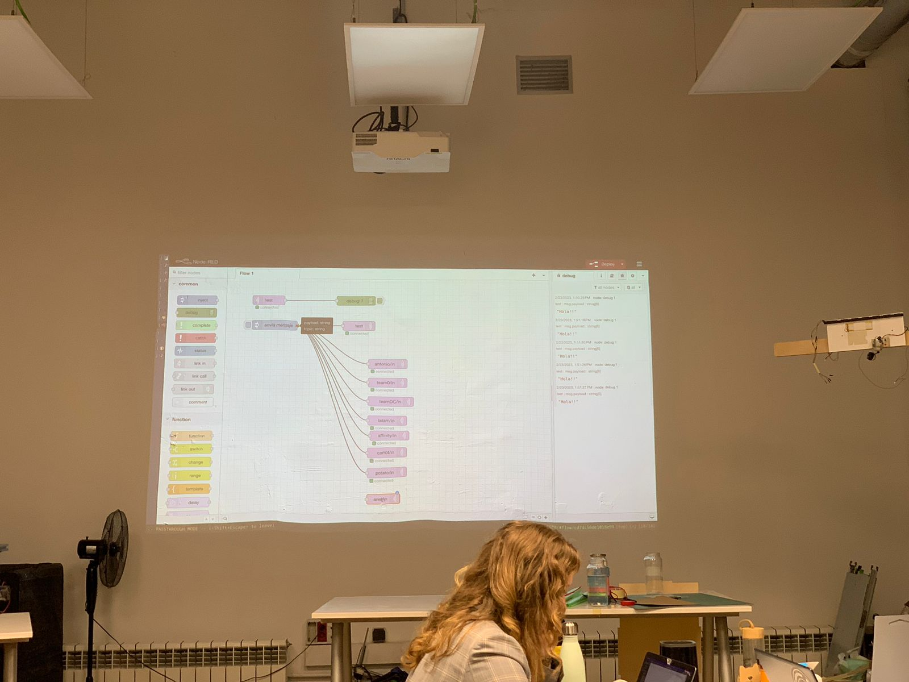
> We were successful in connecting.

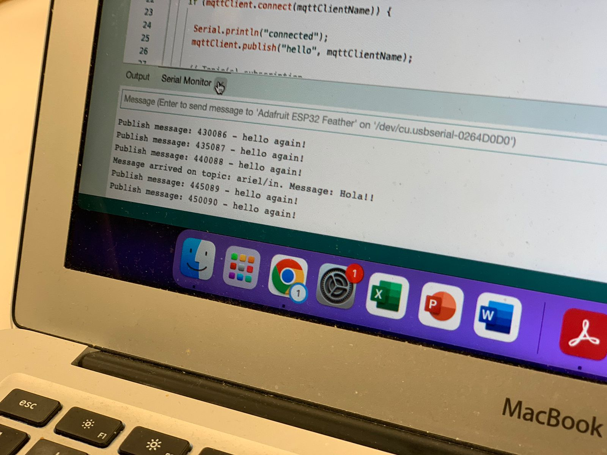
> Some messages we received from Victor.

## Week 4 - Day 1
Today Oscar showed us different ways to code a LED light using the ESP32 feather board. Also integrating pre existing libraries to generate different non-uniform ways to make the LED light blink. The class was very practical. We also learned about MQTT-Broker servers and did a collective exercise of synchronizing our LED lights. Another concept that brought my attention was "Raspberry pi" (Single Board Computer), which is a very simple computer or a more complex Arduino.

###**Micro challenge 7** Synching LED lights through Arduino Server
During the class, we learned different modes of turning on LED lights such as blink and candle.

This is our class with the lights off synching our Arduino LED lights together.

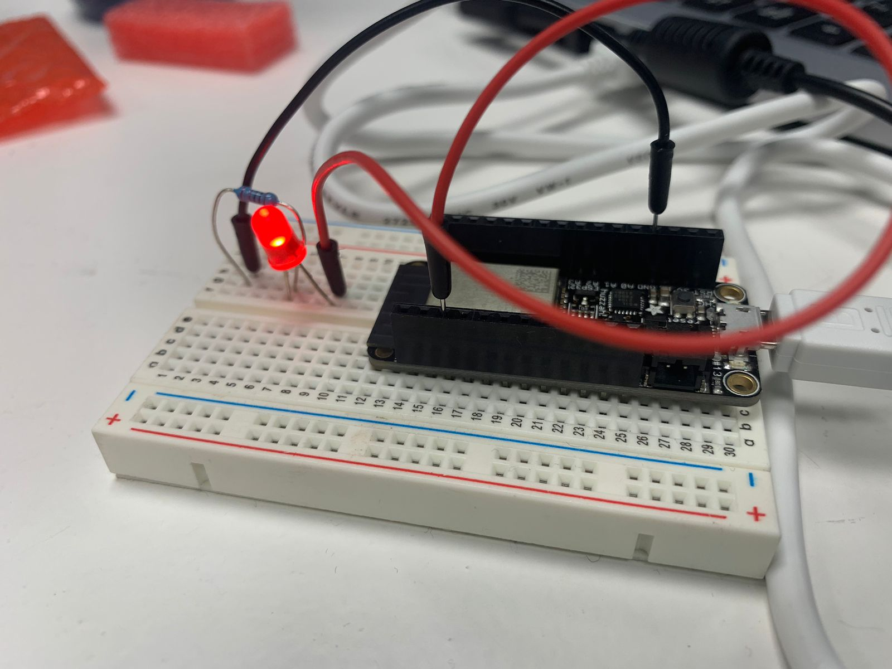
> To me this was a very compelling and easy to understand step by step to using LEDs. During the microchallenge, we incorporated LEDs and had a hard time just turning them on in the most basic function.

<iframe src="https://drive.google.com/file/d/1lZoKBQThtYoYVjHknKmPBWkmZRpmmNTA/preview" width="640" height="480" allow="autoplay"></iframe>
> LED light slowly burning.

<iframe src="https://drive.google.com/file/d/1Cc5l2Oxb43Y6dX0g5hqeNdXkqsLtzpFH/preview" width="640" height="480" allow="autoplay"></iframe>
> Synched LED lights being operated through server.

## Week 4 - Day 2
Edu gave a lecture on CNC machines and types of motors. We were given tips on how to manage the files, how to operate the machine and how to deal with the material and cutting with the tool. We also learned about processes such as nesting that avoids material waste (using online programs such as svgnest). He also deep dived on security and how this is vital when working with CNC.

Our plan is to use the CNC machine as an "add-on" to our Perception Board. The board needs a small table that allows children to view it standing up, so we will use our wood material to execute this complementary table.

###**Micro challenge 8** Using CNC to build a card holder
Me and Ariel and Wen had aligned on that we wanted to build a card holder out of CNC to use with our Perception Board during the Second Fab Lab Challenge. While the card holder is a complementary accesory to the overall experience, we felt the holder could really add comfort to children while interacting with our device and help them focus on the question being discussed.

For the fabrication process, we had Edu's help with the set up of the CNC machine ensuring the thickness of the material (wood) and exporting the file to a code the CNC machine could read.

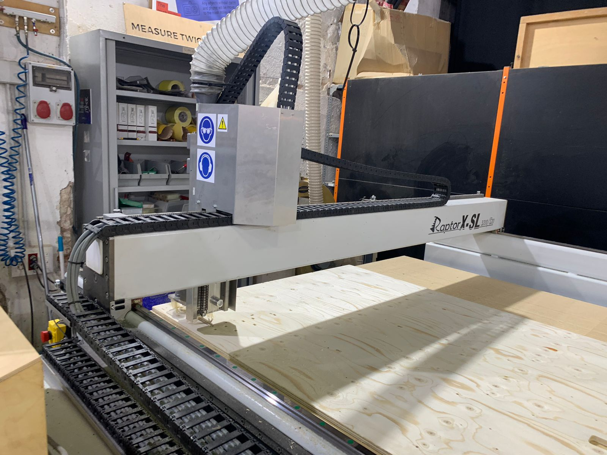

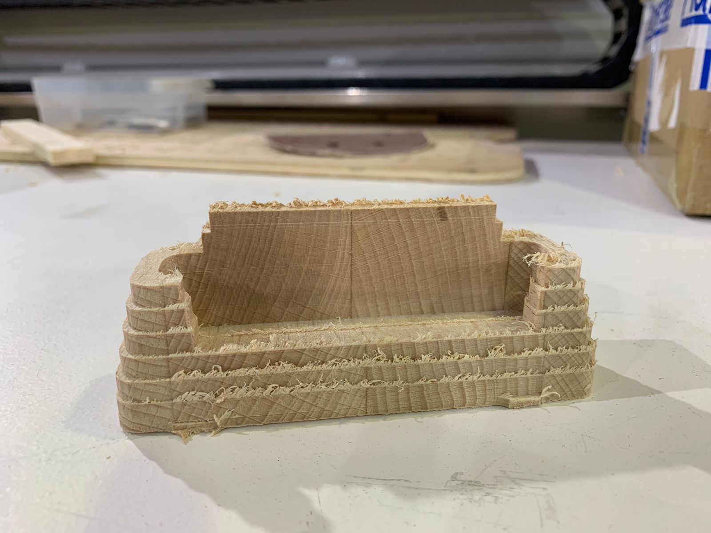

We had to sand the final card holder.
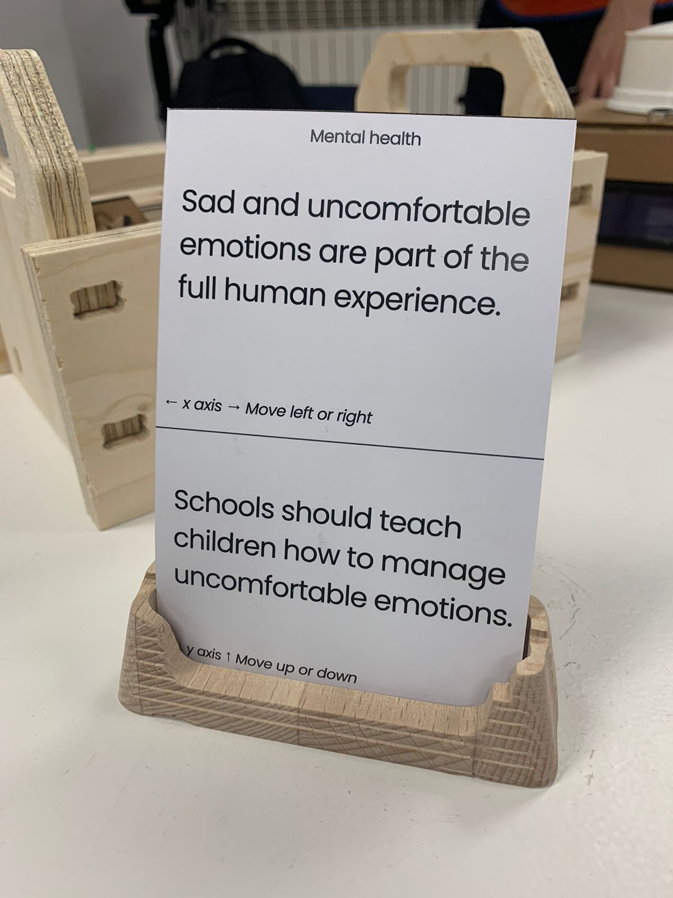

## Week 5 - Second Fab Lab challenge
This week I worked with Wen and Ariel on designing a complementary product that would amplify the experience of using our Perception Board. While we haven't had the time and space to test with school students, we still wanted to iterate on the experience to test with both teachers and students during the Third Trimester.

For this challenge, we had to incorporate 3D printing, CNC and sensors. This is why we designed a **Speaker Mic** that would have the objective of helping define who speaks during a classroom session and can design a small ritual around that moment.

Some learnings during this challenge listed below:

- **Fabrication processes take a lot of time.** During challenges and when working with time constraints, it is best to align fast and then iterate and add more complex systems to the design. Only the 3D printing took over 18 hours.

- **While most processes are digitally fabricated, manual work is very important for incorporating systems and to make sure final adjustments are done correctly.** We had to sand manually, put nails on the 3D printed microphone and make a cardboard box by hand to make sure everything worked correctly at the end.

- **Testing with users the finaly system is equally as important**. While these production weeks focused on fabrication help us design the system, it is also important to go back to our communities and test the product and system with them. We are planning on going back to classrooms to test both the perception board and our speaker mics.

- **Incorporate electronics meaningfully.** While we can be very drawn to using electronics playfully and introducing a lot of sensors, we chose to make the interaction as simple as possible. This is because using the board in itself is quite complex for  children and electronics should help them understand what action is required from them.

[Project repo](https://github.com/jimenasalinasgroppo/microchallenge-02)
