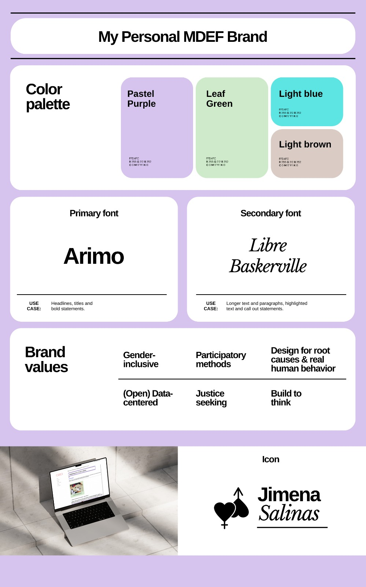

---
hide:
    - toc
---

# Communicating Ideas

Our first session with Kate was very energizing and a good way to take a moment to think of the ways we are not only communicating our projects but our individual fights and our political points of view as designers. One of the highlights in this session was double clicking on language, the diversity of languages found globally and how respecting and honoring the multiculturality of language is important and key.

## First session - Outlining mision, vission and values

**Purpose statement**
Design gender-inclusive futures through open data, participatory processes and creation of new narratives.

Design gender-inclusive futures by designing for root causes, with care and for real human behaviors.

**Mission statement**
Deliver compelling narratives, products and services at the service of solving inequalities through a combination of technology, data and design.

**Vision statement**
To unlock a gender-inclusive world that combats extractive capitalist mindsets.

#My proposed brand kit below.

I tried to align the visual language with my purpose, mission and vision using pastel colors to communicate softness and designing with care. However, I chose to deliberately stay away from pinks and blues to avoid traditional categories and associations to gender.

#Minimum Viable Message

- I am co-creating future visions with children to gather their perceptions and attitudes in regards to gender equality through participatory design.

- I am exploring ways to utilize AI to help women navigate salary negotiations and empower them financially to reduce Intimate Partner Violence.

- I am co-creating future visions on ecofeminism with migrant women to develop futures literacy skills.

## Second session - Mapping stakeholders and prioritizing messages
After the second session of Communicating ideas, I acknowledged the importance of not only sitting back conceptually on what I want to communicate but to actively do so and taking into consideration that involving some actors is more important and even urgent.

Below is my initial draft at having an organized communication strategy and plan. I decided to prioritize my 2 main interventions:

(1) designing futures with children using participatory tools
(2) ecofeminism collages with Mamás que leen.

.jpg)
> This exercise made me aware that the most important stakeholders to keep on the loop are not big populations or groups but the founders of the organizations or the directors of the schools we are collaborating with. This is because they have decision making power and need to stay on the loop of what we are building and our results.

.jpg)
> I noticed that since most of my interventions are one-off interactions, I should also design for continuity (besides the newsletter).
