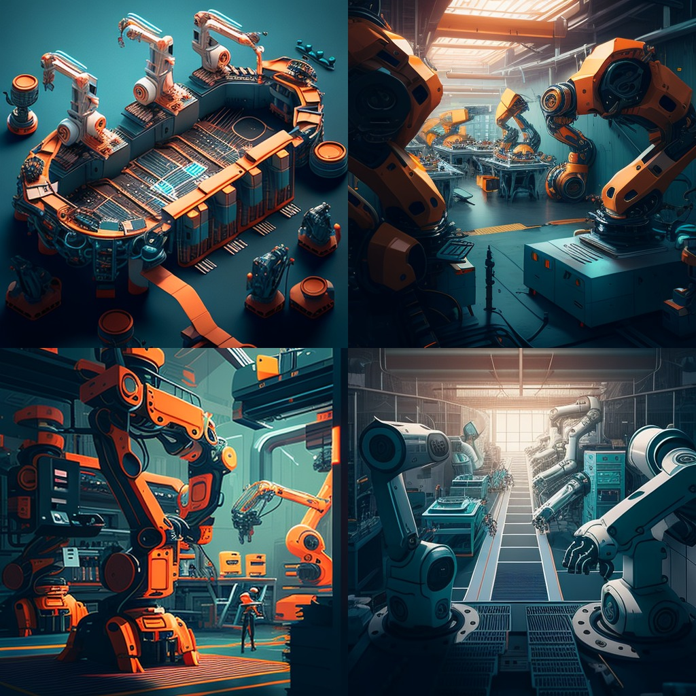

---
hide:
    - toc
---

# Making sense and meaning
During these seminars we were challenged to rethink design from an Academic Eurocentric pe rspective and broaden our definitions, while also thinking of the impact of other disciplines in the design field and even engage in philosophical discussions around making meaning with the help of external guests in the design field.

## Essay

> To write a blog entry of between 1500-2500 words at the end of the course on your website and design a vignette to illustrate the (some) following questions (feel free to replace them by more meaningful ones to you): How design can reconfigure systems of extraction? Which worlds can we design with the power of today’s tools? How can we design the transition towards these worlds?

> Futuristic factory assembly line with robotic arms and drones (generated by Midjourney)

### How can design reconfigure systems of extraction?

It is evident that the practice of design is Eurocentric and that there has been a shift in recent times towards expanding the definition of who is considered a designer. This has allowed the concept of design thinking to gain popularity in the corporate world, with people from traditionally non-design backgrounds now referring to themselves as designers. To further comprehend the potential of design to reconfigure systems of extraction, it is essential to consider who is defining design, where they are located geographically and how they were given authority in a social context to act as definers.

However, if we are to consider that every human being can potentially be a designer and is not a title or a field exclusive to architects, visual designers and product designers, history should go back to pre-Colonial times to understand how design has emerged as a field outside academia.The book “Lo-TEK: Design by Radical Indigenism” by Julia Watson design was personally a good starting point to understand how indigenous communities have developed low-technology solutions to real-world problems, working in tandem with nature rather than exploiting it.

As someone born in Peru and having traveled to Cusco many times, I have been able to observe how the Inca culture created their own laboratory (Moray) to determine the best conditions for cultivating different agricultural products in the Andean region. Additionally, reciprocity was a common way for the Inca community to exchange knowledge for goods and services or for trading commodities or favors. Societies that experiment and prototype at a community level have long existed as well as ways to exchange value without money being the default.
Colonization and industrialization has shifted the design practice to seek reduction of costs, optimization of processes and efficiency as a norm that has dominated the latest centuries. Very recently, “user-centricity”, as mentioned by Kevin Slavin in his “Design as participation” article, is depicted as an alternative that seeks to satisfy user’s desires and is accompanied by buzzwords such as “design thinking” and “innovation.” However, this concept still complies with logics of efficiency, velocity seeking and growth optimizing ways of relating with the world as we seek to please the customer with the purchasing power. We do not need to produce more goods, fabricate artificially more user needs or develop new technology with the aim of stimulating demand. From a planetary perspective, we need minds thinking of new ways to go back to pre-Colonial ways of engaging with the World and coexisting within planetary boundaries. This is a complex task, as it requires a delicate balancing of cultural appropriation and the need to start difficult conversations in Eurocentric spaces. As Slavin mentioned in his article “the lens of the user obscures the view of the ecosystems it affects” and we need to start drawing from ecosystemic perspectives to reconfigure systems of extraction.

### Which worlds can we design with the power of today’s tools?

When considering how to create more hopeful futures through the deliberate application of current technology, I am drawn to language, which plays a critical role in the formation and propagation of current ideologies and discourses. Rather than devising new technologies, which has been known to exacerbate existing prejudices such as AI, I propose that we turn to existing technology and use it deliberately to bring about change. As inaction results in no transformation, we must be prepared to dream of new, better worlds. One thing MDEF has taught me recently is the importance of futures literacy and the importance of being able and daring to imagine a future that is better, more ambitious, more sustainable and more inclusive.

Reading “A History of the World in Seven Cheap Things” by Raj Patel and Jason W.Moore, one vital takeaway is to shift from Eurocentric worldviews, integrate indigenous perspectives and rethink our relationship to nature. For designers, one suggested tool is to abandon dichotomous thinking, particularly Man-Nature distinctions. While concepts such as biomimicry are becoming more popular, it is important to be mindful of not simply copying the design principles of nature, but rather thinking of nature as an active participant in everything we design that is also directly impacted by this.

Reading Gregory Bateson has been key in reshaping the significance of language and reflecting on the philosophy of how we organize words, compile items, and utilize language as a tool to start comprehending and making sense of the world. If we don’t sit back with these bigger, broader questions we may lose the ability to think critically about other ways we relate with the world. His philosophy is especially relevant with the abrupt increase in generative and synthetic tools such as AI and ML which now allow humans to access tools such as chat GPT-3 and Midjourney creating text and images within seconds. Humans should now also learn to be critical about today’s tools and develop more acute ways of identifying deepfakes and biases deeply ingrained in the datasets that allow these technologies to exist in the first place.

A personal takeaway for me, as a Peruvian designer, is to allow humans the materiality of space and time to think about the future. In the Global South, urgency, designing for survival and short-termism does not allow space for greater questions .By contrast, in Europe there is a greater focus on designing with nature and looking to the future as a new area of exploration. Latin America is focused on ensuring survival and generating the necessary economic resources to make it to the next day. A recent debate in class pointed out how some problems are over-funded and others are under-funded, depending on what is trending because funding is still a colonial legacy. This dependency on funding generates added instability in the Global South. Designing new worlds should also begin to incorporate principles of justice and rethinking how we allow resources and initiatives to continue existing beyond funding.

### How can we design the transition towards these worlds?  

I believe a good starting point to transition towards these worlds is to involve humans and non-humans in spaces where the future is being envisioned. Skills such as futures literacy are crucial because our end point and collective vision should involve the perspectives of every human (and non-human species) equally, avoiding Euro-centrism, poor racial misrepresentation and excluding key communities and ecologies.

Designing for transitions also means letting go of Western notions of designing time, our future or transitions may not necessarily be “ahead of us” but are rather consistently shaped by the stories we tell ourselves of our past. The role of memory in a designers toolkit is also vital. A memory that is constantly exercised, rewritten and that can be constantly challenged by new generations. To me, it is astounding how Colonization is much more recent in our history than we as a species would like to admit and thus we should actively cooperate to mitigate its legacies and redesign new ways of relating between nations.

Personally I think this non-Euro-centric utopia seems challenging because it is hard to reimagine capitalism as it is a system that permeates everything. It is impossible to design “outside” of it when we find ourselves so ingrained within it. One of the most important challenges now is how we go from imagining or proposing futures to actually building them in the present. This Master’s is a great opportunity to get our hands dirty and fail early as well. However, re-thinking how we monetize, finance and allow humans working in this space to make a living out of these efforts is also something that needs to be taken into account. Otherwise, these spaces will continue being spaces of privilege.
Beyond re-thinking the design process, I personally think some systems and key indicators need to be urgently reconfigured such as Gross Domestic Product (GDP) as the norm for measuring a country’s success, integrating planetary indicators, as is a comprehensive overhaul of the educational system.Discourses should be crafted to challenge efficiency-seeking to the detriment of the planet's wellbeing. A tool that helps me as a designer is to ask myself questions like: Who is funding this project? Who are they trying to impress to get more money? What are their own incentives for working on this project? When designing behavioral change, it is essential to look beyond what is being designed and to be self-critical. If, for example, one is a Master's student within a design education institution, it is important to consider one's own incentives, such as achieving a good grade, impressing professors and maximizing the communication of one's impact. This will enable an analytical outlook of what is being designed and, most importantly, why. Positionality statements are a first step towards incorporating these perspectives, urging researchers and authors to achieve increased self-awareness of what viewpoints they are bringing into a discussion and to make these transparent.

Another personal takeaway is how “the personal is political” and the decisions we make as individuals, while may not be enough to shift or alter our imminent planetary destruction, can be a way for us to try to “live the values” we seek to find in the present and in the future.Through the use of first person perspective design, it is possible to envision particular futures, while also being aware of the challenges of changing present behaviors. If we want to travel in an eco-friendly way to an island that is thousands of kilometers away a boat might be the best option. However, when time is being monetized and is scarce, spending over thirty hours on a boat becomes something you think twice.

I recently read a Victor Papanek quote that says “the main trouble with design schools seems to be that they teach too much design and not enough about the social and political environment in which design takes place”. I think one of the first steps to transitioning to new worlds is to step back and go back to simplicity, frugality, humility and not getting drowned in intellectualizing the future but start designing it today with intention.

### Further exploration

I asked chat GPT to simulate a debate between Raj Patel, Gregory Bateson and a hypothetical Master’s student. While the result was not an ongoing conversation, it was able to highlight the main political point of view of each of the authors and what they would bring to a conversation about rethinking design systems.

> **PROMPT:** Create a debate between Raj Patel, Gregory Bateson and a Master's Design student about reimagining design systems.

> **Raj Patel:** We should be reimagining design systems to better serve people and the planet. Design systems should be designed to reduce resource consumption, minimize waste, and create products and services that are both sustainable and equitable. We should also be looking for ways to make design systems more scalable and accessible.

> **Gregory Bateson:** I agree that we should be rethinking design systems to better serve people and the planet. We should also be looking for ways to make design systems more responsive to changing circumstances and to feedback from users so that they can be more effective in meeting the needs of those they are designed to serve. We should also be looking for ways to make design systems more equitable and inclusive, so that all users have access to the same resources and opportunities.

> **Masters Design Student:** I agree that we should be reimagining design systems to better serve people and the planet. We could look to nature for inspiration and design systems that are holistically integrated and self-sustaining. We should also be looking for ways to make design systems more creative, innovative, and adaptive. We should also ensure that design systems are accessible and equitable, so that everyone can benefit from their use.
