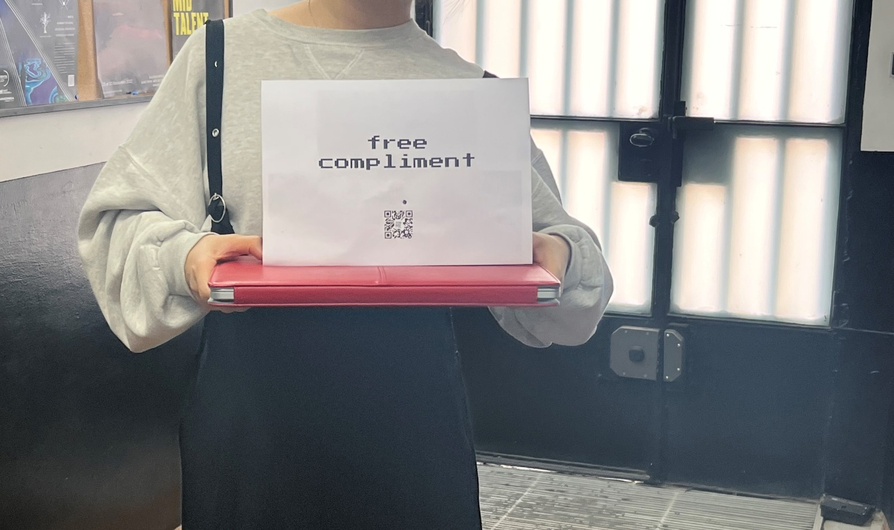

---
hide:
    - toc
---

# Measuring The World
Measuring the world seminar was very hands-on to begin to comprehend data capturing processes, the intentions behind them and how a scientific hypotheses based approach is a way to understand data. Data is changing how the world works in terms of politics and individual freedom and we need to be aware of it.

There is a two-pronged approach to utilizing data, collecting it as an individual or working with data collected by others. There was an interesting discussion about chat GPT 3 and Amazon turk, understanding forms of digital slavery. To me, the content was particularly interesting because I've always wanted to scrape for news headlines looking for gender violence, inspired by the work of MIT's data+feminism lab. I am curious to run python code to extract headlines from Latin America related to this and see what the results show.

## Group Assignment - Sparking curiosity

As a group, we were interested in curiosity as an overarching theme but had trouble translating such a broad abstract concept into a tangible indicator that we could measure in only two days. While we started with sparking curiosity as a concept, during the process we realzied that curiosity is sometimes very used for phishing and scamming as human curiosity is used as a way to get data without a person's consent.

Critically evaluating what we did as a group, we realized that curiosity can take many angles and while we tried to focus on boredom and how that can trigger curiosity, we also realized that many angles of curiosity are not being measured by our chosen data collection methods.

We got the feedback that we should've measured the amount of QR clicks relative to amount of humans in the space and also some interesting reflecctions regarding the need for boredom to trigger curiosity. One of my personal takeaways was Guillem's push that measuring data in situated educational contexts can just be triggers to sparking conversations around the subject and have interesting spaces of discussion.

> People are willing to scan QR codes, despite the risks, for just a free compliment.

[This was our sensemaking journal.](https://hackmd.io/6pe4C8EkSCmeJyPlKlmLGQ?both)
