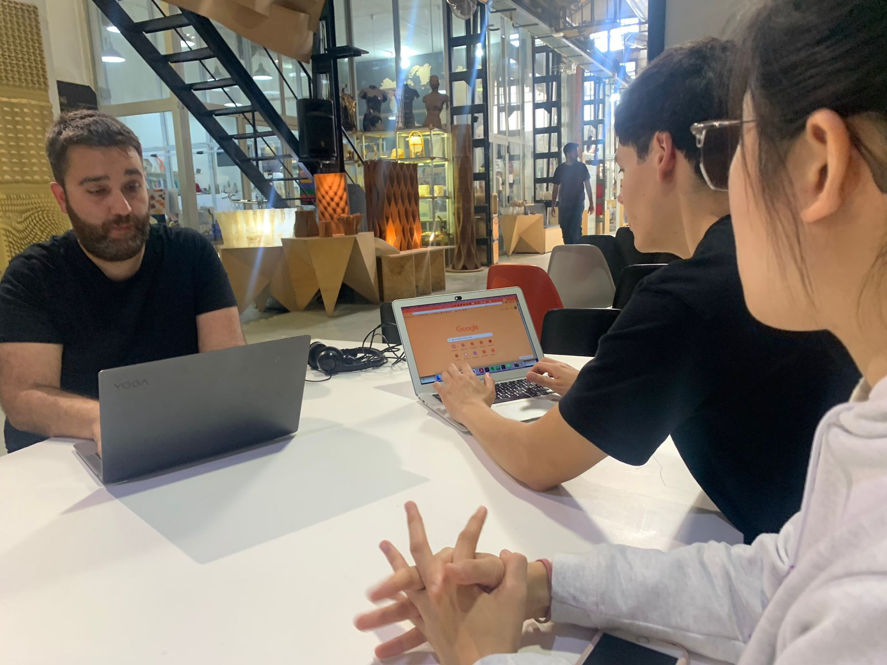

---
hide:
    - toc
---

# Design Studio

## Outlining my first intervention for the Third Trimester

For this third trimester I would like to focus on the Perception Board workshop I have been working with Ariel and Wen, while in parallel running small experiments.

The reason is because I feel there is still a design opportunity to figure out how the Perception board would work in context with children 13 years and older while also incorporating other elements to our system and session such as the Speaker Mic. We are also interested in designing a promotional landing site to pitch the project to other organisations that might be interested in collaborating with us. I feel I could also link it to the theme of gender equality by designing a session fully focused on that subject and then testing with a different community.

In parallel, I would also like to work with Carolina to explore ecofeminism from a different angle.

This is our first draft of the workshop we are planning to run with students as part of MDEFest.

[First draft here](https://docs.google.com/document/d/1oL71yZQzWA71ws4Rr8KWr7-Eeh0ljLj6PJy49fh3j8g/edit?usp=sharing)

Our next steps will be to co-create design sessions with Fab Lab team working with K-12 schools and school teachers.

We are also working on wrapping up and documenting our process to scale the project and pitch to competitions.

[Figma Landing site](https://www.figma.com/file/uOMyI6194EmIxtUgXjSZdM/Little-Big-Futures?node-id=46%3A2&t=Lr7tCo9V2w7nYxTp-1)

## Ecofeminism
### Sharing back Collage Intervention with Mamás que Leen
One of my priorities for this trimester is to share back with a larger community the work related on ecofeminism that I explored during the Second Trimester.

For this reason, I partnered with Carolina to co-create a Medium Publication called Intersectional Tomorrows where we will share reflections and thougths related to our process and results of the intervention. Initially we found ourselves overwhelmed by what to communicate and on what platform but we then decided to start small with one blog post on Medium.

## Perception Board - Futures Literacy in children

### Intervention 1 - Co-creation session with Future Learning at Fab Lab (Xavi)
We did a one hour co-creation session with Xavi to refine our intervention with children.

Some learnings that emerged from the conversation.

- We will carry out the activity with 15 year old children (3er grado)

- We will apply the intervention with the same school in Badalona (to ensure a baseline of same conditions)

- We will try to do some A/B testing between sessions (i.e. one facilitated entirely by us and one facilitated by the teacher with us not involved)

- We will also use papers instead of bringing the actual wooden board and work with groups of 4-5 students. We will then do a collective shareback.

- We will facilitate a voting session on Menti so students can have a say in what topic is discussed.

After the session we emailed the director of the school hoping we can schedule a session during May or early June.

As a group, we are also planning on hosting a Zoom session with MDEF alumni that have also worked with schools, bringing all of us together to share experiences and also officially launch our tools to map perceptions and design futures collaboratively with children. As next steps, we are gathering the emails of the students and defining the theme of the conversation during the MDEFest sessions.
