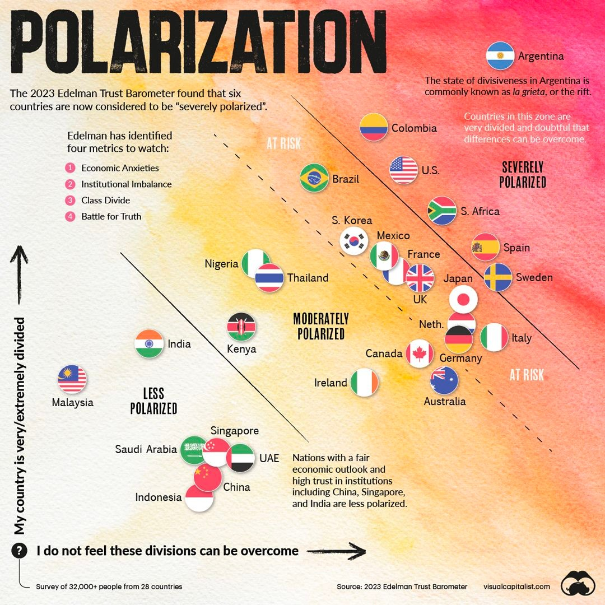

---
hide:
    - toc
---

# Design Studio

## Outlining my first intervention for the Third Trimester
For this third trimester I would like to focus on the Perception Board workshop I have been working with Ariel and Wen, while in parallel running small experiments.

The reason is because I feel there is still a design opportunity to figure out how the Perception board would work in context with children 13 years and older while also incorporating other elements to our system and session such as the Speaker Mic. We are also interested in designing a promotional landing site to pitch the project to other organisations that might be interested in collaborating with us. I feel I could also link it to the theme of gender equality by designing a session fully focused on that subject and then testing with a different community.

In parallel, I would also like to work with Carolina to explore ecofeminism from a different angle.

This is our first draft of the workshop we are planning to run with students as part of MDEFest.

[First draft here](https://docs.google.com/document/d/1oL71yZQzWA71ws4Rr8KWr7-Eeh0ljLj6PJy49fh3j8g/edit?usp=sharing)

Our next steps will be to co-create design sessions with Fab Lab team working with K-12 schools and school teachers.

We are also working on wrapping up and documenting our process to scale the project and pitch to competitions.

[Figma Landing site](https://www.figma.com/file/uOMyI6194EmIxtUgXjSZdM/Little-Big-Futures?node-id=46%3A2&t=Lr7tCo9V2w7nYxTp-1)

##Ways of drifting - Scalability roadmap
Jana and Roger made a recap of the "Ways of drifting" that were presented during the second week of the Masters. The content resonated with me, in particular the Expansive approach to drifting which I feel has been the way I have been evolving my design practice during MDEF.

Interventions and way of drifting:

- **Innerbot - Comparative:** Me and Wen found common areas and ways to apply chat GPT4 to help with mental health and IPV healing.

- **Imagining futures with children - Comparative:** We also approached this design intervention trying to find commonalities between climate change, gender equality and mental health and finding intersections through futures literacy.

- **Ecofeminism - Probing:** Me and Carolina tried to use arts and crafts as a means to begin conversations around ecofeminism and futures literacy with migrant women.

- **Perception Board workshop with children - Serial:** We tried to do a second iteration that builds on the learnings from the initial collage creation workshop and deep dive more on the topic areas we have chosen as a group with Ariel and Wen.

**Scalability roadmap**

My scalability strategy will revolve around creating a network of experts collaborating in the field and generating content tailored to this community.

- Create a distributed network of educators and innovators working at the intersection of design, maker culture, fab labs and integrating design technology into classrooms. With Ariel and Wen we plan on launching this initiative with other MDEF alumni that have also collaborated with schools. We plan to map opportunity areas (such as a repository of schools to collaborate with, open source databases of workshops and tools).

This relates to my initial interest in gender equality since using new tools can be triggers to having new conversations and discussions. Working with children is also a prevention and care approach to approaching the issue while helping frame conversations.

- Create a Medium publication with Carolina around Ecofeminist futures to generate a virtual following of professionals also interested in this design intersection.

- Continue my bimonthly newsletter on designing for gender-inclusive futures.

- Submit Little Big Futures project to design competitions including Duth Design Week, Vienna Design Week and Prototypes for Humanity Design Competition in Dubai.

## Design studio class Scaling: Activity 1- The 5Ws of scaling

**Why?**

- Create a distributed network of teachers and/or designers interested in implementing our Perception Board, collage workshop or other education tools to help children design future solutions for the world’s most pressing problems.

- Generate content around ecofeminism and bring together designers, academics and/or makers working in this intersection with communities around the World.

**What?**

- Digital assets and databases including all the materials, documentation and files to set up or run workshops with schools in Barcelona and elsewhere.

- Blog posts, videos and online conferences around the topic of ecofeminism.

**Who?**

- Network of private and public schools in Barcelona, teachers working on climate change and innovation, designers collaborating with children

- Designers, activists and artists working on ecofeminism from a climate change / nature perspective or gender equality.

**Where?**

- Schools in Barcelona (pilot in Sant Andreu in Baladona), schools in Latin America and/or Asia, after school spaces / parks / public spaces.

- Online community that echoes physical interventions in local community spaces.

**When?**

- In the short term, activities in school in Badalona, long term activities replicated by external participants.

- Release of online community during 2023.

These are our combined answers with Wen and Ariel for Little Big Futures project.

**Why?**

Create a distributed network of teachers and/or designers interested in implementing our Perception Board, collage workshop or other education tools to help children design future solutions for the world’s most pressing problems. To reimagine future tools of education creating alternative ways for children and teenagers to talk about difficult topics and improve the dialogue skills in the society

**What?**
Digital assets and databases including all the materials, documentation and files to set up or run workshops with schools in Barcelona and elsewhere. Perception Board and Tools, both physical and digital

**Who?**
Network of private and public schools in Barcelona, teachers working on climate change and innovation, designers collaborating with children

**Where?**
Schools in Barcelona (pilot in Sant Andreu in Baladona), schools in Latin America and/or Asia, after school spaces / parks / public spaces. Could also happen online.

**When?**
In the short term, activities in school in Badalona, long term activities are replicated by external participants. Potentials to share our projects on a wider platform.

## Scaling: Activity 2- How?

Our structure for Little Big Futures fits under documentation / guide since we are interested in packaging everything into a Landing site and then sharing back with teachers and school children with the objective of urging schools around Barcelona to replicate our workshops on futures literacy with different school children. Our current challenge is to make it as simple as possible so that schools can easily replicate and implement our model since we won’t be able to facilitate sessions in the future and we want this to fit under a distributed model.

## Ecofeminism
### Sharing back Collage Intervention with Mamás que Leen
One of my priorities for this trimester is to share back with a larger community the work related on ecofeminism that I explored during the Second Trimester.

For this reason, I partnered with Carolina to co-create a Medium Publication called Intersectional Tomorrows where we will share reflections and thougths related to our process and results of the intervention. Initially we found ourselves overwhelmed by what to communicate and on what platform but we then decided to start small with one blog post on Medium.

###Medium Article
Me and Carolina quickly worked on writing a Medium article. We found the task to be quite easy since we had already documented our learnings for Design Studio purposes. We focused on channeling the depth of the insights we gained as a result of working closely with Mamás que Leen.

[You can read the article here](https://medium.com/tomorrows/ecofeminism-and-collage-creation-workshop-with-mam%C3%A1s-que-leen-an-invitation-to-create-and-be-part-f8e28d05dd30)

## Perception Board - Futures Literacy in children

### Intervention 1 - Co-creation session with Future Learning at Fab Lab (Xavi)
We did a one hour co-creation session with Xavi to refine our intervention with children.

Some learnings that emerged from the conversation.

- We will carry out the activity with 15 year old children (3er grado)

- We will apply the intervention with the same school in Badalona (to ensure a baseline of same conditions)

- We will try to do some A/B testing between sessions (i.e. one facilitated entirely by us and one facilitated by the teacher with us not involved)

- We will also use papers instead of bringing the actual wooden board and work with groups of 4-5 students. We will then do a collective shareback.

- We will facilitate a voting session on Menti so students can have a say in what topic is discussed.

After the session we emailed the director of the school hoping we can schedule a session during May or early June.

As a group, we are also planning on hosting a Zoom session with MDEF alumni that have also worked with schools, bringing all of us together to share experiences and also officially launch our tools to map perceptions and design futures collaboratively with children. As next steps, we are gathering the emails of the students and defining the theme of the conversation during the MDEFest sessions.

### Intervention 2 - Async planning with teachers from Sant Andreu School in Badalona
Ariel contacted Merce, the school director, to coordinate having a session with 3rd grade students during June. Merce offered us a one hour slot during June 8th for 90 students.

This has brought the following design constraints:

- Because of the large quantity, we might need to divide ourselves up or just run a super quick exercise with each of the 3 classes.

- We can do a train the trainers program for teachers to see if they want to implement in their own schedules. This was Xavi's suggestion.

- Unfortunately the school does not have other time slots to offer because of the dates and reaching out to a new school is not a possibility at this stage.

Our challenge right now is to iterate the workshop to fit the new constraints.

### Prototyping for Design Challenge week
During this week we focused on building a digital interface where children could map their invented futures and pick one out of two Dall-E generated images to feed an interactive gallery.

[Our challenge documentation](https://github.com/jimenasalinasgroppo/microchallenge-03)

In parallel, we also iterated our workshop with children looking at the design constraints of working with 90 children.

**Some alternatives we have explored.**

- Having a one-hour session in one same big space and dividing them all into smaller groups + relying on teachers for facilitation.

- Iterate our session to a quick product demo and go into each classroom for quick 20 minutes slots to gather their opinions and feedback.

Overall, we want to loosen control of the workshop and see what emerges of just bringing the product and choosing a specific topic to discuss such as climate change and deforestation.

### Designing the workshop - Getting feedback from experts
This week I focused on gathering feedback from Mariana, Tomás and Rachel, who is an expert in GBV and designing programs with NGOs. For both sessions, I told them rapidly about the workshop plan, inspired by a 2x2 image I found on the Internet that shows a polarization map in regards to sentiments and perceptions of people in different countries. I was inspired by how it does not speak of solutions but of narratives and sentiments. One thought I had was how can we bring that back to the workshop with 90 teenagers.

**Some reflections after gathering feedback:**

- Perception mapping relates to Reality Tunnels - since teenagers especially are increasingly exposed to confirmation biases via TikTok where algorithms work almost instantly.

- There is an opportunity to embed critical hope when discussing the state of the world, especially in regards to pressing issues such as climate change, equality and mental health. While it is vital to be critical, it is equally as important to have an agenda of hope and leave the workshop assistants with a positive note about the state of the world and how it can change for good.

- Mariana shared how the Atlas of Weak Signals all have positive trends and signals intentionally and made me think of what type of educator I want to be.

- Rachel shared a podcast episode of Hidden Brain called “How Your Beliefs Shape Reality” where this is also relevant since it uses evidence-backed neuroscience studies to show how humans' perception about the Universe being just and being beautiful affect how they relate to the world and how they even show up in certain spaces.

- In regards to my project with Wen and Ariel this made me think how we can not only talk about filter bubbles and echo chambers and designing solutions using co-creation, but that this project also relates to how teenagers feel towards the World and the state of things. Thus, it is important to embed critical hope and while it is important to show how opinions are malleable, it is also important to embed hope into the workshop.

- During my conversation with Tomás, he gave us some actionable feedback. To use more concise prompts, simple language and make it more visual. He also suggested we get to know the class before to understand our users better. He mentioned the work of Ugur Gallenkus as a photographic reference and the book “Adversarial Design.”

- An interesting reference I found online is The World Talks. The World Talks is an online experiment where 2 strangers around the world are connected online based on survey answers and a matchmaking algorithm. The intention is to match people with opposite political views in relation to climate change and migration and is an exercise to counter polarization. In essence, it is very similar to what we are trying to achieve as a group. They also have a guide of top 10 rules for a good discussion that we will apply with the children.

### Workshop prep - Setting up the agenda and presentation

With Wen and Ariel we dedicated a work session to refining our agenda, detailed script and presentation.

<iframe src="https://docs.google.com/presentation/d/e/2PACX-1vSatTTImB0ZxQ1Hkg6_JTX6yDSupz8rt0FjpkDVNE3fW-p71X0p3GyZAL97MltnWsWoTea4EGs6HjOl/embed?start=false&loop=false&delayms=3000" frameborder="0" width="960" height="569" allowfullscreen="true" mozallowfullscreen="true" webkitallowfullscreen="true"></iframe>

We will also be visiting the school on Tuesday to introduce ourselves to the teachers, have a look at the space and infrastructure and meet the students (if possible).

###Visiting the school and co-creating with teachers
On Tuesday of the week of the workshop, we visited Saint Andreu’s secondary school in a building nearby to the Primary school. We were welcomed by the director and school teacher, who showed us around and showed us where we will be conducting the workshop.

**Some decisions that were made:**

- Since tables and chairs are hard to arrange, teenagers will work in circles on the floor, using the printed perception boards and pens.
We will have a projector to connect to our laptops.

- Teacher really liked emotional regulation as a subject and mentioned that the students had previously mapped their emotions and what sensations they felt in their body using a similar exercise.
The space is quite big and will allow us to run the workshop properly.

- The teachers were very open to collaborating with ideas for the prompts and topics explored and they will assist us with co-facilitating the workshop.

###MDEFEST - Perception Board workshop with 90 teenagers at Sant Andreu (08/06)
We conducted the workshop at Sant Andreu’s gymnasium area with around 90 15 year-olds. Our objective was to facilitate healthy debate, welcome differences of thought amongst them and challenge them to change their opinions regarding climate change, mental health and gender equality during the one-hour session. We were scheduled during the morning and we thought this was a positive decision since their brains would be more fresh.

**Feedback survey results:**
At the end of the session, we gathered their feedback through a printed survey that they answered as a group. For us, it was a quick way to gather their impressions with the limited time we had assigned and get some insights into what outcomes we had accomplished and what were our areas of improvement.

**Results:**
- Do you want to discuss more about the topics after the exercise?
Yes - 12 (86%)
No - 2 (14%)

- Did you move the pointer more than 4 times?
Yes - 11 (79%)
No - 3 (21%)

- Do you think your mind is more open after this exercise?
Yes - 9 (64%)
No -  5 (36%)

- From 1 to 10, how satisfied are you with your experience with the Perception Board?
8
8
10
5
8
8
7
7
8
7
5
8
7.5
8

**Average: 7.5**

- Do you feel uncomfortable seeing the opinions of others?
Yes - 11 (79%)
Yes and No - 3 (21%)

Observation:
They marked both yes and no, interesting to see they don’t fully agree on this one. We personally feel some tension is good for the exercise.

**Workshop learnings:**

- **Diverse Groups:** Create groups independently to prevent echo chambers and the reluctance to express different opinions among friends.

- **Address Acoustic Challenges:** Consider space limitations and aim for a format that accommodates around 30 people for optimal communication.

- **Ample Space for Questions:** Allow sufficient room for questions and prompts, keeping them simple and gradually increasing complexity.

- **Follow Rules of Engagement:** Refer to established guidelines to manage potentially heated arguments effectively.

- **Teacher Co-Facilitators:** Teachers should assist in question design and setting ground rules as active co-facilitators.

- The teacher mentioned that we should include gender equality during the session. We added a question last minute, but found out that the wording was a bit too complicated for them and we should keep it as simple as possible.

**Opinions from students:**

- Chat GPT can’t be used as an alternative to therapy because it can’t empathize and has no feelings. Therapy should be subsidized or made more accessible but not through that type of technology.

- Humans and animals know how to coexist. However, humans should find ways to not kill animals in excess and be less cruel. They also feel veganism is not a solution and that some people even do it more because it’s a trend.

- It was interesting to see one female student speak up and share that she had been bullied by 2 students from the class and that chat GPT had helped her express herself and feel understood during class because she could not call her parents during class time. She felt Chat GPT had really helped her.

- At some point, the discussions got very heated and Ariel had to remind them of the rules of engagement. After each argument, students would clap one another and we actually found that we were doing the opposite of what we intended (polarizing the class more). Something to keep in mind is how to manage the energy in the classroom because these types of arguments tend to get personal and resonate emotionally wit some students.

For future iterations of the workshop, we would focus more on one specific topic, reduce the quantity of students and allow for more in-depth discussion. I personally feel the Perception Board is a conversation starter to address taboo topics or generate an excuse to have debate sessions within the classrooms.

Overall, I feel this intervention was a good wrap up for our MDEF experience. It combined all of our interests and was also proof of the trust we had built with the school teachers and directors. The format itself was quite challenging with 90 teenagers and only one hour but it was a great stress test for our product. I feel there is a huge opportunity area in developing workshops that aim to improve soft skills and futures literacy, while engaging with children as empowered actors with points of view that should be integrated into the design of goods and services.
