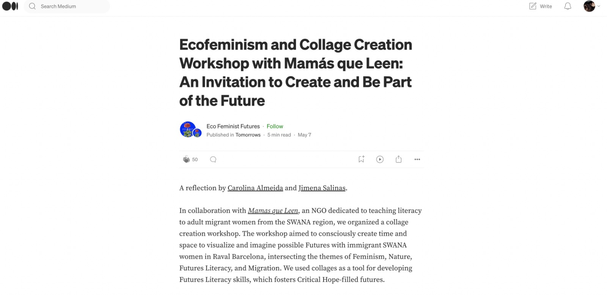

---
hide:
    - toc
---

# Design Studio

## Outlining my first intervention for the Third Trimester
For this third trimester I would like to focus on the Perception Board workshop I have been working with Ariel and Wen, while in parallel running small experiments.

The reason is because I feel there is still a design opportunity to figure out how the Perception board would work in context with children 13 years and older while also incorporating other elements to our system and session such as the Speaker Mic. We are also interested in designing a promotional landing site to pitch the project to other organisations that might be interested in collaborating with us. I feel I could also link it to the theme of gender equality by designing a session fully focused on that subject and then testing with a different community.

In parallel, I would also like to work with Carolina to explore ecofeminism from a different angle.

This is our first draft of the workshop we are planning to run with students as part of MDEFest.

[First draft here](https://docs.google.com/document/d/1oL71yZQzWA71ws4Rr8KWr7-Eeh0ljLj6PJy49fh3j8g/edit?usp=sharing)

Our next steps will be to co-create design sessions with Fab Lab team working with K-12 schools and school teachers.

We are also working on wrapping up and documenting our process to scale the project and pitch to competitions.

[Figma Landing site](https://www.figma.com/file/uOMyI6194EmIxtUgXjSZdM/Little-Big-Futures?node-id=46%3A2&t=Lr7tCo9V2w7nYxTp-1)

##Ways of drifting - Scalability roadmap
Jana and Roger made a recap of the "Ways of drifting" that were presented during the second week of the Masters. The content resonated with me, in particular the Expansive approach to drifting which I feel has been the way I have been evolving my design practice during MDEF.

Interventions and way of drifting:

- **Innerbot - Comparative:** Me and Wen found common areas and ways to apply chat GPT4 to help with mental health and IPV healing.

- **Imagining futures with children - Comparative:** We also approached this design intervention trying to find commonalities between climate change, gender equality and mental health and finding intersections through futures literacy.

- **Ecofeminism - Probing:** Me and Carolina tried to use arts and crafts as a means to begin conversations around ecofeminism and futures literacy with migrant women.

- **Perception Board workshop with children - Serial:** We tried to do a second iteration that builds on the learnings from the initial collage creation workshop and deep dive more on the topic areas we have chosen as a group with Ariel and Wen.

**Scalability roadmap**

Create a distributed network of educators and innovators working at the intersection of design, maker culture, fab labs and integrating design technology into classrooms. With Ariel and Wen we plan on launching this initiative with other MDEF alumni that have also collaborated with schools. We plan to map opportunity areas (such as a repository of schools to collaborate with, open source databases of workshops and tools).

This relates to my initial interest in gender equality since using new tools can be triggers to having new conversations and discussions. Working with children is also a prevention and care approach to approaching the issue while helping frame conversations.

## Ecofeminism
### Sharing back Collage Intervention with Mamás que Leen
One of my priorities for this trimester is to share back with a larger community the work related on ecofeminism that I explored during the Second Trimester.

For this reason, I partnered with Carolina to co-create a Medium Publication called Intersectional Tomorrows where we will share reflections and thougths related to our process and results of the intervention. Initially we found ourselves overwhelmed by what to communicate and on what platform but we then decided to start small with one blog post on Medium.

###Medium Article
Me and Carolina quickly worked on writing a Medium article. We found the task to be quite easy since we had already documented our learnings for Design Studio purposes. We focused on channeling the depth of the insights we gained as a result of working closely with Mamás que Leen.

[You can read the article here](https://medium.com/tomorrows/ecofeminism-and-collage-creation-workshop-with-mam%C3%A1s-que-leen-an-invitation-to-create-and-be-part-f8e28d05dd30)

## Perception Board - Futures Literacy in children

### Intervention 1 - Co-creation session with Future Learning at Fab Lab (Xavi)
We did a one hour co-creation session with Xavi to refine our intervention with children.

Some learnings that emerged from the conversation.

- We will carry out the activity with 15 year old children (3er grado)

- We will apply the intervention with the same school in Badalona (to ensure a baseline of same conditions)

- We will try to do some A/B testing between sessions (i.e. one facilitated entirely by us and one facilitated by the teacher with us not involved)

- We will also use papers instead of bringing the actual wooden board and work with groups of 4-5 students. We will then do a collective shareback.

- We will facilitate a voting session on Menti so students can have a say in what topic is discussed.

After the session we emailed the director of the school hoping we can schedule a session during May or early June.

As a group, we are also planning on hosting a Zoom session with MDEF alumni that have also worked with schools, bringing all of us together to share experiences and also officially launch our tools to map perceptions and design futures collaboratively with children. As next steps, we are gathering the emails of the students and defining the theme of the conversation during the MDEFest sessions.

### Intervention 2 - Async planning with teachers from Sant Andreu School in Badalona
Ariel contacted Merce, the school director, to coordinate having a session with 3rd grade students during June. Merce offered us a one hour slot during June 8th for 90 students.

This has brought the following design constraints:

- Because of the large quantity, we might need to divide ourselves up or just run a super quick exercise with each of the 3 classes.

- We can do a train the trainers program for teachers to see if they want to implement in their own schedules. This was Xavi's suggestion.

- Unfortunately the school does not have other time slots to offer because of the dates and reaching out to a new school is not a possibility at this stage.

Our challenge right now is to iterate the workshop to fit the new constraints.

### Prototyping for Design Challenge week
During this week we focused on building a digital interface where children could map their invented futures and pick one out of two Dall-E generated images to feed an interactive gallery.

[Our challenge documentation](https://github.com/jimenasalinasgroppo/microchallenge-03)

In parallel, we also iterated our workshop with children looking at the design constraints of working with 90 children.

**Some alternatives we have explored.**

- Having a one-hour session in one same big space and dividing them all into smaller groups + relying on teachers for facilitation.

- Iterate our session to a quick product demo and go into each classroom for quick 20 minutes slots to gather their opinions and feedback.

Overall, we want to loosen control of the workshop and see what emerges of just bringing the product and choosing a specific topic to discuss such as climate change and deforestation.
