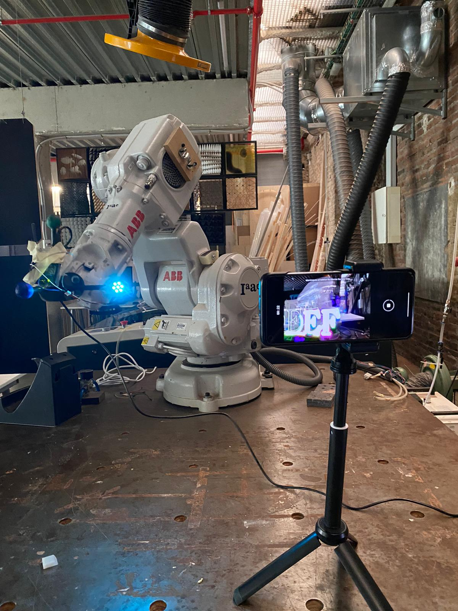
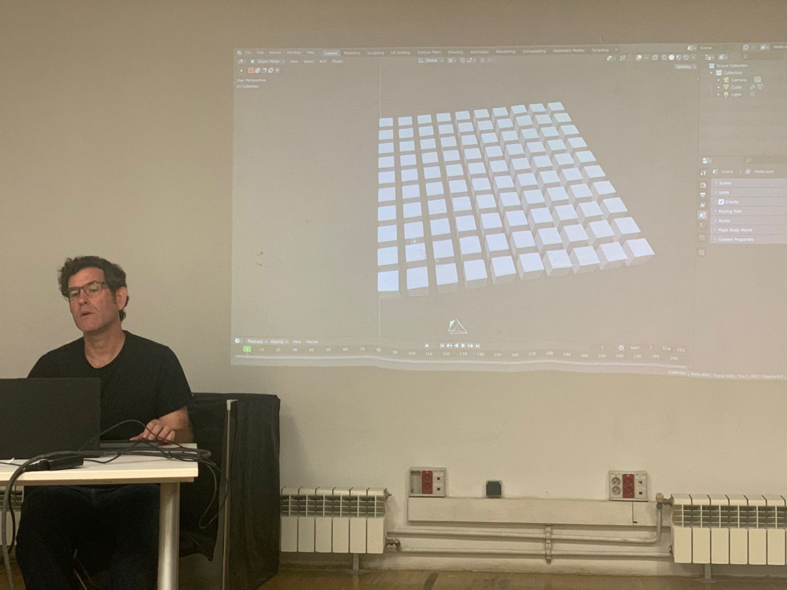

---
hide:
    - toc
---

# Prototyping for Design - Trimester 3

##Day 1 - Robots
During this class we were introduced to the topic of robots, specifically looking at robotic arms. I was sick for this session but looking through the class documentation what stood out for me was exploring all the possibilities related to the use of this technology and how robots can be used for many different purposes.

I also played around with the Rhino plug in to see the simulation of the robotic arm. It was interesting to see how the joints indicate the type of movement the robot makes and my understanding of types of movements by robots is now expanded. I also learned that Rhino and Grasshopper are tools that help simulate how specific robots (like robotic arms) can move. I prepped a Rhino file with a group from the class using Grasshopper using the plug ins that are found in the class documentation.

One of the questions this module sparked for me was how can we introduce robots to solutions to human problems beyond engineering and manufacturing? I know robots help with assembly line of manufacturing, such as cutting wood.

##Day 2 - Introduction to Blender
During this session Victor introduced us to the software of Blender. I had previously used Blender for a prototyping for design challenge but was unaware of many of its benefits and also did not know that it is open source.

We were introduced in depth to its history, the concept of software libre and open and how the product has evolved in the past years. I was also surprised to learn that Blender can also be used with Python and shares similarities with coding.

As Blender is a tool focused on animation it is not necessarily the right tool always. However, Victor showed how he used Blender applied to Romi, a project focused on the south of France and north of Spain using tools for farmer hackers. This real-life example helped contextualize the tool to design settings.

As such, the class underscored how knowing and using tools like Blender can be a valuable asset for designers in their work.

##Day 3 - Live coding as a human interface
During this class, Xavi shared his background and how he became part of the Future Learning stream at the Fab Lab. To me it was very interesting to learn about his background, having collaborated with him previously to get in contact with primary schools in Badalona.
We were then introduced to the work of Citlali Hernandez. She shared her work using Fab Lab tools to create wearable electronics merging conceptual art. Blending choreography and dancing with electronics and how she has showcased her work in cities such as Valencia and in Santiago de Chile. Some questions raised where the body as complexity and what is the body? It was also interesting to see how she incorporated the Raspberry pi to her own body of work.

We also played around with Hydra (https://hydra.ojack.xyz/) changing the shapes to play around with circles and oscilloscopes. Hydra is a livecoding video synth that works on the browser. It is open source and works for both beginners and experts.
