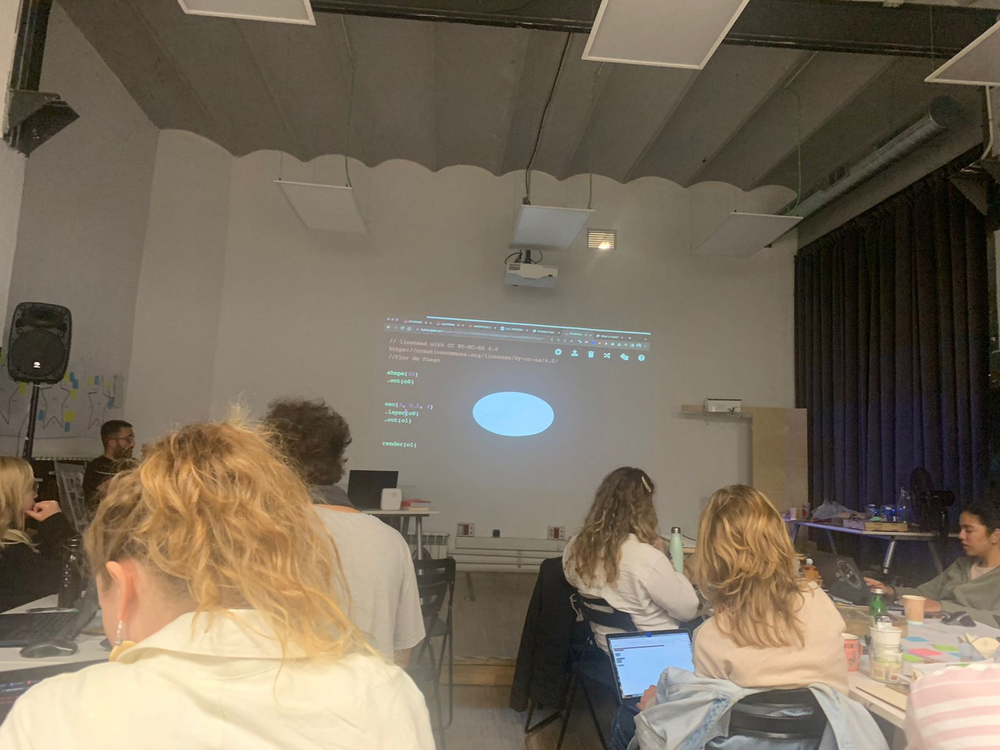
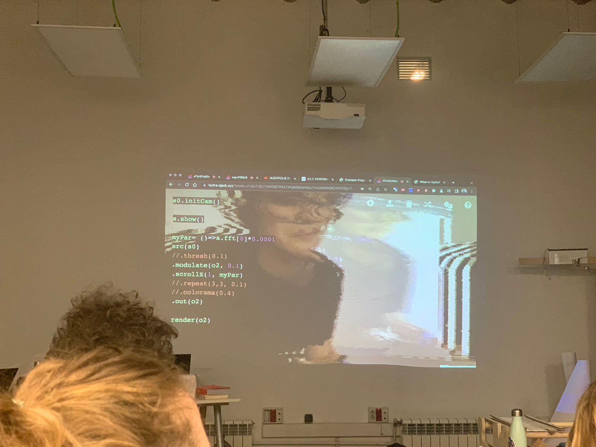
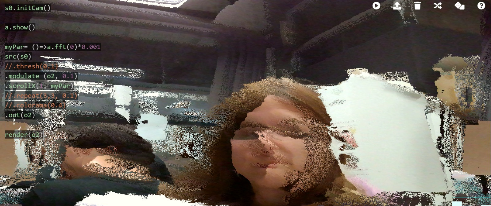
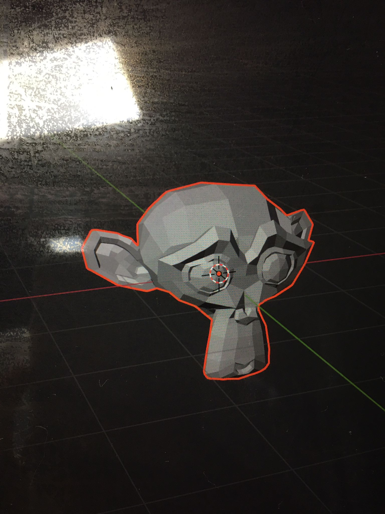
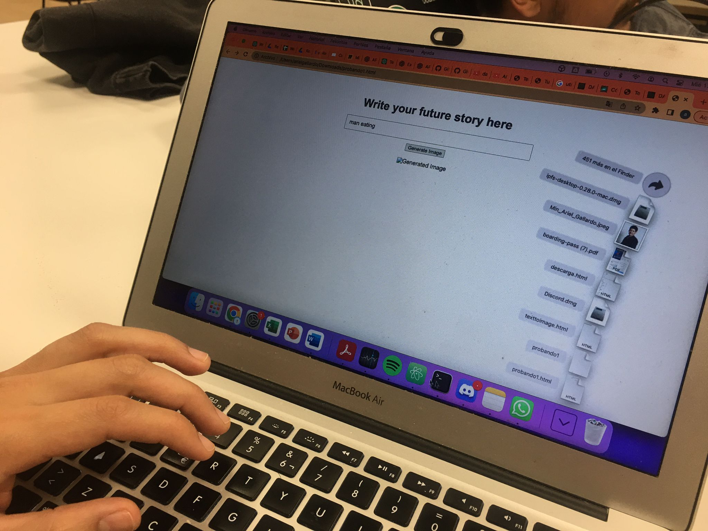
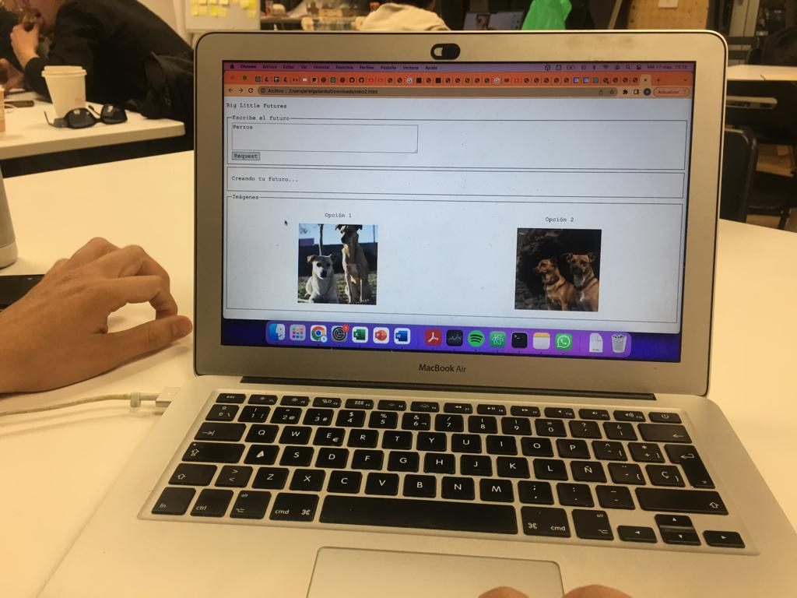
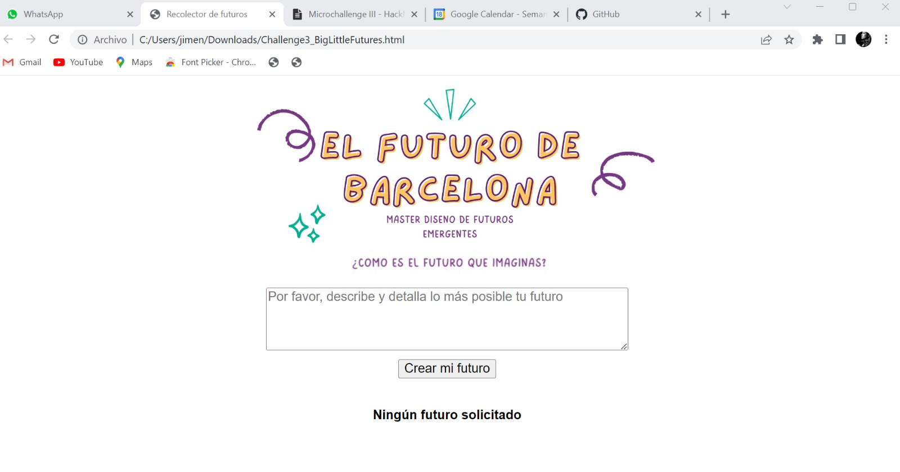
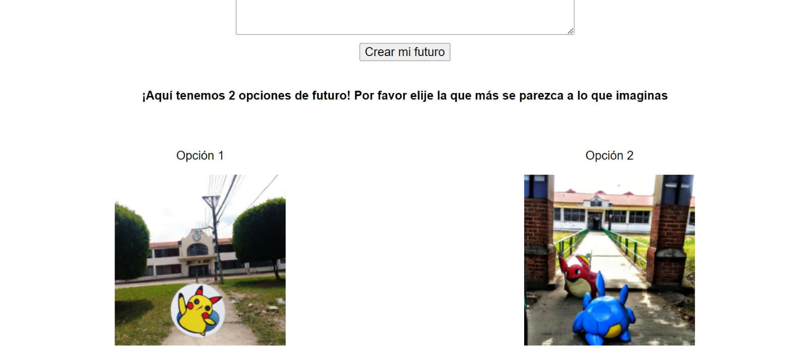
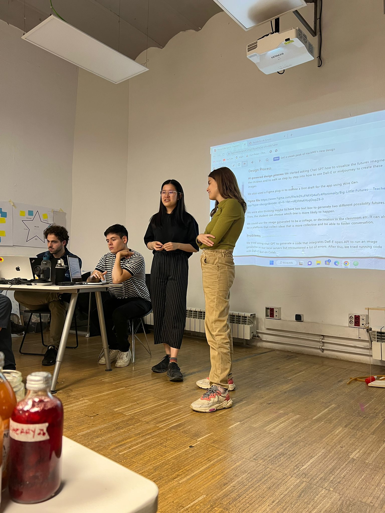

---
hide:
    - toc
---

# Prototyping for Design - Trimester 3

##Day 1 - Robots
During this class we were introduced to the topic of robots, specifically looking at robotic arms. I was sick for this session but looking through the class documentation what stood out for me was exploring all the possibilities related to the use of this technology and how robots can be used for many different purposes.

I also played around with the Rhino plug in to see the simulation of the robotic arm. It was interesting to see how the joints indicate the type of movement the robot makes and my understanding of types of movements by robots is now expanded. I also learned that Rhino and Grasshopper are tools that help simulate how specific robots (like robotic arms) can move. I prepped a Rhino file with a group from the class using Grasshopper using the plug ins that are found in the class documentation.

One of the questions this module sparked for me was how can we introduce robots to solutions to human problems beyond engineering and manufacturing? I know robots help with assembly line of manufacturing, such as cutting wood.

##Day 2 - Introduction to Blender
During this session Victor introduced us to the software of Blender. I had previously used Blender for a prototyping for design challenge but was unaware of many of its benefits and also did not know that it is open source.

We were introduced in depth to its history, the concept of software libre and open and how the product has evolved in the past years. I was also surprised to learn that Blender can also be used with Python and shares similarities with coding.

As Blender is a tool focused on animation it is not necessarily the right tool always. However, Victor showed how he used Blender applied to Romi, a project focused on the south of France and north of Spain using tools for farmer hackers. This real-life example helped contextualize the tool to design settings.

As such, the class underscored how knowing and using tools like Blender can be a valuable asset for designers in their work.

##Day 3 - Live coding as a human interface
During this class, Xavi shared his background and how he became part of the Future Learning stream at the Fab Lab. To me it was very interesting to learn about his background, having collaborated with him previously to get in contact with primary schools in Badalona.
We were then introduced to the work of Citlali Hernandez. She shared her work using Fab Lab tools to create wearable electronics merging conceptual art. Blending choreography and dancing with electronics and how she has showcased her work in cities such as Valencia and in Santiago de Chile. Some questions raised where the body as complexity and what is the body? It was also interesting to see how she incorporated the Raspberry pi to her own body of work.

We also played around with Hydra (https://hydra.ojack.xyz/) changing the shapes to play around with circles and oscilloscopes. Hydra is a livecoding video synth that works on the browser. It is open source and works for both beginners and experts.

##Day 4 - Blender as interface
During this session Victor showed us integrations of Python and Blender. The one that stood out for me the most was using the cell phone's sensors to make the Blender image move as the cell phone is also rotated and moved. I did not know these types of syncs were possible using Blender and Python and gave me curiosity to explore more, especially since I'm interested in learning how to model on Blender animations and renders that can be used for product design and pitching product ideas.

The class was spent trying to control LED strips using a combination of Blender and Arduino.

Code to receive data:
> if len(message.split(b',')) == 17:
x = float(message.split(b',')[-2]) * 0.01745
y = float(message.split(b',')[-1]) * 0.01745
z = float(message.split(b',')[-3]) * 0.01745 # print(x,y,z)
context.object.rotation_euler.x = x
context.object.rotation_euler.y = y
context.object.rotation_euler.z = z

##Challenge Week Term III - Digital Prototyping for Design

<iframe src="https://drive.google.com/file/d/1YW8ZNQZqIR8PUvrW4pTaYo8ZwW8aB_ad/preview" width="640" height="480" allow="autoplay"></iframe>

For this week, me, Wen and Ariel were planning to push forward the creation of AI-generated imagery using the children's imagined futures as inputs. We want to also focus on outlining the systems design of integrating digital artifacts to be handled by students during the implementation of our Perception Board that can enrich the experience and also integrate our workshop with 9-year olds with the one we will execute with 15-year olds during MDEFest.

This was the challenge where we had the least clarity of what we wanted our output to be. This affected our planning the first day but we later figured out ways to embrace the ambiguity of the process. During the first day we were trying to find existing codes that already did the main functionality and find ways to integrate a Dall-E token to our code.

One strategic action we took during this week was to prioritize and choose the most complicated task first and invest most of our time on figuring how to set up the text-to-image web app since as a team we had basic coding experience.

The result was a Web app that allows children to input their futures, generate 2 images that they can choose from as a result and then generate a gallery or repository of all the compiled futures. We felt this gallery could then be used to sell either NFTs or physical posters of the output as a fundraising mechanism for parent associations.

**My personal contribution**

My role during the week was to prototype with different ways to make the web app work and focus on documenting and prepping all the assets required for the intervention with the schools using Figma and getting ready the print assets. Ariel was in charge of coding the product and coordinating with the school director. Wen was in charge of facilitating and solving bugs in the code while also making sure our prompts to chat GPT4 were as close to what we required as possible. We were very time efficient and tried to focus on being very intentional with the digital interface we were building.

**Feedback received during challenge week**

As we had a functioning product, we had very useful feedback related to the ethical implications of using Dall-E with children and how that can affect our own learning outcomes. What stood out for me the most was how our collage creation exercise is actually analog to how algorithms are created with specific inputs. In that sense, introducing the digital interface of creation of futures can be used to have a conversation around the ethical implications of using AI in classroom settings with children.

**How the project links to my research project (Design studio)**

This digital interface relates to my research project since my initial hypothesis was to work at the service of children's visions regarding equality. If we conduct a session focused more on inclusion and gender equality, I could use the digital interface to visualize their own futures in regards to these subjects and then use those as starting points or conversation triggers for debate sessions with 15-year old students. I am very curious to see the results of testing our product with a classroom settings to get a more clear picture of the possibilities of the tool.

**Final interface**

Our final interface looks like the images below. We tried to make the copy as easy to understand as possible while making the UI visually attractive as well.

[Project Repo](https://github.com/jimenasalinasgroppo/microchallenge-03)
