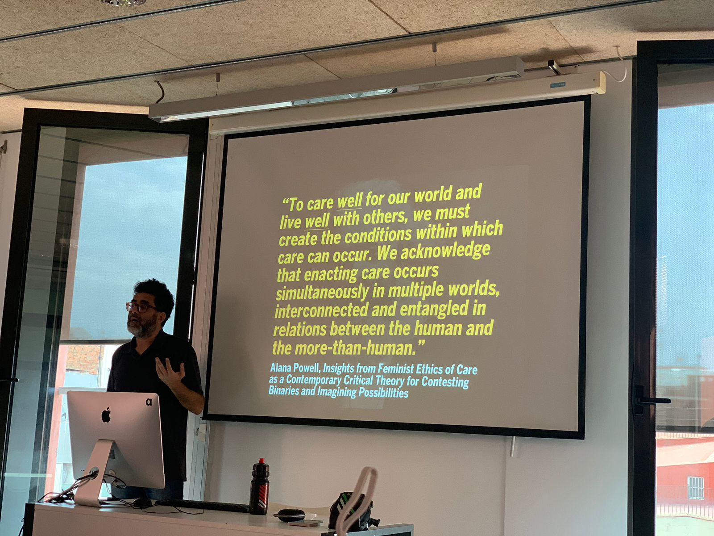

---
hide:
    - toc
---

# Design Ethics

##Day 1 - Intro
In this class, Ariel discussed various topics related to naturalism, technology, design, and systems thinking. Ariel highlighted how technology has become an inherent part of our existence and how it is not neutral but carries underlying values and ethics.

The idea of "design is ethics by other means" was introduced, emphasizing how design choices can reflect the ethical values of those who create them. The concept of the iceberg model was also discussed, which suggests that what we see on the surface is only a small part of a larger system, and that there are underlying layers that relate to different things. Overall, this class emphasized the importance of understanding the assumptions and values that underlie the technology we use, and the ethical implications of design choices in our increasingly technological world.

In this class, we explored the idea of technological neutrality and how it can be a reductive way of looking at technology. For instance, the saying "games don't kill people, people kill people" oversimplifies the complex role that technology can play in shaping our behavior and experiences. We discussed how even something as seemingly neutral as a gun can have a profound impact on the situation and the people involved. When someone holds a gun, they become a hybrid of sorts, a person with a weapon that defines what is possible within the situation. This discussion challenged us to think more critically about the role of technology in our lives and the ethical implications of our design choices.

We also explored the values and assumptions that are inscribed in our designs and how they can shape the products we create with the example of the product that cradles newborn babies. We discussed the importance of promoting care and support for families, rather than relying solely on techno-solutionism as the norm. We also delved into the negative consequences that can arise from designing for simplicity and convenience, rather than considering the complexity of the issue at hand.

 Overall, this class challenged us to think more critically about the values we want to promote in our designs and how we can mitigate tensions that arise as a result.

##Day 2 - Types of Design Ethics
>John Culkin, "We become what we behold. We shape our tools and then our tools shape us."

The overarching theme of the class was to avoid exploiting others and to find ways to align ethical principles with technological and design advancements.

One philosopher, Gudnyas, from Uruguay, recognized the importance of feminist critical theory and environmentalism in shaping ethical principles. This aligns with Donna Haraway's idea of bringing together diverse perspectives to address complex issues. This was especially relevant to my work trying to push gender justice through design interventions.

Similarly, in the context of AI, an open letter was discussed, calling for a pause on giant AI experiments, and the dangers of eugenics and scientific racism were explored. Another important takeaway for me was looking at AI technology and how it perpetuates racism and bias even as an uninteded consequence.

The class also discussed how design can be used to promote key human goods. Victor Papanek's book "Design for the Real World" emphasizes how everyone designs in their everyday lives. However, the profession of design is often seen as exclusive, and the class questioned what the key human good of design is. Mariana Mazucatto's perspective on the business value of design was explored, along with the concept of design justice by Sasha Constanza-Chock. We were also introduced to the notion of care applied to design, looking at examples like Lekshmy Parameswaran from The Care Lab. We also looked at dark patterns in UI design (i.e. shaming user for not choosing a specific option) and how this affects the ethics of the design process itself.

Ultimately, the class emphasized the importance of deep thought and intention in all aspects of life, including design and technological advancements. The goal is to move towards a more preferred state, where ethical principles are aligned with advancements in technology and design.

My biggest takeaway of this class was mentioned at the end when Ariel made us question: What is design's purpose? It is unclear when you compare to medicine or law and other professions that have more clarity of their goal and purpose. 
