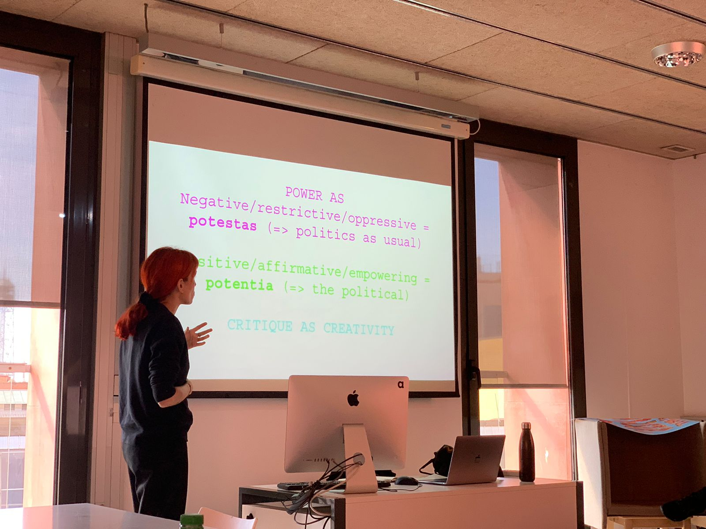

---
hide:
    - toc
---

# Critical Transfeminist Design

##Day 1 - Intro
>> “En un mundo donde el lenguaje y el nombrar las cosas son poder... el silencio es opresión y violencia.”
Adrienne Rich

The importance of acknowledging the colonial background and systemic racism in our structures was a central theme in this seminar. The discussion explored the concept of eugenics and how it has been used to justify terrible acts in the name of moral duty. The use of men to refer to humankind and the British Eugenics Society were also touched upon. Julian Huxley, a biologist and one of the most important thinkers of the British Eugenics Society, promoted the idea of enhancing the human race through genetics. However, eugenics policies were used to sterilize women from ethnic minorities without consent and even with consent, state forces convinced women in precarious situations why they wouldn't be good mothers. This resonated with me personally because in Peru during Alberto Fujimori's regime many indigenous women were sterilized without their consent and this practice is still justified by large parts of the Peruvian population.

The class also delved into the importance of paying attention to the use of terms, terminology, narrative, and discourses. Spinoza's philosophy, which distinguishes power as negative, restrictive, and oppressive (potestas) from power as positive, affirmative, and empowering (potentia), was also discussed. The idea that politics cannot be split from ethics and epistemology was also highlighted.

The discussion then shifted to the topic of Indigenous feminism and radical Indigenous survivance and empowerment, which counter creating narratives that reproduce colonial background. The importance of being aware of one's own privileges was emphasized, and Daniela Ortiz's critical approach to migrant laws in Spain and the Spanish State was discussed. Ius Sanguinis, which is still present in Spain, was also touched upon, and it was pointed out how systemic racism, colonialism, and extreme inequalities are still present in our structures.

The class also explored the concept of the subaltern, which refers to the experience and subjective condition of the subordinate, determined by a relation of domination, and the idea that "we cannot demolish the master's house with the master's tools". Epistemic violence was discussed, and it was pointed out that it is important to pay attention to absences as well as presences.

The class concluded by emphasizing the importance of being aware of one's own privileges and contradictions, using tools from Western philosophy to open up critical cracks on what topics to address, and acknowledging who occupies the place of enunciation.

The discussion also explored bioethics and biohacking within a queer perspective, emphasizing that there are no universal rules or methodologies.

Mary Magic's idea of synthesizing hormones for queer bodies raises important questions about control and ownership of our bodies, particularly in the context of colonization and bioethics. She proposes that open source hormones could be developed as an alternative to biomedically-produced hormones, which have been shown to contain xenoestrogens that disrupt hormonal balance.

Overall, Mary Magic's proposal opens up important conversations about control, ownership, and autonomy over our own bodies, particularly in the context of colonization and queer bodies. It challenges us to rethink dominant medical narratives and to consider alternative ways of taking care of ourselves and our bodies.
