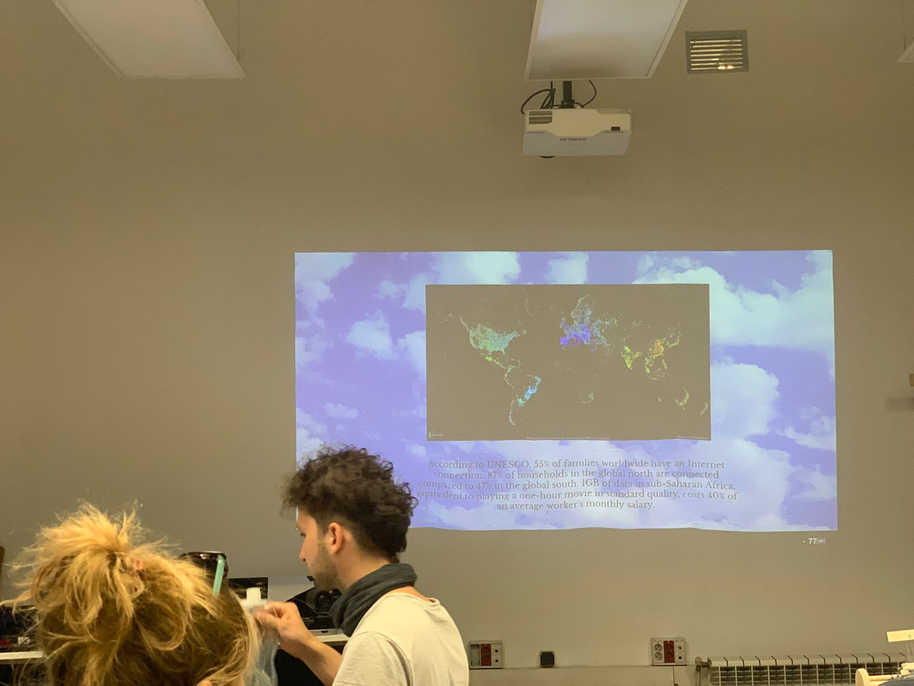
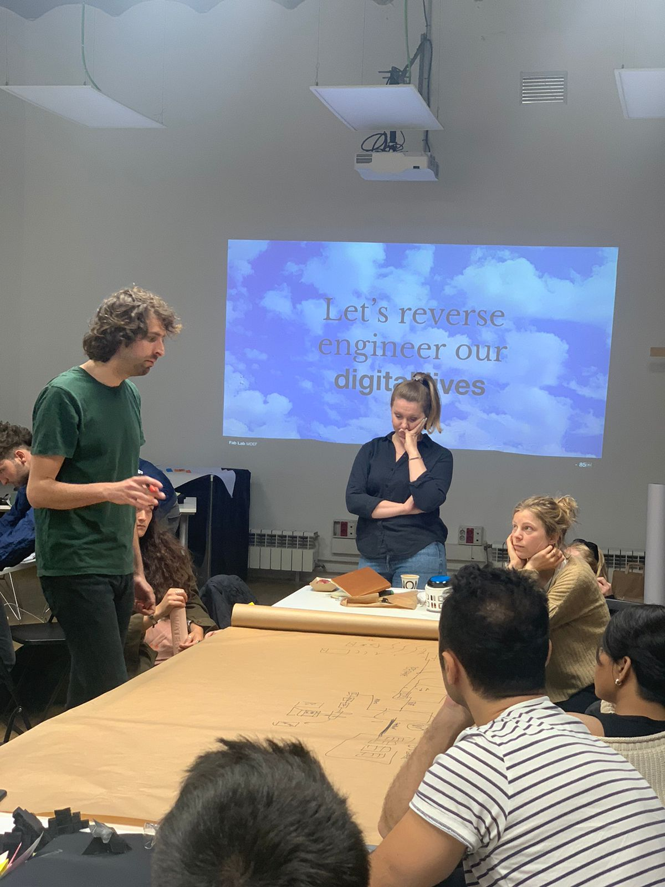

---
hide:
    - toc
---

# Decentralized Autonomous Organizations

## First Session with Guillem
In a recent session of my MDEF tech track, we delved into the world of Decentralized Autonomous Organizations (DAOs) and explored various technologies and design approaches that can help us build sustainable, regenerative, and expressive futures.

One key insight that emerged from the session was the idea that protocols and platforms are not just engineering artifacts, but rather social constructs that enable us to communicate and collaborate with each other. Whether it's a digital protocol like JPEG or HTML, or a platform like Instagram or WhatsApp, these tools shape the way we interact and make decisions.

To apply these ideas to our own intervention projects, we were asked to choose a digital protocol or platform that we plan to use and reflect on its strengths and limitations in terms of enabling participation, transparency, and inclusivity.

In addition to exploring these practical aspects of technology design, we also delved into some deeper philosophical and ethical questions. For instance, we discussed the concept of "decolonizing technologies" and how we can move from extractive and convenience-focused technologies to regenerative, expressive, and rebel technologies that prioritize sustainability and social justice.

We also explored some fascinating case studies, such as the Critical Engineering Manifesto, which challenges us to question the dominant narratives and power structures that shape our technology landscape, and the provocative question of how to host a website for 500 years, which highlights the ephemeral nature of our digital infrastructure and the need for more sustainable alternatives.

Overall, the session helped us see technology not as a mystical or magical force, but as a tangible and material reality that is deeply intertwined with social, political, and environmental issues. By understanding the inner workings of digital protocols and platforms, and by adopting a more critical and reflective stance towards technology, we can begin to design and build more sustainable and equitable futures.

We then did an exercise of reverse engineering our digital lives, understanding the complexity of physical wires, servers and networks involved in something as routine as sending a message via Whatsapp.

## Sessions with Mar Canet
In a recent class, we explored the intersection of AI, art, and media technology, particularly in relation to NFTs. The session was led by Mar Canet, who shared his insights on AI-aided ceramic sculptures and their potential for bridging deep learning with materiality.

One of the highlights of the session was the discussion on NFTs and how they are transforming the art world. We learned about an NFT shop located in an abandoned gas station, which sells video performances created using artist-made Snapchat filters as NFTs. 

We then delved into the world of cryptocurrency, specifically Ethereum and its predecessor, Cryptokitties. We learned about the role of miners in blockchain infrastructure and how Ethereum funded Cryptokitties to slow down their operations. Mar also explained the different types of blockchain wallets, including hardware and cold wallets, and how they are essential for securely storing cryptocurrencies.

We discussed the various types of tokens, including fungible, semi-fungible, and non-fungible tokens. Mar highlighted the importance of understanding the technology behind NFTs and how it enables the creation of unique, one-of-a-kind digital assets.

Finally, we created our own wallets using Temple Wallet and learned about IPFS as a good place to store our digital assets. Overall, the session was eye-opening and highlighted the importance of understanding the underlying technology behind NFTs and cryptocurrency in general.
